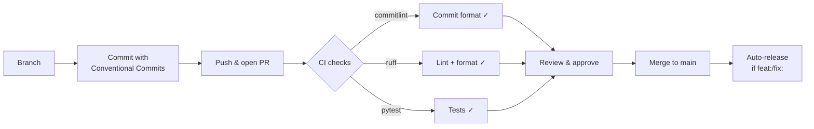

# Contributing

## Setup

```bash
# Install Poetry if you don't have it
curl -sSL https://install.python-poetry.org | python3 -

# Clone and install
git clone https://github.com/aryeko/planpilot.git
cd planpilot
poetry install

# Install git hooks (commit-msg linting)
./scripts/install-hooks.sh
```

## Development

Development tasks are managed with [poethepoet](https://github.com/nat-n/poethepoet). Run any task with `poe <task>` (or `poetry run poe <task>` if poe is not on your PATH):

| Command | Description |
|---------|-------------|
| `poe lint` | Run ruff linter (`ruff check .`) |
| `poe format` | Auto-format code (`ruff format .`) |
| `poe format-check` | Check formatting without changes (`ruff format --check .`) |
| `poe docs-links` | Validate local markdown links in `README.md` and `docs/` |
| `poe workflow-lint` | Lint GitHub Actions workflows (`./scripts/actionlint.sh`) |
| `poe test` | Run non-E2E tests (`pytest -v --ignore=tests/e2e`) |
| `poe test-e2e` | Run offline E2E suite (`pytest -v tests/e2e/test_cli_e2e.py`) |
| `poe coverage` | Run tests and generate HTML coverage report |
| `poe typecheck` | Run mypy type-checking (`mypy src/planpilot`) |
| `poe check` | Run lint + format-check + typecheck + non-E2E tests |

```bash
# Quick checks before pushing
poe docs-links
poe workflow-lint
poe check

# Verify CLI
poetry run planpilot --help
```

## Architecture

planpilot follows a layered SDK-first architecture:

- **`src/planpilot/core/contracts/`** -- Core data models, ABCs, and exception hierarchy
- **`src/planpilot/core/plan/`** -- Plan loading from JSON, relational validation, deterministic hashing
- **`src/planpilot/core/auth/`** -- Token resolvers and auth strategy factory
- **`src/planpilot/core/providers/`** -- Provider implementations and factory (GitHub provider in `core/providers/github/`)
- **`src/planpilot/core/renderers/`** -- `BodyRenderer` implementations; `MarkdownRenderer` is default
- **`src/planpilot/core/engine/`** -- `SyncEngine` 5-phase pipeline over Provider and Renderer abstractions
- **`src/planpilot/core/config/`** -- Config load/scaffold logic
- **`src/planpilot/sdk.py`** -- Composition root (`PlanPilot.from_config`) and SDK facade
- **`src/planpilot/cli/`** -- Parser/app/commands and persistence helpers

To add a new provider (for example Jira), implement the `Provider` ABC in `src/planpilot/core/providers/jira/` and wire it in `src/planpilot/core/providers/factory.py`.

## Documentation update policy

For any user-visible behavior or architecture change, update docs in the same PR.

Primary references:

- `docs/README.md` — docs index and navigation
- `docs/design/documentation-architecture.md` — ownership map and update rules
- `docs/plans/2026-02-13-docs-refresh-execution-plan.md` — docs inventory and update strategy

Quick mapping:

- CLI changes -> `README.md`, `docs/modules/cli.md`, `docs/how-it-works.md`
- Engine/sync semantics -> `docs/design/engine.md`, `docs/how-it-works.md`, `docs/modules/sdk.md`
- Provider behavior -> `docs/modules/providers.md`, `docs/modules/github-provider.md`, `docs/design/contracts.md`
- Config/schema changes -> `README.md`, `docs/modules/config.md`, `docs/reference/plan-schemas.md`
- CI/release changes -> `RELEASE.md` and relevant workflow docs
- Operator guidance/troubleshooting -> `docs/guides/troubleshooting.md`

## Commit messages

We use [Conventional Commits](https://www.conventionalcommits.org/) to drive automated versioning and changelog generation. All commits must follow this format:

```
<type>[optional scope]: <description>

[optional body]

[optional footer(s)]
```

Common types:

| Type | Purpose | Version bump |
|------|---------|-------------|
| `feat` | New feature | Minor |
| `fix` | Bug fix | Patch |
| `docs` | Documentation only | None |
| `chore` | Maintenance / tooling | None |
| `test` | Adding or updating tests | None |
| `refactor` | Code change that neither fixes nor adds | None |
| `perf` | Performance improvement | Patch |
| `ci` | CI/CD changes | None |

Breaking changes: add `!` after the type (e.g. `feat!: remove fallback`) or include a `BREAKING CHANGE:` footer.

**Header limit**: 72 characters maximum (enforced by CI and the local hook).

Commit messages are linted in CI via [commitlint](https://github.com/opensource-nepal/commitlint) and locally via a `commit-msg` git hook. The same `commitlint` package is included as a dev dependency (`poetry install`). Run `./scripts/install-hooks.sh` to install the hook.

## Pull requests



- Keep changes focused and well-tested.
- Use Conventional Commit format for all commits (enforced by CI).
- Include rationale and verification steps.
- Ensure `poe check` passes (lint + format-check + typecheck + non-E2E tests).
- Ensure `poe docs-links` and `poe workflow-lint` pass.
- PRs require at least 1 approving review and all CI checks to pass.
- Prefer dry-run examples in docs for sync operations.

## Test structure

Tests mirror the source layout under `tests/`:

```text
tests/
├── contracts/        → src/planpilot/core/contracts/
├── plan/             → src/planpilot/core/plan/
├── auth/             → src/planpilot/core/auth/
├── providers/github/ → src/planpilot/core/providers/github/
├── renderers/        → src/planpilot/core/renderers/
├── engine/           → src/planpilot/core/engine/
├── test_sdk.py       → src/planpilot/sdk.py
└── test_cli.py       → src/planpilot/cli/
```

- Unit tests mock the `Provider` and `BodyRenderer` abstractions -- no real API calls.
- Shared fixtures live in `tests/conftest.py`.
- Coverage target: 90%+ branch coverage (`poe test` reports coverage automatically).
- Type-checking currently gates runtime code in `src/planpilot`; tests are not mypy-gated.
- When adding a new module, create a matching test file in the same relative path.

## Adding a provider

To add a new provider (e.g. Jira):

1. Create `src/planpilot/core/providers/jira/` with `__init__.py`, `client.py`, and `provider.py`.
2. Implement the `Provider` ABC from `src/planpilot/core/contracts/provider.py`.
3. Add corresponding tests under `tests/providers/jira/`.
4. Wire it into `src/planpilot/core/providers/factory.py`.

No changes to `SyncEngine`, `BodyRenderer`, or plan modules are needed for a standard adapter.
