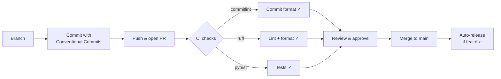

# Contributing

## Setup

```bash
# Install Poetry if you don't have it
curl -sSL https://install.python-poetry.org | python3 -

# Clone and install
git clone https://github.com/aryeko/planpilot.git
cd planpilot
poetry install
```

## Development

```bash
# Run tests
poetry run pytest -v

# Lint
poetry run ruff check .

# Format
poetry run ruff format .

# Verify CLI
poetry run planpilot --help
```

## Commit messages

We use [Conventional Commits](https://www.conventionalcommits.org/) to drive automated versioning and changelog generation. All commits must follow this format:

```
<type>[optional scope]: <description>

[optional body]

[optional footer(s)]
```

Common types:

| Type | Purpose | Version bump |
|------|---------|-------------|
| `feat` | New feature | Minor |
| `fix` | Bug fix | Patch |
| `docs` | Documentation only | None |
| `chore` | Maintenance / tooling | None |
| `test` | Adding or updating tests | None |
| `refactor` | Code change that neither fixes nor adds | None |
| `perf` | Performance improvement | Patch |
| `ci` | CI/CD changes | None |

Breaking changes: add `!` after the type (e.g. `feat!: remove fallback`) or include a `BREAKING CHANGE:` footer.

Commit messages are linted in CI via [commitlint](https://github.com/opensource-nepal/commitlint).

## Pull requests



- Keep changes focused and well-tested.
- Use Conventional Commit format for all commits (enforced by CI).
- Include rationale and verification steps.
- Ensure `ruff check` and `ruff format --check` pass.
- PRs require at least 1 approving review and all CI checks to pass.
- Prefer dry-run examples in docs for sync operations.
