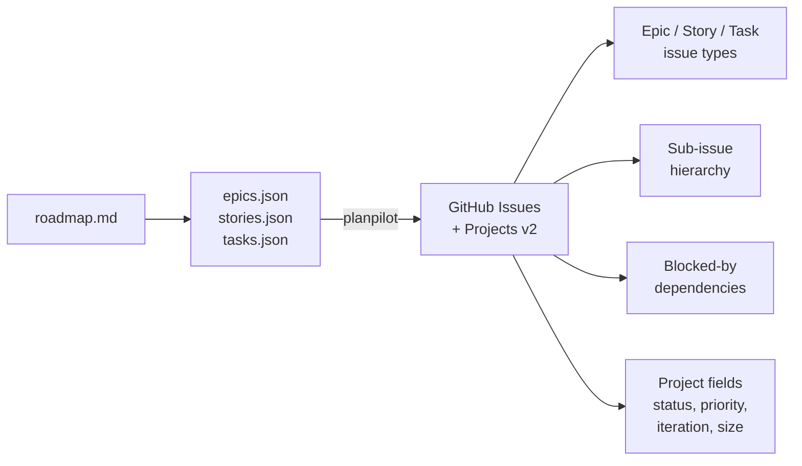

#  planpilot

[](https://github.com/aryeko/planpilot/actions/workflows/ci.yml)
[](https://codecov.io/gh/aryeko/planpilot)
[](https://pypi.org/project/planpilot/)
[](https://pypi.org/project/planpilot/)
[](https://pepy.tech/project/planpilot)
[](https://github.com/aryeko/planpilot/blob/main/LICENSE)

Sync roadmap plans (epics, stories, tasks) to GitHub Issues and Projects v2.

> **⭐ If planpilot helps you manage your roadmaps, consider [giving it a star](https://github.com/aryeko/planpilot)!**

## Why planpilot?

Managing roadmaps through GitHub's UI works for small projects, but breaks down fast: manually creating dozens of issues, linking parent/child hierarchies, setting up blocked-by dependencies, and keeping project board fields in sync is tedious and error-prone. Scripting the GitHub API directly means dealing with pagination, rate limits, idempotency, and GraphQL complexity.

**planpilot treats your roadmap as code.** Define epics, stories, and tasks in JSON files, commit them alongside your source code, and let planpilot handle the rest — creating issues, wiring up sub-issue hierarchies, setting blocked-by relations, and populating project board fields. It's idempotent (safe to rerun), supports dry-run previews, and works across multiple epics in a single run.

## What it does

**planpilot** takes structured plan files and turns them into a fully linked project board:



- **One-way sync**: local plan files -> GitHub
- **Idempotent**: safe to rerun -- updates existing issues via markers
- **Dry-run first**: preview all changes before applying
- **Multi-epic**: sync multiple epics natively in one run
- **Provider-agnostic**: adapter pattern supports GitHub today, with Jira/Linear planned
- **Async-first**: built on asyncio for fast, concurrent sync operations

## Architecture

planpilot follows SOLID principles with a modular, provider-agnostic design:

```text
src/planpilot/
├── core/            # Runtime domains (auth/config/contracts/engine/plan/providers/renderers)
├── cli/             # CLI parser/app/commands and persistence helpers
├── sdk.py           # SDK composition root and public facade
└── __init__.py      # Public API exports
```

Core domains provide business logic, and the SDK composes runtime pieces. This keeps provider and renderer implementations swappable without changing engine internals.

See [docs/design/architecture.md](docs/design/architecture.md) for the full architecture guide.

## Requirements

- Python 3.11+
- GitHub token with `repo` and `project` scopes
- [`gh` CLI](https://cli.github.com/) only when using `auth: "gh-cli"`

## Installation

```bash
# Install pipx if you don't have it
brew install pipx && pipx ensurepath   # macOS
# or: sudo apt install -y pipx && pipx ensurepath   # Debian/Ubuntu

# Install planpilot
pipx install planpilot
```

[`pipx`](https://pipx.pypa.io/) installs CLI tools in isolated environments -- avoids PEP 668 / "externally managed environment" errors on macOS Homebrew and system Python.

<details>
<summary>Alternative: pip (inside a virtualenv)</summary>

```bash
python3 -m venv .venv && source .venv/bin/activate
pip install planpilot
```

</details>

<details>
<summary>From source (Poetry)</summary>

```bash
poetry install
```

</details>

## Try it now

See planpilot in action without any configuration or GitHub token — the built-in example runs a fully offline dry-run:

```bash
git clone https://github.com/aryeko/planpilot.git && cd planpilot
pipx install .   # or: pip install .
planpilot sync --config examples/sync-workflow/planpilot.json --dry-run
```

```text
planpilot - sync complete (dry-run)

  Plan ID:   3832d3ffce22
  Target:    example-org/example-repo
  Board:     https://github.com/orgs/example-org/projects/1

  Items:     6 total (1 epic, 2 stories, 3 tasks)
  Created:   6 (1 epic, 2 stories, 3 tasks)

  Sync map:  /absolute/path/to/examples/sync-workflow/output/sync-map-sample.json.dry-run

  [dry-run] No changes were made
```

## Install Agent Skills

planpilot ships three agent skills that form a complete product workflow:

| Skill | Purpose |
|-------|---------|
| `create-prd` | Generate structured PRDs from feature ideas |
| `create-tech-spec` | Create codebase-aware technical specs from PRDs |
| `roadmap-to-github-project` | Sync specs to GitHub Issues + Projects v2 |

### Agent Self-Install

Tell your agent:

```
Fetch and follow instructions from https://raw.githubusercontent.com/aryeko/planpilot/main/skills/INSTALL.agent.md
```

The agent will install `planpilot` and all three skills automatically.

### Manual Install

Install skills to the open discovery path used by agent platforms that support filesystem skills:

```bash
for skill in create-prd create-tech-spec roadmap-to-github-project; do
  mkdir -p ~/.agents/skills/$skill
  curl -fsSL "https://raw.githubusercontent.com/aryeko/planpilot/main/skills/$skill/SKILL.md" \
    -o ~/.agents/skills/$skill/SKILL.md
done
```

Full standalone instructions: [`skills/INSTALL.md`](skills/INSTALL.md)

## Quickstart

### 1. Generate `planpilot.json`

```bash
planpilot init
```

The interactive wizard auto-detects your git remote and guides you through provider, target repo, board URL, plan layout, and auth. Or create the config manually:

```bash
cat > planpilot.json <<'JSON'
{
  "provider": "github",
  "target": "your-org/your-repo",
  "board_url": "https://github.com/orgs/your-org/projects/1",
  "plan_paths": {
    "epics": ".plans/epics.json",
    "stories": ".plans/stories.json",
    "tasks": ".plans/tasks.json"
  },
  "sync_path": ".plans/sync-map.json"
}
JSON
```

### 2. Dry-run (preview changes)

```bash
planpilot sync --config ./planpilot.json --dry-run
```

### 3. Apply changes

```bash
planpilot sync --config ./planpilot.json --apply
```

### 4. Multi-epic plans

planpilot supports multi-epic plans natively. Keep all epics/stories/tasks in the configured plan files and run once:

```bash
planpilot sync --config ./planpilot.json --apply
```

## CLI commands

### `planpilot init`

| Flag | Default | Description |
|------|---------|-------------|
| `--output`, `-o` | `planpilot.json` | Output file path |
| `--defaults` | off | Generate config with auto-detected defaults (no prompts) |

### `planpilot sync`

| Flag | Default | Description |
|------|---------|-------------|
| `--config` | `./planpilot.json` | Path to `planpilot.json` |
| `--dry-run` | — | Preview mode (no provider mutations) |
| `--apply` | — | Apply mode |
| `--verbose` | off | Enable verbose logging |

### `planpilot clean`

| Flag | Default | Description |
|------|---------|-------------|
| `--config` | `./planpilot.json` | Path to `planpilot.json` |
| `--dry-run` | — | Preview which issues would be deleted |
| `--apply` | — | Execute deletions |
| `--all` | off | Delete all planpilot-managed issues by label, regardless of current plan hash |
| `--verbose` | off | Enable verbose logging |

### `planpilot map sync`

| Flag | Default | Description |
|------|---------|-------------|
| `--config` | `./planpilot.json` | Path to `planpilot.json` |
| `--dry-run` | — | Preview local sync-map reconciliation |
| `--apply` | — | Persist reconciled local sync-map |
| `--plan-id` | auto | Explicit remote plan ID to reconcile |
| `--verbose` | off | Enable verbose logging |

`map sync` reconciles local artifacts from provider metadata only; it does not mutate provider items.
In apply mode it writes both the local sync-map and local plan files.

Full CLI reference: [docs/modules/cli.md](docs/modules/cli.md)

## Plan file schemas

See [docs/reference/plan-schemas.md](docs/reference/plan-schemas.md) for plan schema examples and [docs/modules/plan.md](docs/modules/plan.md) for validation behavior.

A complete working example is in the [examples/](examples/) directory, including sample rendered issue bodies and a sync-map output.

## Documentation

- Start here:
  - [Docs Index](docs/README.md)
  - [CLI Reference](docs/reference/cli-reference.md)
  - [SDK Reference](docs/reference/sdk-reference.md)
  - [Config Reference](docs/reference/config-reference.md)
  - [Exit Codes](docs/reference/exit-codes.md)
  - [Workflows Reference](docs/reference/workflows-reference.md)
  - [Developer Workflow](docs/reference/developer-workflow.md)
  - [Docs Inventory](docs/reference/docs-inventory.md)
  - [Troubleshooting](docs/guides/troubleshooting.md)
- Architecture and behavior:
  - [How It Works](docs/how-it-works.md)
  - [Architecture](docs/design/architecture.md)
  - [Contracts](docs/design/contracts.md)
  - [Engine](docs/design/engine.md)
  - [Map Sync Design](docs/design/map-sync.md)
  - [Clean Workflow Design](docs/design/clean.md)
  - [Code Map](docs/design/codemap.md)
- Module implementation details:
  - [CLI](docs/modules/cli.md)
  - [SDK](docs/modules/sdk.md)
  - [Providers](docs/modules/providers.md)
  - [GitHub Provider](docs/modules/github-provider.md)
- Operations:
  - [E2E Testing](docs/testing/e2e.md)
  - [Release Guide](RELEASE.md)
  - [Changelog](CHANGELOG.md)

## Support

- **Questions / ideas**: use [GitHub Discussions](https://github.com/aryeko/planpilot/discussions)
- **Bugs / feature requests**: open a [GitHub Issue](https://github.com/aryeko/planpilot/issues/new/choose)

## Branding

Branding assets (logo + social preview images) are in [`assets/branding/navigator/`](assets/branding/navigator/).

## Development

Development tasks use [poethepoet](https://github.com/nat-n/poethepoet):

```bash
poe lint           # ruff check
poe format         # ruff format
poe docs-links     # validate local markdown links
poe test           # pytest -v --ignore=tests/e2e
poe test-e2e       # run offline E2E suite
poe coverage       # pytest + HTML coverage report
poe coverage-e2e   # E2E-only coverage XML
poe typecheck      # mypy
poe check          # lint + format-check + typecheck + tests
```

## Contributing

See [CONTRIBUTING.md](CONTRIBUTING.md) for setup and development instructions.

## License

[MIT](LICENSE)
