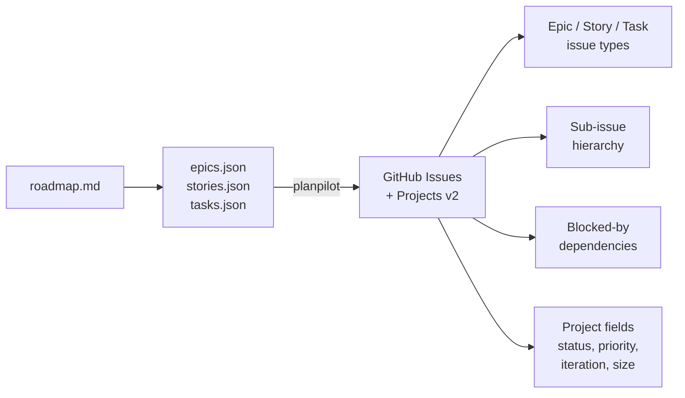

# planpilot

[](https://github.com/aryeko/planpilot/actions/workflows/ci.yml)
[](https://codecov.io/gh/aryeko/planpilot)
[](https://pypi.org/project/planpilot/)
[](https://pypi.org/project/planpilot/)
[](LICENSE)

Sync roadmap plans (epics, stories, tasks) to GitHub Issues and Projects v2.

## What it does

**planpilot** takes structured plan files and turns them into a fully linked project board:



- **One-way sync**: local plan files -> GitHub
- **Idempotent**: safe to rerun -- updates existing issues via markers
- **Dry-run first**: preview all changes before applying
- **Multi-epic**: slice large plans and sync each epic sequentially

## Requirements

- Python 3.11+
- [`gh` CLI](https://cli.github.com/) installed and authenticated
- GitHub token scopes: `repo`, `project`

## Installation

```bash
pip install planpilot
```

Or with Poetry:

```bash
poetry add planpilot
```

## Quickstart

### 1. Dry-run (preview changes)

```bash
planpilot \
  --repo your-org/your-repo \
  --project-url https://github.com/orgs/your-org/projects/1 \
  --epics-path .plans/epics.json \
  --stories-path .plans/stories.json \
  --tasks-path .plans/tasks.json \
  --sync-path .plans/github-sync-map.json \
  --dry-run
```

### 2. Apply changes

```bash
planpilot \
  --repo your-org/your-repo \
  --project-url https://github.com/orgs/your-org/projects/1 \
  --epics-path .plans/epics.json \
  --stories-path .plans/stories.json \
  --tasks-path .plans/tasks.json \
  --sync-path .plans/github-sync-map.json \
  --apply
```

### 3. Multi-epic plans

The sync tool expects one epic per run. For multi-epic plans, slice first:

```bash
planpilot-slice \
  --epics-path .plans/epics.json \
  --stories-path .plans/stories.json \
  --tasks-path .plans/tasks.json \
  --out-dir .plans/tmp
```

Then sync each epic:

```bash
for f in .plans/tmp/epics.*.json; do
  id=$(basename "$f" .json | sed 's/epics\.//')
  planpilot \
    --repo your-org/your-repo \
    --project-url https://github.com/orgs/your-org/projects/1 \
    --epics-path ".plans/tmp/epics.${id}.json" \
    --stories-path ".plans/tmp/stories.${id}.json" \
    --tasks-path ".plans/tmp/tasks.${id}.json" \
    --sync-path ".plans/github-sync-map.${id}.json" \
    --apply
done
```

## Optional flags

| Flag | Default | Description |
|------|---------|-------------|
| `--label` | `codex` | Label applied to created issues |
| `--status` | `Backlog` | Project status field value |
| `--priority` | `P1` | Project priority field value |
| `--iteration` | `active` | Iteration title, `active`, or `none` |
| `--size-field` | `Size` | Project size field name |
| `--size-from-tshirt` | `true` | Map `estimate.tshirt` to size field |
| `--verbose` | off | Enable verbose logging |

Full CLI reference: [docs/cli-reference.md](docs/cli-reference.md)

## Plan file schemas

See [docs/schemas.md](docs/schemas.md) for the expected structure of `epics.json`, `stories.json`, and `tasks.json`, with full examples.

A complete working example is in the [examples/](examples/) directory.

## Documentation

- [How It Works](docs/how-it-works.md) -- sync pipeline, idempotency, what gets created
- [CLI Reference](docs/cli-reference.md) -- all flags and commands
- [Plan Schemas](docs/schemas.md) -- JSON format with examples and validation rules
- [Architecture / v1 Scope](docs/architecture/v1-scope.md) -- what's in and out of scope
- [Migration Guide](docs/migration.md) -- upgrading from previous versions
- [Release Guide](RELEASE.md) -- automated versioning, publishing, and release pipeline

## Contributing

See [CONTRIBUTING.md](CONTRIBUTING.md) for setup and development instructions.

## License

[MIT](LICENSE)
