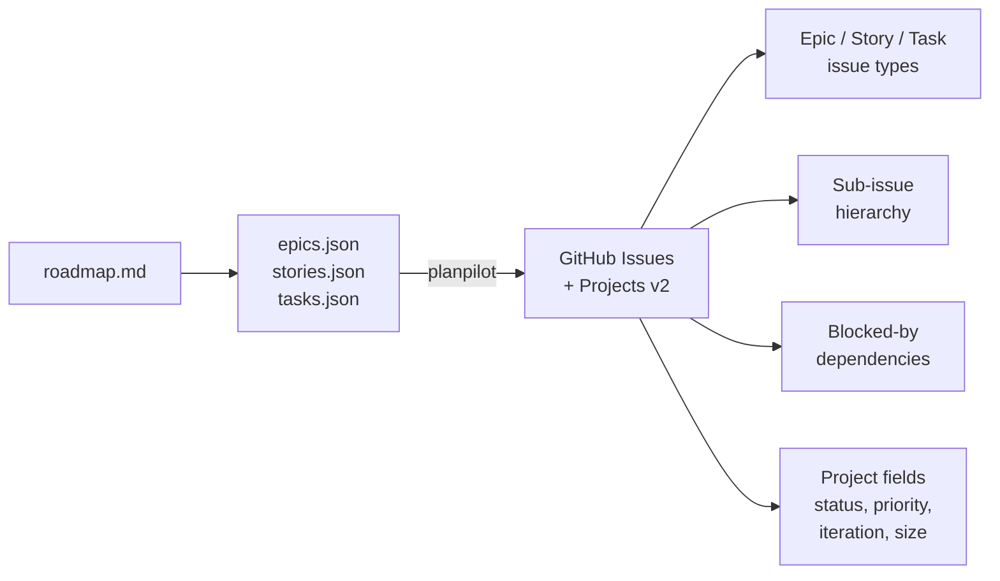

#  planpilot

[](https://github.com/aryeko/planpilot/actions/workflows/ci.yml)
[](https://codecov.io/gh/aryeko/planpilot)
[](https://pypi.org/project/planpilot/)
[](https://pypi.org/project/planpilot/)
[](https://pepy.tech/project/planpilot)
[](https://github.com/aryeko/planpilot/blob/main/LICENSE)

Sync roadmap plans (epics, stories, tasks) to GitHub Issues and Projects v2.

> **⭐ If planpilot helps you manage your roadmaps, consider [giving it a star](https://github.com/aryeko/planpilot)!**

## What it does

**planpilot** takes structured plan files and turns them into a fully linked project board:



- **One-way sync**: local plan files -> GitHub
- **Idempotent**: safe to rerun -- updates existing issues via markers
- **Dry-run first**: preview all changes before applying
- **Multi-epic**: sync multiple epics natively in one run
- **Provider-agnostic**: adapter pattern supports GitHub today, with Jira/Linear planned
- **Async-first**: built on asyncio for fast, concurrent sync operations

## Architecture

planpilot follows SOLID principles with a modular, provider-agnostic design:

```text
src/planpilot/
├── contracts/       # Core types, ABCs, and exception hierarchy
├── plan/            # Plan loading, validation, and hashing
├── auth/            # Token resolver strategy + factory
├── renderers/       # Body rendering implementations
├── engine/          # 5-phase sync orchestration
├── providers/       # Provider adapter layer
│   └── github/      # GitHub GraphQL adapter + generated client
├── sdk.py           # Composition root and config loading
└── cli.py           # CLI entry point
```

Core modules depend on contracts, and the SDK composes the runtime pieces. This keeps provider and renderer implementations swappable without changing engine internals.

See [docs/design/architecture.md](docs/design/architecture.md) for the full architecture guide.

## Requirements

- Python 3.11+
- [`gh` CLI](https://cli.github.com/) installed and authenticated
- GitHub token scopes: `repo`, `project`

## Installation

```bash
pip install planpilot
```

Or with Poetry:

```bash
poetry add planpilot
```

## Quickstart

### 1. Dry-run (preview changes)

```bash
planpilot \
  --repo your-org/your-repo \
  --project-url https://github.com/orgs/your-org/projects/1 \
  --epics-path .plans/epics.json \
  --stories-path .plans/stories.json \
  --tasks-path .plans/tasks.json \
  --sync-path .plans/github-sync-map.json \
  --dry-run
```

### 2. Apply changes

```bash
planpilot \
  --repo your-org/your-repo \
  --project-url https://github.com/orgs/your-org/projects/1 \
  --epics-path .plans/epics.json \
  --stories-path .plans/stories.json \
  --tasks-path .plans/tasks.json \
  --sync-path .plans/github-sync-map.json \
  --apply
```

### 3. Multi-epic plans

planpilot supports multi-epic plans natively. Run once with full plan files:

```bash
planpilot \
  --repo your-org/your-repo \
  --project-url https://github.com/orgs/your-org/projects/1 \
  --epics-path .plans/epics.json \
  --stories-path .plans/stories.json \
  --tasks-path .plans/tasks.json \
  --sync-path .plans/github-sync-map.json \
  --apply
```

## Optional flags

| Flag | Default | Description |
|------|---------|-------------|
| `--label` | `planpilot` | Label applied to created issues |
| `--status` | `Backlog` | Project status field value |
| `--priority` | `P1` | Project priority field value |
| `--iteration` | `active` | Iteration title, `active`, or `none` |
| `--size-field` | `Size` | Project size field name |
| `--no-size-from-tshirt` | off | Disable t-shirt size mapping |
| `--verbose` | off | Enable verbose logging |

Full CLI reference: [docs/modules/cli.md](docs/modules/cli.md)

## Plan file schemas

See [docs/modules/plan.md](docs/modules/plan.md) for plan schema and validation details.

A complete working example is in the [examples/](examples/) directory, including sample rendered issue bodies and a sync-map output.

## Documentation

- [Docs Index](docs/README.md) -- v2 documentation hub
- [Architecture](docs/design/architecture.md) -- layer rules and data flow
- [Contracts](docs/design/contracts.md) -- core domain and adapter contracts
- [Engine](docs/design/engine.md) -- sync pipeline behavior
- [CLI](docs/modules/cli.md) -- command structure, output, and exit codes
- [SDK](docs/modules/sdk.md) -- public API and composition root
- [Providers](docs/modules/providers.md) -- provider model and extension guide
- [Release Guide](RELEASE.md) -- automated versioning, publishing, and release pipeline

## Support

- **Questions / ideas**: use [GitHub Discussions](https://github.com/aryeko/planpilot/discussions)
- **Bugs / feature requests**: open a [GitHub Issue](https://github.com/aryeko/planpilot/issues/new/choose)

## Branding

Branding assets (logo + social preview images) are in [`assets/branding/navigator/`](assets/branding/navigator/).

## Development

Development tasks use [poethepoet](https://github.com/nat-n/poethepoet):

```bash
poe lint           # ruff check
poe format         # ruff format
poe test           # pytest -v
poe coverage       # pytest + HTML coverage report
poe typecheck      # mypy
poe check          # lint + format-check + tests (all-in-one)
```

## Contributing

See [CONTRIBUTING.md](CONTRIBUTING.md) for setup and development instructions.

## License

[MIT](LICENSE)
