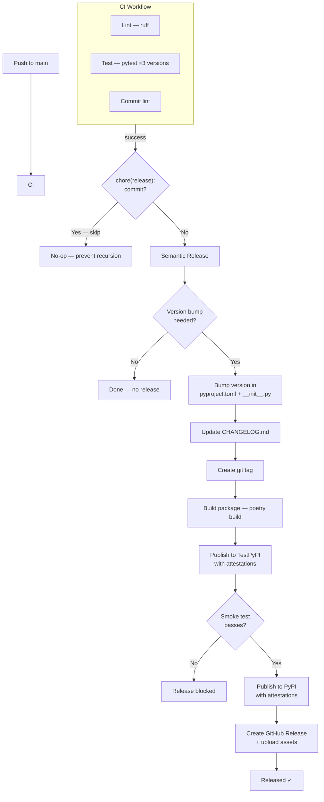

# Release Guide

## How releases work

planpilot uses [python-semantic-release](https://python-semantic-release.readthedocs.io/) for fully automated versioning and publishing. When commits are merged to `main`, CI runs first and the release workflow starts only after CI succeeds:



### Gates

1. **CI gate** — the release workflow only runs after CI succeeds on `main` (lint, tests, package checks; commitlint is enforced on PRs).
2. **Recursion guard** — release commits (`chore(release): X.Y.Z`) are skipped to prevent infinite loops. This is defense-in-depth; `GITHUB_TOKEN` pushes don't trigger workflows by design.
3. **TestPyPI gate** — if the package fails to publish or fails the smoke test, PyPI publish and GitHub Release are blocked.

### Smoke test

The smoke test (`scripts/smoke-test.sh`) runs after TestPyPI publish and validates:

- **Installability** — `pip install planpilot==X.Y.Z` from TestPyPI (with retries for index lag)
- **Import + version** — verifies `planpilot.__version__` matches the released version
- **CLI entry point** — `planpilot --help` exits cleanly

### Attestations

Both TestPyPI and PyPI publishes include [PEP 740 attestations](https://peps.python.org/pep-0740/) via Sigstore/OIDC. This provides cryptographic proof that published packages were built by this repo's GitHub Actions workflow and haven't been tampered with.

**You never need to manually bump versions, tag, or publish.**

## Commit message conventions

Version bumps are determined by commit message prefixes:

| Prefix | Version bump | Example |
|--------|-------------|---------|
| `feat:` | Minor (0.x.0 → 0.x+1.0) | `feat: add Jira adapter` |
| `fix:` | Patch (0.0.x → 0.0.x+1) | `fix: handle empty task_ids` |
| `perf:` | Patch (0.0.x → 0.0.x+1) | `perf: reduce API calls during sync` |
| `feat!:` / `BREAKING CHANGE:` | **Major** (x.0.0 → x+1.0.0) | `feat!: require epic_id on stories` |
| `docs:`, `chore:`, `ci:`, `test:`, `refactor:`, `style:` | No release | `docs: update schema examples` |

> **Note:** `major_on_zero` is enabled — breaking changes will bump the major version even during `0.x` development (e.g. `0.3.0` → `1.0.0`). This signals to users that an intentional breaking change has been made.

Breaking changes can be indicated with a `!` after the type (e.g. `feat!:`) or with a `BREAKING CHANGE:` footer in the commit body.

## Dry-run (preview next release)

Use the manual "Test Release (dry-run)" workflow to see what the next release would look like without making any changes:

1. Go to Actions > Test Release (dry-run) > Run workflow
2. Review the output to see the next version and changelog

No packages are published, no tags are created.

## Pre-release checks

Before merging a release-worthy PR:

```bash
poetry run pytest -v
poetry run ruff check .
poetry run ruff format --check .
poetry run planpilot --help
```

## Branch protection

The `main` branch is protected:

- PRs require at least 1 approving review
- All CI checks must pass (lint, tests, commitlint)
- Stale reviews are dismissed on new pushes
- Direct pushes to `main` are blocked

### Release bot (GitHub App)

Because branch protection blocks direct pushes to `main`, the release workflow uses a [GitHub App](https://docs.github.com/en/apps) (`planpilot-release`) to push the version bump commit and tag. The app mints a short-lived installation token at the start of each run via [`actions/create-github-app-token`](https://github.com/actions/create-github-app-token) — no long-lived PATs to rotate.

| Secret | What it holds |
|--------|--------------|
| `RELEASE_APP_ID` | GitHub App ID |
| `RELEASE_APP_PRIVATE_KEY` | App private key (`.pem`) |

The app has minimal permissions (Contents: Read & Write) and is installed only on this repo. Release commits appear as `planpilot-release[bot]` in the git log. All other jobs use `GITHUB_TOKEN`.

## Manual override

If you need to force a specific version bump, you can run semantic-release locally:

```bash
pip install python-semantic-release
semantic-release version --patch  # or --minor, --major
```

This is rarely needed since commit messages drive versioning automatically.
