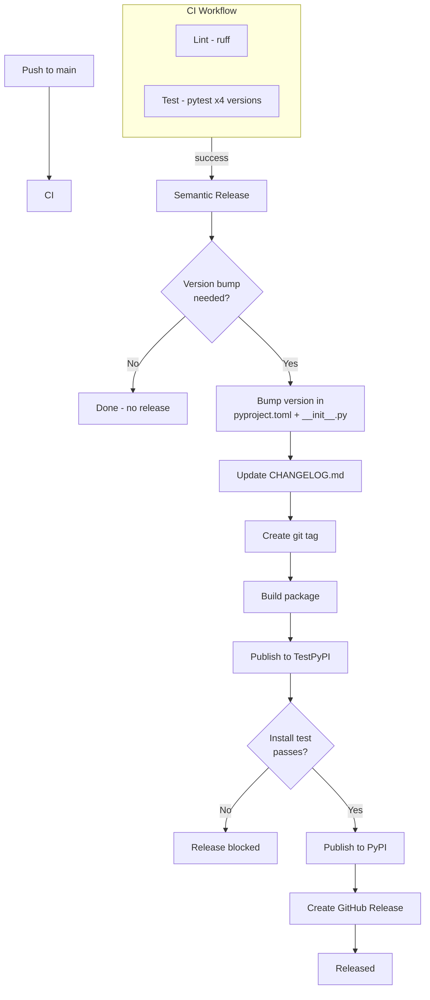

# Release Guide

## How releases work

planpilot uses [python-semantic-release](https://python-semantic-release.readthedocs.io/) for fully automated versioning and publishing. When commits are merged to `main`, CI runs first and the release workflow starts only after CI succeeds:



CI acts as the first gate -- the release workflow only runs after lint and tests pass. TestPyPI acts as the second gate -- if the package fails to publish or install from TestPyPI, the production PyPI publish and GitHub Release are blocked.

**You never need to manually bump versions, tag, or publish.**

## Commit message conventions

Version bumps are determined by commit message prefixes:

| Prefix | Version bump | Example |
|--------|-------------|---------|
| `feat:` | Minor (0.x.0) | `feat: add Jira adapter` |
| `fix:` | Patch (0.0.x) | `fix: handle empty task_ids` |
| `perf:` | Patch (0.0.x) | `perf: reduce API calls during sync` |
| `BREAKING CHANGE:` | Major (x.0.0) | `feat!: require epic_id on stories` |
| `docs:`, `chore:`, `ci:`, `test:`, `refactor:`, `style:` | No release | `docs: update schema examples` |

Breaking changes can also be indicated with a `!` after the type (e.g. `feat!:`) or with a `BREAKING CHANGE:` footer in the commit body.

## Dry-run (preview next release)

Use the manual "Test Release (dry-run)" workflow to see what the next release would look like without making any changes:

1. Go to Actions > Test Release (dry-run) > Run workflow
2. Review the output to see the next version and changelog

No packages are published, no tags are created.

## Pre-release checks

Before merging a release-worthy PR:

```bash
poetry run pytest -v
poetry run ruff check .
poetry run ruff format --check .
poetry run planpilot --help
```

## Branch protection

The `main` branch is protected:

- PRs require at least 1 approving review
- All CI checks must pass (lint, tests, commitlint)
- Stale reviews are dismissed on new pushes
- Direct pushes to `main` are blocked

## Manual override

If you need to force a specific version bump, you can run semantic-release locally:

```bash
pip install python-semantic-release
semantic-release version --patch  # or --minor, --major
```

This is rarely needed since commit messages drive versioning automatically.
