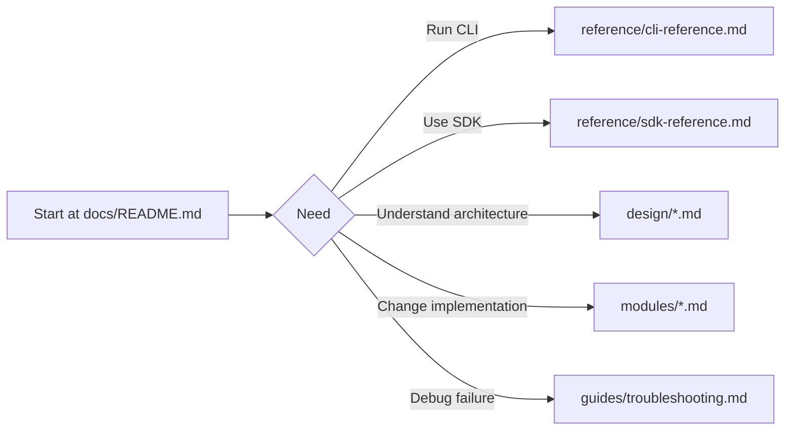

# PlanPilot v2 Docs

Documentation hub for architecture, module contracts, operator workflows, and reference material.

## Documentation

### Start here

1. **[Architecture](./design/architecture.md)** — Layers, dependency rules, UML class diagram, data flow
2. **[Repository Layout](./design/repository-layout.md)** — Current package ownership (`core/`, `cli/`, `sdk.py`) and code map
3. **[Contracts](./design/contracts.md)** — All contract types in one place (plan, item, sync, config, provider, renderer, exceptions)
4. **[Engine](./design/engine.md)** — Sync pipeline phases (Discovery -> Upsert -> Enrich -> Relations -> Result)
5. **[Map Sync Design](./design/map-sync.md)** — Plan ID discovery/selection and local reconciliation semantics
6. **[Clean Workflow Design](./design/clean.md)** — Metadata-scoped discovery and deterministic deletion strategy
7. **[Documentation Architecture](./design/documentation-architecture.md)** — Doc IA, ownership map, and update rules
8. **[How It Works](./how-it-works.md)** — User-facing sync behavior, idempotency, and dry-run/apply semantics
9. **[E2E Testing](./testing/e2e.md)** — Offline E2E test design, coverage matrix, usage, and extension rules
10. **[Plan Schemas](./reference/plan-schemas.md)** — Plan file shapes and examples
11. **[Docs Refresh Plan](./plans/2026-02-13-docs-refresh-execution-plan.md)** — Full docs-system review and execution plan

### Quick reference

- **[CLI Reference](./reference/cli-reference.md)** — command/flag matrix and examples
- **[SDK Reference](./reference/sdk-reference.md)** — API lookup for SDK entrypoints and result objects
- **[Troubleshooting](./guides/troubleshooting.md)** — common failures and practical fixes

### Navigation flow

### Module specs

| Module | Spec | Purpose |
|--------|------|---------|
| Plan | [modules/plan.md](./modules/plan.md) | Loading, validation, hashing |
| Providers | [modules/providers.md](./modules/providers.md) | Provider ABC, factory, extension guide |
| GitHub | [modules/github-provider.md](./modules/github-provider.md) | Core classes, codegen setup, operational hardening, operations inventory |
| Auth | [modules/auth.md](./modules/auth.md) | TokenResolver ABC, concrete resolvers, factory |
| Renderers | [modules/renderers.md](./modules/renderers.md) | Renderer ABC, Markdown implementation |
| Config | [modules/config.md](./modules/config.md) | Config models, JSON schema, validation rules |
| SDK | [modules/sdk.md](./modules/sdk.md) | Public API facade, lifecycle, load_config |
| CLI | [modules/cli.md](./modules/cli.md) | Args, output format, exit codes |
| Map Sync | [modules/map-sync.md](./modules/map-sync.md) | Reconciliation internals in `core/map_sync/*` |
| Clean | [modules/clean.md](./modules/clean.md) | Deletion planner internals in `core/clean/*` |

### Decisions

| ADR | Topic |
|-----|-------|
| [001](./decisions/001-ariadne-codegen.md) | Use ariadne-codegen for GitHub GraphQL client |

## Locked v2 Decisions

- Discovery is provider-search-first using metadata marker query (`PLAN_ID:<plan_id>`)
- All renderers emit a shared plain-text metadata block (`PLANPILOT_META_V1` ... `END_PLANPILOT_META`)
- Discovery uses provider-native search APIs with partitioning as needed and fail-fast on truncation/capability limits
- Reconciliation ownership is hybrid:
  - Plan-authoritative: title/body/type/label/size/relations
  - Provider-authoritative: status/priority/iteration after creation
- Exit codes are differentiated (`0`, `2`, `3`, `4`, `5`, `1`)
- SDK is the composition root via `PlanPilot.from_config(...)`
- Dry-run uses a `DryRunProvider` (no auth/network calls, no provider mutations)
- SDK returns result objects only; local artifact persistence is caller-owned
- Engine owns dispatch concurrency (`max_concurrent`); provider owns per-call retries and rate-limit coordination

## Docs Maintenance

- `docs/README.md` is the docs navigation source of truth.
- Each behavior change should update both design-level docs (`docs/design/`) and module-level docs (`docs/modules/`) where relevant.
- When adding a new docs page, link it here and ensure local markdown links resolve.

## Known v2 Limitations

- Engine processes type levels sequentially (epics -> stories -> tasks); within each level, operations are concurrent up to `max_concurrent`
- Workflow board fields (`status`, `priority`, `iteration`) are provider-authoritative after create
- Relation mutations are capability-gated and produce explicit errors when unsupported
- CLI text summary is human-oriented, not a stable machine interface
- In `validation_mode=partial`, unresolved parent/dependency references are omitted from rendered context and relations for that run

## Migration from v1

### Architecture

| v1 | v2 | Rationale |
|----|-----|-----------|
| No SDK layer — CLI constructs engine directly | SDK is the composition root | Programmatic usage is first-class |
| CLI imports Core modules directly | CLI imports only from SDK public API | Clean layer boundary |
| Shared models (`RepoContext`, `ProjectContext`, `RelationMap`) | Provider-specific models stay in provider | Provider-specific types are opaque |

### Engine

| v1 | v2 | Rationale |
|----|-----|-----------|
| Engine calls `load_plan()`, `validate_plan()`, `compute_plan_id()` | SDK handles plan loading/hashing; engine receives `Plan` + `plan_id` | Engine is pure orchestration, no I/O |
| Engine calls `render_epic()`, `render_story()`, `render_task()` | Single `renderer.render(item, context)` | Decouples renderer from entity types |
| Engine knows about `RepoContext`, `ProjectContext`, field resolution | Provider handles all setup in `__aenter__` | Engine doesn't know provider internals |
| Engine calls `set_issue_type()`, `add_to_project()`, `set_project_field()` | `create_item()` handles as idempotent multi-step | Simpler engine, provider owns platform setup |
| Engine builds `#123` refs using `issue_number` | Engine uses `SyncEntry.key` (provider-agnostic) | Works for any provider |
| Relations use `node_id` and `get_issue_relations()` | `Item.reconcile_relations(parent, blockers)` handles add/remove convergence | Complexity moves to provider while keeping engine provider-agnostic |

### Plan

| v1 | v2 | Rationale |
|----|-----|-----------|
| Free functions: `load_plan()`, `validate_plan()`, `compute_plan_id()` | Classes: `PlanLoader`, `PlanValidator`, `PlanHasher` | OOP, testable, mockable |
| Separate `Epic`, `Story`, `Task` subclasses | Single flat `PlanItem` with `type: PlanItemType` | Simpler model, type-driven validation |
| Typed linkage fields (`story_id`, `epic_id`, etc.) | `parent_id` + optional `sub_item_ids` | One hierarchy model |
| Strict-only validation | Configurable `strict`/`partial` mode | Supports partial plan workflows |

### Providers

| v1 | v2 | Rationale |
|----|-----|-----------|
| 15+ abstract methods in Provider ABC | 5 CRUD methods + async context manager | Dramatically simpler contract |
| Engine orchestrates multi-step create | `create_item()` handles all as idempotent workflow | Provider-owned setup with retry-safe convergence |
| No factory | Dict-based `create_provider()` factory | Pluggable providers |
| `gh` CLI subprocess per API call | ariadne-codegen + httpx | Type safety, connection pooling |
| Auth embedded in provider | Separated `TokenResolver` — token passed to provider | Auth is orthogonal to transport |

### Config

| v1 | v2 | Rationale |
|----|-----|-----------|
| `SyncConfig` built from CLI args | `PlanPilotConfig` loadable from JSON file | Config file is single source of truth |
| Flat path fields | Nested `PlanPaths` (multi-file + unified modes) | Cleaner grouping |
| `repo` (GitHub-specific) | `target` (provider-agnostic) | Works for any provider |
| `project_url` (GitHub-specific) | `board_url` (provider-agnostic, required for v2) | Generic naming |
| No auth config | `auth` field with resolver strategies | Configurable per-environment |
| Mutable model | `frozen = True` | Prevents mutation during sync |

### CLI

| v1 | v2 | Rationale |
|----|-----|-----------|
| All config via CLI flags | Config via `--config <path>` | Simpler CLI |
| No subcommands | `planpilot sync` subcommand | Extensible for future commands |
| Summary uses `issue_number`, `repo` | Summary uses `key`, `target` | Provider-agnostic |

### Renderers

| v1 | v2 | Rationale |
|----|-----|-----------|
| Three methods: `render_epic()`, `render_story()`, `render_task()` | Single `render(item, context)` | Decoupled from entity types |
| `BodyRenderer` was a Protocol | `BodyRenderer` is an ABC in Contracts | Moved to Contracts layer |
| No factory | Dict-based `create_renderer()` factory | Pluggable renderers |
