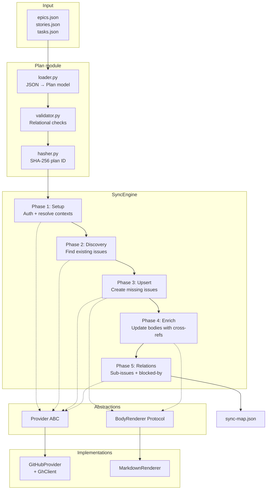

# Architecture

## Design principles

- **SOLID** -- each module has a single responsibility; the sync engine depends on abstractions, not concrete providers.
- **Provider-agnostic** -- the `Provider` ABC and `BodyRenderer` Protocol allow new integrations (Jira, Linear) without modifying core sync logic.
- **Async-first** -- all I/O-bound operations use `asyncio` for concurrent execution.
- **Validated at the boundary** -- Pydantic models enforce schemas on entry; internal code works with typed objects, never raw dicts.
- **Fail-fast** -- missing files, invalid JSON, broken references, and auth failures are caught before any GitHub mutations.

## Module map

```text
src/planpilot/
├── models/              # Pydantic domain models
│   ├── plan.py          # Epic, Story, Task, Plan
│   ├── project.py       # ProjectContext, RepoContext, IssueRef, ...
│   ├── sync.py          # SyncEntry, SyncMap, SyncResult
│   └── enums.py         # EntityType enum
├── plan/                # Plan file operations
│   ├── loader.py        # JSON → Plan (with PlanLoadError)
│   ├── validator.py     # Relational integrity checks
│   └── hasher.py        # Deterministic SHA-256 plan ID
├── providers/           # Provider adapter layer
│   ├── base.py          # Provider ABC (abstract interface)
│   └── github/          # GitHub implementation
│       ├── client.py    # GhClient (async gh CLI wrapper)
│       ├── provider.py  # GitHubProvider (Provider impl)
│       ├── mapper.py    # API response → domain model mappers
│       └── queries.py   # GraphQL query/mutation constants
├── rendering/           # Issue body generation
│   ├── base.py          # BodyRenderer Protocol
│   ├── markdown.py      # MarkdownRenderer (GitHub-flavored)
│   └── components.py    # Shared rendering helpers
├── sync/                # Sync orchestration
│   ├── engine.py        # SyncEngine (5-phase pipeline)
│   └── relations.py     # Blocked-by roll-up logic
├── config.py            # SyncConfig (Pydantic BaseModel)
├── exceptions.py        # Exception hierarchy
└── cli.py               # CLI entry point
```

## Data flow



## Provider adapter pattern

The `Provider` ABC defines the full interface a project management system must implement:

```python
class Provider(ABC):
    async def check_auth(self) -> None: ...
    async def get_repo_context(self, repo, label) -> RepoContext: ...
    async def get_project_context(self, project_url, field_config) -> ProjectContext | None: ...
    async def search_issues(self, repo, plan_id, label) -> list[ExistingIssue]: ...
    async def create_issue(self, input) -> IssueRef: ...
    async def update_issue(self, repo, number, title, body) -> None: ...
    async def set_issue_type(self, issue_id, type_id) -> None: ...
    async def add_to_project(self, project_id, issue_id) -> str | None: ...
    async def set_project_field(self, project_id, item_id, field_id, value) -> None: ...
    async def get_issue_relations(self, issue_ids) -> RelationMap: ...
    async def add_sub_issue(self, parent_id, child_id) -> None: ...
    async def add_blocked_by(self, issue_id, blocker_id) -> None: ...
```

To add a new provider (e.g. Jira):

1. Create `providers/jira/` with a `JiraProvider` class implementing `Provider`.
2. Create a corresponding client wrapper (e.g. `JiraClient`).
3. Wire it into `cli.py` via a `--provider` flag.
4. No changes to `SyncEngine`, `BodyRenderer`, or any plan modules.

## Exception hierarchy

```text
PlanPilotError
├── PlanLoadError          # File I/O or JSON parse failures
├── PlanValidationError    # Relational integrity errors (aggregated)
├── AuthenticationError    # Provider auth failures
├── ProviderError          # Provider API call failures
├── ProjectURLError        # Invalid project URL format
└── SyncError              # Non-recoverable sync failures
```

`PlanValidationError` collects all errors and raises them together, so users see every issue in one pass rather than fixing them one at a time.

## Sync engine phases

In `--apply` mode, the engine runs all five phases:

| Phase | What it does |
|-------|-------------|
| **1. Setup** | Authenticate, resolve repo context (label, issue types), resolve project context (fields, iterations) |
| **2. Discovery** | Search for existing issues by `PLAN_ID` marker |
| **3. Upsert** | Create missing epics → stories → tasks; skip existing |
| **4. Enrich** | Update all issue bodies with cross-reference links and checklists |
| **5. Relations** | Add sub-issue hierarchy and blocked-by links (with story/epic roll-up) |

In `--dry-run` mode, the engine works **fully offline** — no API calls. It loads, validates, and enumerates what would be created, writes a placeholder sync map, and exits immediately.

## Testing strategy

Tests mirror the source structure:

```text
tests/
├── models/          → src/planpilot/models/
├── plan/            → src/planpilot/plan/
├── providers/github/→ src/planpilot/providers/github/
├── rendering/       → src/planpilot/rendering/
├── sync/            → src/planpilot/sync/
├── test_cli.py      → src/planpilot/cli.py
└── test_exceptions.py→ src/planpilot/exceptions.py
```

- Unit tests mock the `Provider` and `BodyRenderer` abstractions.
- No real GitHub API calls in the test suite.
- `conftest.py` provides shared fixtures (plan JSON files, sample configs).
- Coverage target: 90%+ branch coverage.

## v1 scope

### In scope

- One-way sync from local plan files to GitHub Issues and Projects v2.
- Idempotent upsert via issue body markers and sync-map output.
- Dry-run preview mode and explicit apply mode.
- Sub-issue hierarchy and blocked-by dependency linking.
- Provider adapter pattern (GitHub implemented; Jira/Linear ready to add).
- Async execution for I/O-bound operations.

### Out of scope

- Bidirectional sync from GitHub back to plan files.
- Destructive operations (auto-delete/close on missing local items).
- Automatic creation of project field definitions or options.
- Real-time sync or webhook-driven updates.
