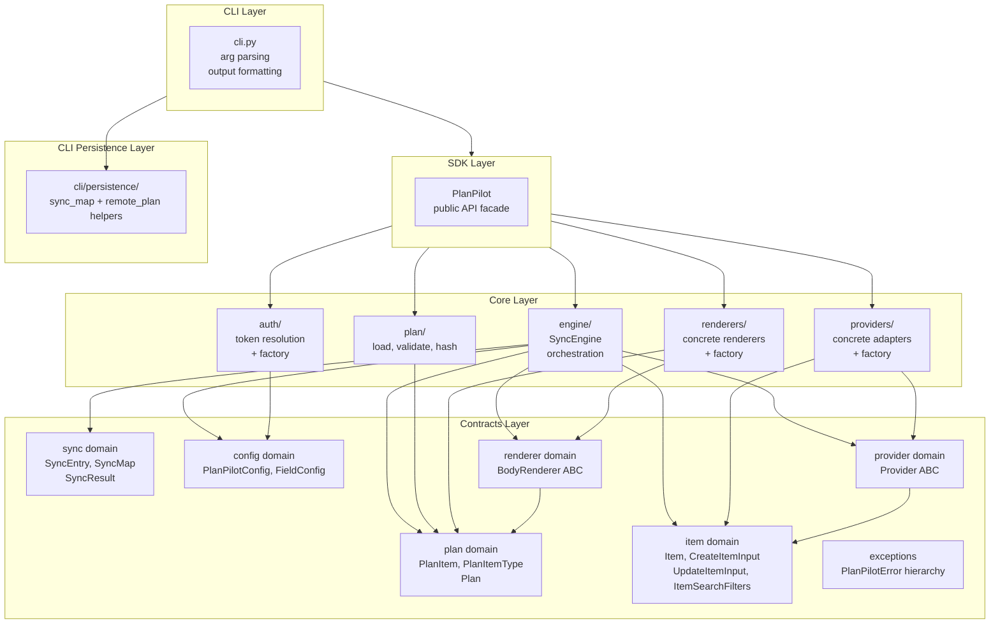

# PlanPilot v2 Architecture

## Design Principles

- **SDK-first** — The CLI is a thin wrapper around a fully-functional SDK. Programmatic usage is the default, CLI is convenience.

- **Layered dependencies** — Strict downward-only dependencies. Each layer depends only on the layer directly below it. No bypassing, no circular dependencies, no peer imports.

- **Adapter pattern** — Both providers (GitHub, Jira, Linear) and renderers (Markdown, wiki) are pluggable adapters. The core engine knows nothing about concrete implementations.

- **SOLID principles** — Single responsibility, open/closed via adapters, Liskov substitution for Provider/Renderer, interface segregation via focused ABCs, dependency inversion throughout.

- **Async-first** — All I/O operations are async. The SDK and engine are fully async-compatible.

## Layer Architecture

### Contracts

Pure data types and abstract interfaces. Six domains with clear responsibilities. See [contracts.md](contracts.md) for all type definitions and field details.

### Core

Five peer modules containing all business logic. Each depends only on Contracts, never on each other.

| Module | Responsibility | Spec |
|--------|---------------|------|
| `engine/` | Sync orchestration (5-phase pipeline) | [engine.md](engine.md) |
| `plan/` | Load, validate, hash plan files | [plan.md](../modules/plan.md) |
| `providers/` | Concrete provider adapters + factory | [providers.md](../modules/providers.md) |
| `renderers/` | Concrete renderer implementations + factory | [renderers.md](../modules/renderers.md) |
| `auth/` | Token resolution strategies + factory | [auth.md](../modules/auth.md) |

**Rules:** No imports between Core modules. Engine receives Provider and Renderer via dependency injection. Factories are Core utilities, not SDK concerns.

### SDK

The composition root — the only place that sees all Core modules and wires them together. See [sdk.md](../modules/sdk.md).

### CLI

Thin shell wrapper. Imports only from the SDK's public API surface. Could be deleted and SDK still works. See [cli.md](../modules/cli.md).

## Dependency Rules

| Layer | Can Import From | Cannot Import From |
|-------|----------------|-------------------|
| **Contracts** | Other Contract domains (downward only), stdlib, third-party | Core, SDK, CLI |
| **Core** | Contracts only | Other Core modules, SDK, CLI |
| **SDK** | Core, Contracts (re-exports selected types publicly) | CLI, CLI persistence |
| **CLI** | SDK public API (which re-exports selected Contracts types), approved CLI persistence helpers | Core, Contracts directly |

The SDK re-exports Contracts types (e.g. `SyncResult`, `PlanPilotConfig`, `PlanItemType`) so that CLI and external callers access them through the SDK without importing Contracts directly.

## UML Class Diagram

## Data Flow

## Key Architectural Decisions

### Contracts as domain-organized vocabulary

Contracts are organized into six focused domains (plan, item, sync, config, provider, renderer), each with clear responsibility and minimal cross-domain dependencies. This prevents the "models/ junk drawer" anti-pattern.

### Provider and Renderer ABCs live in Contracts, not Core

The interfaces define **what the system needs** from external adapters. They are part of the domain vocabulary. Core contains only **how** — concrete implementations and factories.

### Deterministic plan hashing is canonicalized

`PlanHasher` computes `plan_id` from canonically ordered plan items plus canonical JSON serialization, including normalization for empty-vs-missing optional containers.

### Engine and Providers are Core peers

The engine receives a `Provider` ABC and calls its methods. Concrete adapters implement `Provider` but don't know the engine exists. They communicate only through Contracts. This is dependency inversion.

### SDK is the composition root

The SDK is the only place that sees all Core modules and wires them together. Core modules never import each other — they are assembled by the SDK.

### CLI depends only on SDK

The CLI is pure I/O — argument parsing and output formatting. It imports only from the SDK's public API surface. The CLI could be replaced with a web UI or a script and the SDK would work unchanged.
