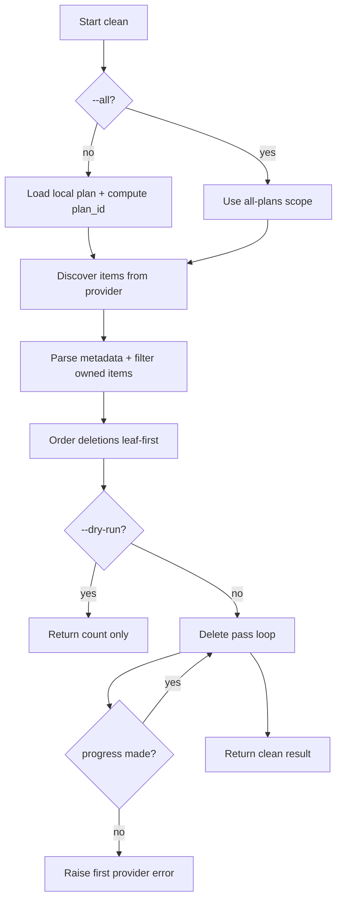

# Clean Workflow Design

## Purpose

`clean` removes planpilot-managed provider items discovered by metadata. It supports two scopes:

- default scope: items belonging to the current computed plan hash
- all-plans scope: all planpilot-managed items, regardless of plan hash

## High-Level Flow

## Deletion Strategy

Deletion ordering is planner-driven to reduce relation constraint failures:

- children before parents (leaf-first)
- metadata parent IDs used when plan is absent (`--all` mode)
- cycle/unmapped-parent tolerant ordering

The apply path executes deletion in passes:

1. attempt deletion for all remaining items
2. keep failed deletions for next pass
3. if at least one item was deleted, retry remaining set
4. if no progress was made in a pass, fail with the first provider error

## Dry-Run Semantics

Dry-run is discovery-only but still uses the real provider to ensure accurate previews.

- no delete mutations are executed
- item count reflects what apply mode would target

## Failure Semantics

- config/plan load/validation failures: CLI exit `3`
- auth/provider failures: CLI exit `4`
- sync/cleanup execution failures: CLI exit `5`

## Guarantees

- no provider writes in dry-run mode
- deterministic deletion planning for reproducible behavior
- explicit error surfacing when cleanup cannot progress
