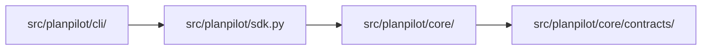

# Runtime Code Map

This page maps runtime ownership and allowed dependency direction.

## Runtime package map

## Domain map

| Area | Path | Responsibility |
|---|---|---|
| CLI | `src/planpilot/cli/` | Command parsing, app routing, summaries, local persistence hooks |
| SDK | `src/planpilot/sdk.py` | Composition root and public API facade |
| Engine | `src/planpilot/core/engine/` | Discovery, upsert, enrich, relation orchestration |
| Plan | `src/planpilot/core/plan/` | Load, validate, and hash plan data |
| Providers | `src/planpilot/core/providers/` | External platform adapters and dry-run provider |
| Renderers | `src/planpilot/core/renderers/` | Body rendering and metadata marker emission |
| Config | `src/planpilot/core/config/` | Config loading and scaffold helpers |
| Auth | `src/planpilot/core/auth/` | Token resolver factory and preflight checks |
| Map Sync | `src/planpilot/core/map_sync/` | Remote plan ID discovery/selection and local sync-map reconciliation |
| Clean | `src/planpilot/core/clean/` | Metadata-scoped item discovery and leaf-first deletion planning |

## Boundary rules

- CLI imports public API (`planpilot`) and approved CLI helpers; it does not import provider internals.
- SDK may compose core domains and is the only cross-domain composition root.
- Core domains are peer runtime modules and do not depend on CLI.
- Contracts stay provider-agnostic and contain only shared types/interfaces.

## Related

- [Architecture](./architecture.md)
- [Repository Layout](./repository-layout.md)
- [Contracts](./contracts.md)
