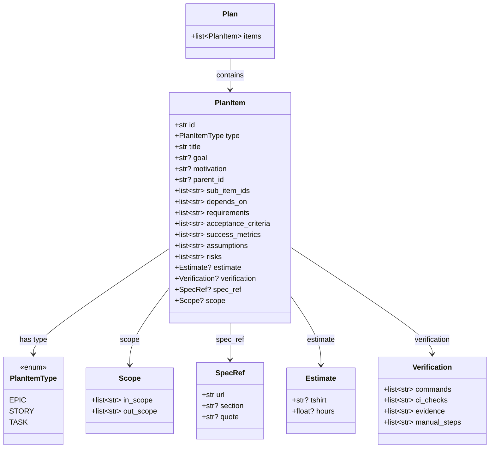
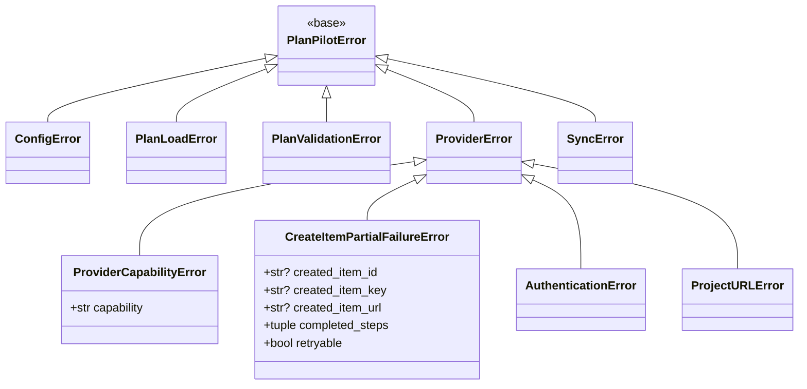

# Contracts Reference

The Contracts layer is the foundation of PlanPilot — pure data types and abstract interfaces with zero dependencies on other layers. Organized into six domains plus an exception hierarchy.

## Domain Dependencies

```
plan domain          (no dependencies)
├── item domain      (depends on plan — uses PlanItemType)
│   ├── provider domain   (depends on item — uses Item, inputs)
│   └── sync domain       (depends on item — to_sync_entry conversion)
└── renderer domain  (depends on plan — uses PlanItem)

config domain        (no dependencies)
exceptions           (no dependencies)
```

`plan` and `config` are independent foundations. All other domains depend downward only.

## Plan Domain

<!-- NOTE: PlanItem fields also appear in the UML class diagram in architecture.md — keep both in sync -->

**Responsibility:** The input structure — plan entities that users define in JSON files.



**`PlanItem`** is a single flat model for all plan entities. The `type` field discriminates epics, stories, and tasks. Fields that don't apply to a given type are validated by `PlanValidator`:

- **Required (all types):** `id`, `type`, `title`, `goal`, `requirements`, `acceptance_criteria`
- **Hierarchy:** `parent_id` (canonical), `sub_item_ids` (optional consistency projection), `depends_on`
- **Optional (all types):** `motivation`, `spec_ref`, `scope`, `assumptions`, `risks`, `estimate`, `success_metrics`
- **Task-only:** `verification`

**Dependencies:** None

## Item Domain

**Responsibility:** Provider-agnostic work item abstraction — what a work item looks like and how to create/update/search items, independent of any specific provider.

**Models:**

| Type | Fields | Purpose |
|------|--------|---------|
| `CreateItemInput` | `title`, `body`, `item_type: PlanItemType`, `labels`, `size` | Create a new item |
| `UpdateItemInput` | `title`, `body`, `item_type`, `labels`, `size` | Reconcile an existing item (non-None fields applied) |
| `ItemSearchFilters` | `labels: list[str]`, `body_contains: str` | Search/discovery filters |
| `ItemFields` | Base fields shared by inputs/filters | |

**Contracts:**

```python
class Item(ABC):
    # Data (read-only)
    id: str                       # Provider-internal ID (e.g. node_id)
    key: str                      # Human-readable key (e.g. "#42", "PROJ-123")
    url: str                      # Full URL to the item
    title: str
    body: str
    item_type: PlanItemType | None  # None for items with unrecognized type

    # Relation methods (implemented by provider subclasses)
    @abstractmethod
    async def set_parent(self, parent: Item) -> None: ...

    @abstractmethod
    async def add_dependency(self, blocker: Item) -> None: ...

    @abstractmethod
    async def reconcile_relations(self, *, parent: Item | None, blockers: list[Item]) -> None: ...
```

`reconcile_relations(...)` is the orchestration path used by the engine. `set_parent(...)` and `add_dependency(...)` remain part of the contract for compatibility and provider-level relation helpers.

**Dependencies:** Uses `PlanItemType` from plan domain.

## Sync Domain

**Responsibility:** Sync state and results. Tracks the mapping between plan entities and provider items.

| Type | Fields | Purpose |
|------|--------|---------|
| `SyncEntry` | `id`, `key`, `url`, `item_type` | Mapping entry for a single item |
| `SyncMap` | `plan_id`, `target`, `board_url`, `entries: dict[str, SyncEntry]` | Full sync map (flat, keyed by item ID) |
| `SyncResult` | `sync_map`, `items_created: dict[PlanItemType, int]`, `dry_run` | Return value from engine |

**Utilities:**
- `to_sync_entry(item: Item) -> SyncEntry` — converts an `Item` to a `SyncEntry` for persistence

**Dependencies:** Uses `Item` from item domain.

## Config Domain

**Responsibility:** Configuration for sync runs. Loadable from a JSON config file so the SDK and CLI share a single source of truth.

| Type | Key Fields | Purpose |
|------|------------|---------|
| `PlanPilotConfig` | `provider`, `target`, `auth`, `token`, `board_url`, `plan_paths`, `validation_mode`, `sync_path`, `label`, `max_concurrent`, `field_config` | Top-level config, loadable from `planpilot.json` |
| `PlanPaths` | `epics`, `stories`, `tasks`, `unified` | Plan file paths (multi-file or unified mode) |
| `FieldConfig` | `status`, `priority`, `iteration`, `size_field`, `size_from_tshirt`, `create_type_strategy`, `create_type_map` | Project field preferences |

See [config module spec](../modules/config.md) for full field definitions, validation rules, and JSON schema examples.

**Dependencies:** None

## Provider Domain

**Responsibility:** Contract for external system adapters. Defines what any provider (GitHub, Jira, Linear) must be able to do.

```python
class Provider(ABC):
    async def __aenter__(self) -> Provider: ...
    async def __aexit__(self, exc_type, exc_val, exc_tb) -> None: ...
    async def search_items(self, filters: ItemSearchFilters) -> list[Item]: ...
    async def create_item(self, input: CreateItemInput) -> Item: ...
    async def update_item(self, item_id: str, input: UpdateItemInput) -> Item: ...
    async def get_item(self, item_id: str) -> Item: ...
    async def delete_item(self, item_id: str) -> None: ...
```

See [providers module spec](../modules/providers.md) for discovery capabilities, partial failure contract, and reconciliation ownership rules.

**Note:** `ProviderContext` is **not** part of Contracts. It is a base class in `providers/base.py` (Core layer) that concrete providers subclass for resolved state. Opaque to engine and SDK.

**Dependencies:** Uses `Item`, `CreateItemInput`, `UpdateItemInput`, `ItemSearchFilters` from item domain.

## Renderer Domain

**Responsibility:** Contract for body formatting. A single unified method renders any `PlanItem` — the renderer inspects which fields are present and skips empty ones.

```python
class RenderContext:
    plan_id: str                              # Deterministic plan hash for metadata block
    parent_ref: str | None                    # Human-readable ref to parent (e.g. "#42")
    sub_items: list[tuple[str, str]]          # (key, title) of child items
    dependencies: dict[str, str]              # {dep_id: issue_ref} for blocked-by links

class BodyRenderer(ABC):
    @abstractmethod
    def render(self, item: PlanItem, context: RenderContext) -> str: ...
```

The renderer does not need to know the item's type. Fields that are empty/None are skipped. This fully decouples the renderer from specific plan entity types.

**Dependencies:** Uses `PlanItem` from plan domain.

## Exception Hierarchy



| Exception | Raised By | CLI Exit Code |
|-----------|-----------|---------------|
| `ConfigError` | Config loader | 3 |
| `PlanLoadError` | Plan loader | 3 |
| `PlanValidationError` | Plan validator | 3 |
| `AuthenticationError` | Token resolver, provider | 4 |
| `ProviderError` | Provider operations | 4 |
| `ProviderCapabilityError` | Provider setup (missing capabilities) | 4 |
| `CreateItemPartialFailureError` | Provider `create_item()` | 5 (wrapped in `SyncError`) |
| `ProjectURLError` | Provider setup (invalid board URL) | 4 |
| `SyncError` | Engine reconciliation failures | 5 |
