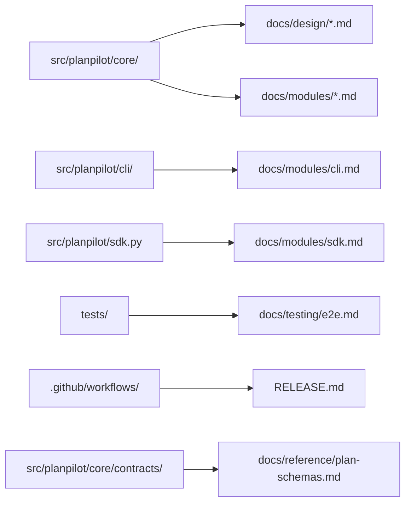
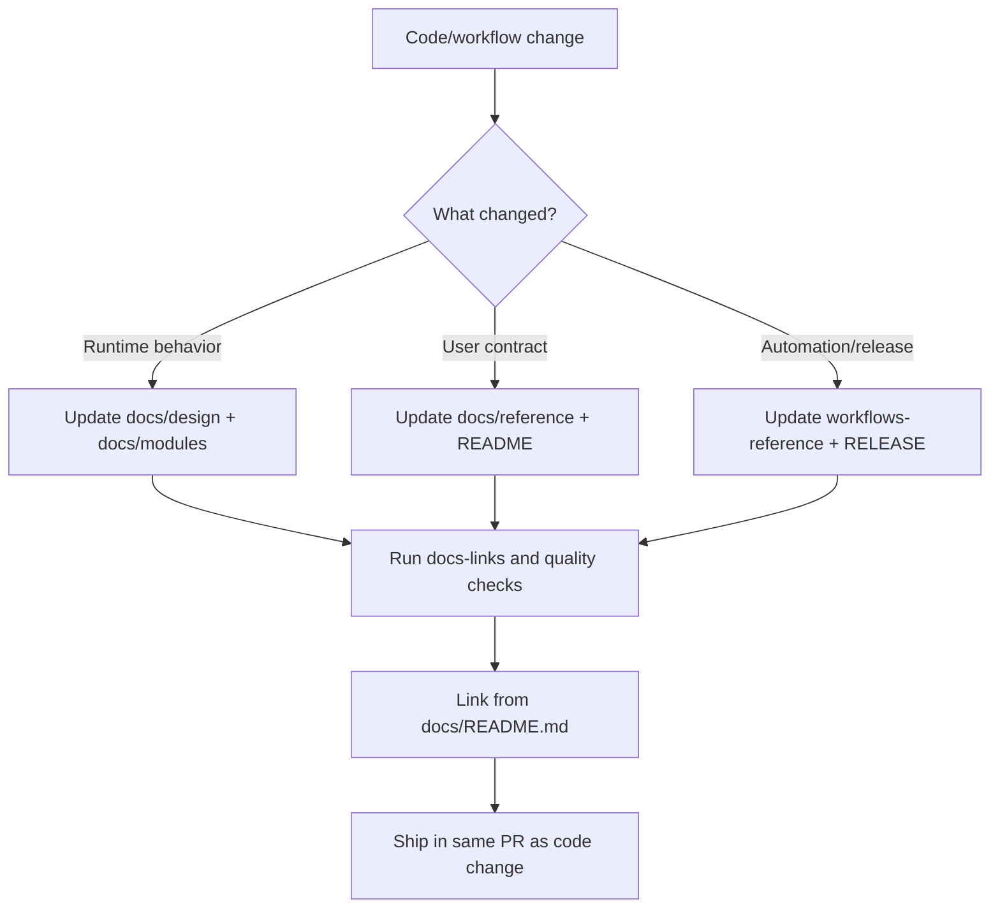
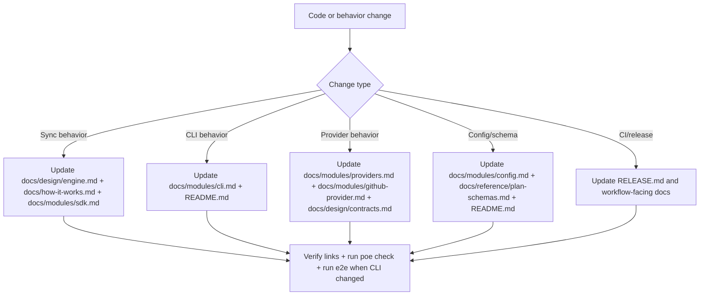

# Documentation Architecture

This guide defines how documentation is organized, how it maps to runtime code, and which files should be updated for common change types.

## Information Architecture

```mermaid
flowchart TD
    Root[docs/README.md\nNavigation hub] --> Design[docs/design/\nArchitecture and behavior contracts]
    Root --> Modules[docs/modules/\nModule-level specs]
    Root --> Reference[docs/reference/\nSchemas and user-facing formats]
    Root --> Guides[docs/guides/\nTroubleshooting and operator runbooks]
    Root --> Testing[docs/testing/\nVerification strategy]
    Root --> Decisions[docs/decisions/\nADR rationale]
    Root --> Plans[docs/plans/\nHistorical execution plans]

    Design --> A1[architecture.md]
    Design --> A2[contracts.md]
    Design --> A3[engine.md]
    Design --> A4[map-sync.md]
    Design --> A5[clean.md]
    Design --> A6[repository-layout.md]
    Design --> A7[codemap.md]

    Modules --> M1[cli.md]
    Modules --> M2[sdk.md]
    Modules --> M3[providers.md]
    Modules --> M4[github-provider.md]
    Modules --> M5[plan.md]
    Modules --> M6[config.md]
    Modules --> M7[auth.md]
    Modules --> M8[renderers.md]
    Modules --> M9[map-sync.md]
    Modules --> M10[clean.md]

    Reference --> R1[cli-reference.md]
    Reference --> R2[sdk-reference.md]
    Reference --> R3[config-reference.md]
    Reference --> R4[exit-codes.md]
    Reference --> R5[plan-schemas.md]
    Reference --> R6[workflows-reference.md]
    Reference --> R7[developer-workflow.md]
```

## Code-to-Docs Ownership Map

## Update Rules

- Update `README.md` for onboarding, CLI usage, or user-visible behavior changes.
- Update `docs/README.md` whenever docs structure or navigation changes.
- Update `docs/design/*.md` when behavior contracts or architecture constraints change.
- Update `docs/modules/*.md` when implementation details change in the corresponding runtime module.
- Update `docs/reference/*.md` when user-facing command/config/output contracts change.
- Update `docs/reference/workflows-reference.md` when CI/release/security workflow behavior changes.
- Update `docs/reference/developer-workflow.md` when local verification commands or contributor expectations change.
- Update `RELEASE.md` and workflow docs when release or CI semantics change.

## Docs Lifecycle

## Docs Update Decision Flow

## What To Update For Common Changes

| Change type | Must update |
|---|---|
| CLI flags, summaries, or exit codes | `README.md`, `docs/modules/cli.md`, `docs/how-it-works.md` |
| Sync behavior (discovery/upsert/enrich/relations) | `docs/design/engine.md`, `docs/how-it-works.md`, `docs/modules/sdk.md` |
| Map sync behavior | `docs/design/map-sync.md`, `docs/modules/cli.md`, `docs/modules/sdk.md` |
| Clean behavior | `docs/design/clean.md`, `docs/modules/cli.md`, `docs/modules/sdk.md` |
| Provider internals or capability model | `docs/modules/providers.md`, `docs/modules/github-provider.md`, `docs/design/contracts.md` |
| Config schema or defaults | `README.md`, `docs/modules/config.md`, `docs/reference/plan-schemas.md` |
| CI/release hardening | `README.md` (if user-visible), `RELEASE.md`, `docs/reference/workflows-reference.md` |
| Contributor verification flow | `CONTRIBUTING.md`, `docs/reference/developer-workflow.md` |

## Verification Checklist

- `poe check` passes.
- `poe docs-links` passes.
- `poe test-e2e` passes when CLI behavior changes.
- Local markdown links resolve.
- New docs files are linked from `docs/README.md`.
