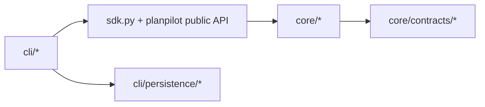

# Repository Layout

This document is the canonical map of package ownership in the current architecture.

## Ownership Model

- `src/planpilot/core/` owns runtime domains and integrations.
- `src/planpilot/cli/` owns command UX and local persistence helpers.
- `src/planpilot/sdk.py` is the composition root and public programmatic entrypoint.
- `src/planpilot/__init__.py` is the public import surface.

## Current Runtime Tree

```text
src/planpilot/
|- __init__.py
|- __main__.py
|- sdk.py
|- cli/
|  |- __init__.py
|  |- __main__.py
|  |- parser.py
|  |- app.py
|  |- commands/
|  |- persistence/
|  |- progress/
|  |- init/
|  `- scaffold/
`- core/
   |- auth/
   |- clean/
   |- config/
   |- contracts/
   |- engine/
   |- init/
   |- map_sync/
   |- metadata.py
   |- plan/
   |- providers/
   |- renderers/
   `- targets/
```

## Dependency Direction



Rules:

- CLI does not import core internals directly.
- SDK may compose across core domains.
- Core domains do not depend on CLI.

## Contributor Quick Map

| Task | Primary Location |
|------|------------------|
| Add/adjust CLI command | `src/planpilot/cli/commands/` |
| Add scaffold/default-detection behavior | `src/planpilot/core/config/scaffold.py` |
| Change config loading rules | `src/planpilot/core/config/loader.py` |
| Modify sync orchestration | `src/planpilot/core/engine/engine.py` |
| Extend provider behavior | `src/planpilot/core/providers/` |
| Extend markdown rendering | `src/planpilot/core/renderers/markdown.py` |
| Update SDK public methods | `src/planpilot/sdk.py` |

## Related

- [Runtime Code Map](./codemap.md)
- [Architecture](./architecture.md)
