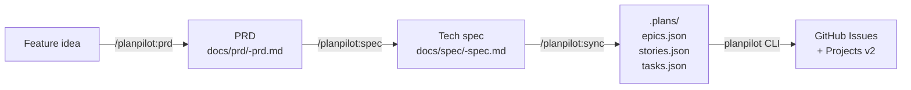

# Plugin and Skills Guide

planpilot ships a Claude Code plugin and three agent skills that form a complete product planning workflow: write a feature idea, get a structured PRD, turn it into a technical spec, then sync the resulting epics/stories/tasks to GitHub Issues + Projects v2.

## Skill chain overview



Each step is independent — you can enter the chain at any point.

| Skill | Command | Use when |
|-------|---------|----------|
| `create-prd` | `/planpilot:prd` | You have a feature idea and need a structured PRD |
| `create-tech-spec` | `/planpilot:spec` | You have a PRD and need a codebase-aware technical spec |
| `plan-sync` | `/planpilot:sync` | You have a PRD/spec and want `.plans` JSON + GitHub sync |

---

## Install: Claude Code Plugin (recommended)

The plugin is registered on GitHub; the underlying `planpilot` CLI is distributed via PyPI and installed automatically when Claude Code installs the plugin:

```bash
claude plugin marketplace add aryeko/planpilot
claude plugin install planpilot@planpilot
```

Then invoke skills with prefixed commands:

```bash
/planpilot:prd     # Create a PRD from a feature idea
/planpilot:spec    # Create a tech spec from a PRD
/planpilot:sync    # Generate .plans JSON and sync to GitHub
```

---

## Install: Agent self-install

Tell your agent (any platform supporting filesystem skills):

```text
Fetch and follow instructions from https://raw.githubusercontent.com/aryeko/planpilot/main/src/planpilot/skills/INSTALL.agent.md
```

The agent installs `planpilot` from PyPI and copies all three skill files automatically.

---

## Install: Manual

```bash
for skill in create-prd create-tech-spec plan-sync; do
  mkdir -p ~/.agents/skills/$skill
  curl -fsSL "https://raw.githubusercontent.com/aryeko/planpilot/main/src/planpilot/skills/$skill/SKILL.md" \
    -o ~/.agents/skills/$skill/SKILL.md
done
```

Full instructions: [`src/planpilot/skills/INSTALL.md`](../../src/planpilot/skills/INSTALL.md)

---

## Walkthrough

### Step 1 — Create a PRD

Invoke `/planpilot:prd` and describe a feature. The skill asks clarifying questions and produces a structured PRD saved to `docs/prd/<slug>-prd.md`.

**Outputs:** goal, motivation, requirements, acceptance criteria, success metrics, risks, open questions.

### Step 2 — Create a tech spec

Invoke `/planpilot:spec` and point it at your PRD. The skill reads your codebase and produces an implementation spec saved to `docs/spec/<slug>-spec.md`.

**Outputs:** architecture decisions, component design, data model, API contracts, test plan, rollout approach.

### Step 3 — Sync to GitHub

Invoke `/planpilot:sync` and point it at your PRD or spec. The skill generates `.plans/epics.json`, `.plans/stories.json`, `.plans/tasks.json`, then calls `planpilot sync` to push them to GitHub Issues + Projects v2.

**Prerequisite:** `planpilot.json` config file in your repo root (run `planpilot init` to generate one).

---

## Troubleshooting

| Problem | Fix |
|---------|-----|
| Commands not registered | Reinstall: `claude plugin install planpilot@planpilot` |
| `planpilot` not found after plugin install | Run `pip install planpilot` or `pipx install planpilot` manually |
| Sync fails with auth error | Check `auth` field in `planpilot.json`; run `planpilot init` to regenerate |
| Skill not invoked by agent | Verify skill files exist at `~/.agents/skills/*/SKILL.md` |

---

## Related

- [Plugin Reference](../reference/plugin-reference.md) — command and install method quick lookup
- [CLI Reference](../reference/cli-reference.md) — `planpilot sync` / `clean` / `map sync` flags
- [Troubleshooting](./troubleshooting.md) — CLI and provider failures
