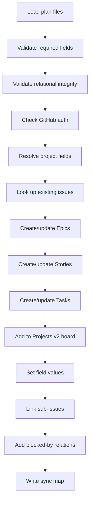
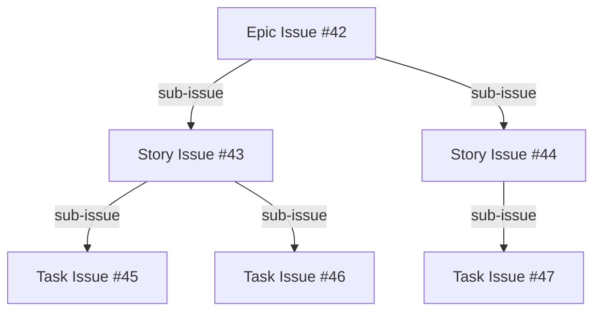
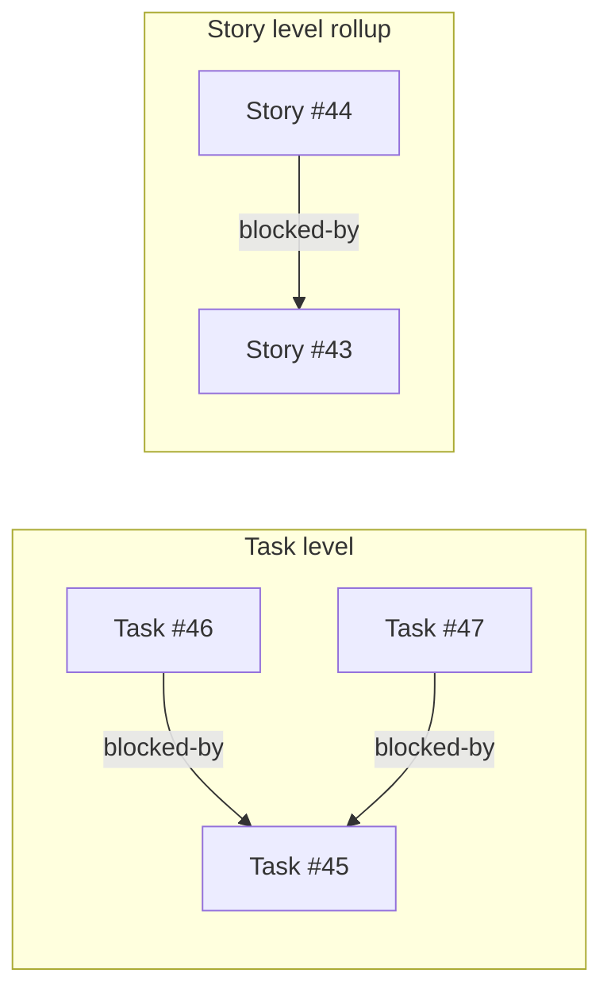

# How It Works

## Overview

planpilot reads structured plan files (JSON) and creates a fully linked project board on GitHub. It creates GitHub Issues for each epic, story, and task, links them with sub-issue relationships and blocked-by dependencies, and adds them to a GitHub Projects v2 board with configured fields.

## Sync pipeline



## Validation

planpilot validates plan files in two phases before touching GitHub:

1. **Required fields** -- every epic, story, and task must contain all required fields defined in the [schema](schemas.md). Missing fields produce clear error messages (e.g. `epic[0] missing required field 'goal'`). Validation stops immediately if any fields are missing.

2. **Relational integrity** -- cross-references are checked: `epic_id` on stories must match an epic, `story_id` on tasks must match a story, `depends_on` must reference valid task IDs, and parent `story_ids`/`task_ids` lists must be complete and consistent.

There are no silent fallbacks -- if a required field or relationship is missing, the tool fails with an actionable error rather than guessing defaults.

## Idempotency

planpilot is safe to rerun. It uses **HTML comment markers** embedded in issue bodies to track which plan artifact each issue corresponds to:

```html
<!-- PLAN_ID: a1b2c3d4e5f6 -->
<!-- EPIC_ID: E-1 -->
```

The `PLAN_ID` is a SHA-256 hash (first 12 chars) of the normalized plan content. On subsequent runs, planpilot searches for existing issues with matching markers and updates them instead of creating duplicates.

## What gets created

### Issues

Each plan artifact becomes a GitHub Issue:

| Plan artifact | GitHub Issue Type | Contains |
|---------------|-------------------|----------|
| Epic | Epic issue | Goal, scope, success metrics, risks, linked stories |
| Story | Story issue | Goal, scope, linked to parent epic, linked tasks |
| Task | Task issue | Motivation, requirements, acceptance criteria, verification, dependencies |

Issue types (Epic, Story, Task) are set automatically when the repository has GitHub Issue Types enabled. Otherwise, regular issues are created.

### Hierarchy

planpilot creates a sub-issue tree that mirrors the plan structure:



### Dependencies

Task `depends_on` relationships become **blocked-by** links on GitHub. Dependencies are rolled up automatically to parent stories and epics:



- If tasks in different stories have dependencies, their parent stories get a blocked-by link
- If stories in different epics have dependencies, their parent epics get a blocked-by link

### Project fields

When `--project-url` points to a GitHub Projects v2 board, each issue is:

1. Added to the project
2. Given field values based on CLI flags:
   - **Status** (e.g. "Backlog") -- `--status`
   - **Priority** (e.g. "P1") -- `--priority`
   - **Iteration** (e.g. current active) -- `--iteration`
   - **Size** (from task's `estimate.tshirt`) -- `--size-field` + `--size-from-tshirt`

### Labels

A label (default: `codex`) is applied to all created issues. If the label doesn't exist, planpilot creates it.

## Sync map output

After syncing, planpilot writes a JSON sync map file (specified by `--sync-path`) that maps plan IDs to GitHub issue numbers:

```json
{
  "plan_id": "a1b2c3d4e5f6",
  "repo": "your-org/your-repo",
  "project_url": "https://github.com/orgs/your-org/projects/1",
  "epics": {
    "E-1": {
      "issue_number": 42,
      "url": "https://github.com/your-org/your-repo/issues/42",
      "node_id": "I_abc123",
      "project_item_id": "PVTI_xyz789"
    }
  },
  "stories": {
    "S-1": { "issue_number": 43, "url": "...", "node_id": "...", "project_item_id": "..." }
  },
  "tasks": {
    "T-1": { "issue_number": 44, "url": "...", "node_id": "...", "project_item_id": "..." }
  }
}
```

This file enables idempotent reruns and can be used by other tools to reference created issues.

## Dry-run mode

When `--dry-run` is passed, planpilot:
- Validates all input files
- Checks GitHub authentication
- Logs every action it **would** take (prefixed with `[dry-run]`)
- Writes a sync map with placeholder values
- Makes **zero** API calls that modify state

Always dry-run first before using `--apply`.

## Multi-epic plans

planpilot validates that each run contains exactly one epic. For plans with multiple epics, use `planpilot-slice` to split into per-epic files, then sync each one sequentially. See the [CLI reference](cli-reference.md) for usage.

Cross-epic task dependencies are automatically filtered out during slicing to keep each per-epic plan self-contained.
