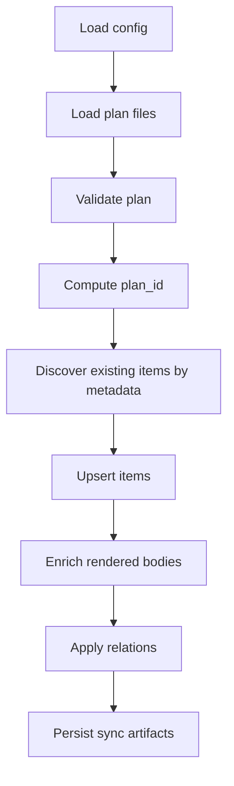

# How It Works

## Overview

`planpilot` reads plan JSON, validates it, discovers existing provider items by metadata marker, then creates/updates items and relations. Runs are idempotent by design.

## Sync flow

1. Load config from `planpilot.json`.
2. Load plan files (`unified` or `epics/stories/tasks`).
3. Validate plan structure and references (`strict` or `partial` mode).
4. Compute deterministic `plan_id`.
5. Discover existing items by metadata (`PLAN_ID:<plan_id>` marker).
6. Upsert missing/changed items.
7. Enrich bodies with context links/checklists.
8. Apply relations (parent/dependency) when supported by provider.
9. Persist sync map (`sync_path` for apply, `sync_path.dry-run` for dry-run) in CLI flows.

## Idempotency model

- Each rendered body includes:
  - `PLANPILOT_META_V1`
  - `PLAN_ID:<id>`
  - `ITEM_ID:<id>`
  - `ITEM_TYPE:<EPIC|STORY|TASK>`
  - `PARENT_ID:<id or empty>`
  - `END_PLANPILOT_META`
- Discovery matches these markers, so reruns update the same provider items instead of creating duplicates.

## Dry-run behavior

- `sync --dry-run` uses `DryRunProvider`:
  - no auth/network calls
  - no provider mutations
- A dry-run sync map is still written to `<sync_path>.dry-run` for inspection.
- `clean --dry-run` is discovery-only but still uses the real provider so deletion previews are accurate.

## Apply behavior

- `--apply` uses the configured provider.
- Create/update operations run through provider-level retries/rate-limit handling.
- Sync map is written to `sync_path`.

## Validation modes

- `strict`: all references (`parent_id`, `depends_on`) must resolve in loaded items.
- `partial`: unresolved references are allowed when referenced items are not included in this run.

## Output and exit codes

- CLI summary is human-focused.
- See [reference/exit-codes.md](reference/exit-codes.md) for canonical process-exit mapping.
