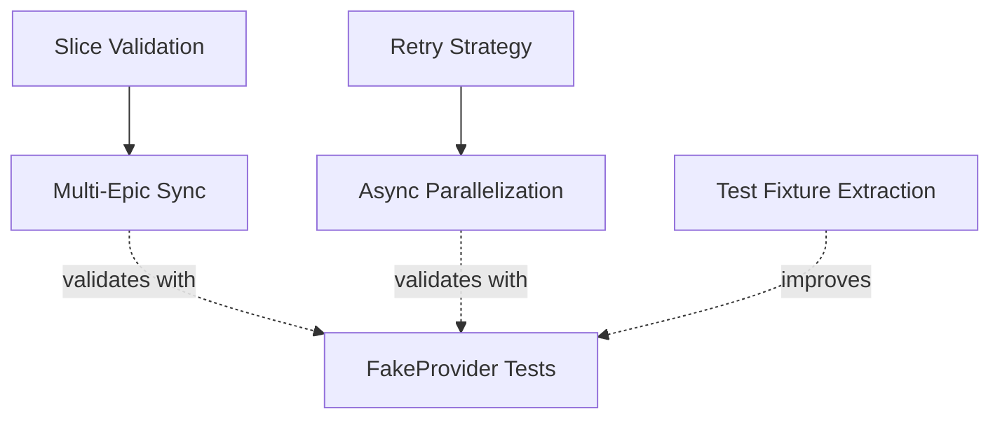

# Design Specs

This directory contains design specifications for planned improvements to
planpilot. Each spec documents the problem, proposed solution, implementation
scope, and success criteria.

## Overview

| # | Spec | Priority | Effort | Status |
|---|------|----------|--------|--------|
| 1 | [Multi-Epic Sync](multi-epic-sync.md) | **P0 -- Critical** | L | Spec ready |
| 2 | [Slice Input Validation](slice-validation.md) | **P0 -- Critical** | S | Spec ready |
| 3 | [Retry Strategy](retry-strategy.md) | **P1 -- High** | M | Spec ready |
| 4 | [Async Parallelization](async-parallelization.md) | **P2 -- Medium** | M | Spec ready |
| 5 | [FakeProvider Integration Tests](fake-provider-integration-tests.md) | **P2 -- Medium** | M | Spec ready |
| 6 | [Engine Test Fixture Extraction](engine-test-fixture-extraction.md) | **P3 -- Low** | S | Spec ready |

Effort: **S** = small (< 1 day), **M** = medium (1-3 days), **L** = large (3-5 days)

## Priority Rationale

### P0 -- Critical (correctness / core functionality gaps)

**[Multi-Epic Sync](multi-epic-sync.md)** -- The single-epic constraint is the
most impactful architectural limitation. Users must manually orchestrate slicing
and per-epic sync via bash loops. The better slice implementation lives in an
unpackaged `skills/` script instead of the pip-installable package. Phase 1
(consolidate slice) and Phase 2 (`sync-all` command) close this gap.

**[Slice Input Validation](slice-validation.md)** -- Prerequisite for multi-epic
sync. Without validation, malformed JSON produces silent corruption or opaque
`KeyError` traces. Small effort, high safety payoff. Should land before or
alongside multi-epic Phase 1.

### P1 -- High (reliability)

**[Retry Strategy](retry-strategy.md)** -- A single transient API failure aborts
the entire sync. For plans with 100+ entities this is a real reliability problem.
The spec accounts for the `gh` CLI architecture (no direct HTTP header access)
and covers both primary/secondary rate limits and GraphQL-level errors.

### P2 -- Medium (performance / test quality)

**[Async Parallelization](async-parallelization.md)** -- The engine uses
`asyncio` but executes all API calls sequentially. For large plans, parallel
execution can cut sync time by 4-5x. Depends on retry strategy being in place
first (concurrent calls amplify transient failure risk).

**[FakeProvider Integration Tests](fake-provider-integration-tests.md)** -- All
engine tests use `AsyncMock`. A `FakeProvider` backed by in-memory data would
catch integration bugs that mocks hide (type mismatches, ordering issues,
idempotency regressions). Independent of other specs.

### P3 -- Low (code quality / hygiene)

**[Engine Test Fixture Extraction](engine-test-fixture-extraction.md)** --
Removes ~100 lines of boilerplate from `test_engine.py` by extracting a shared
`config_for_engine` fixture. Pure refactor, no behavior change. Can be done
anytime.

## Dependency Graph

Solid arrows = hard dependency (must be done first).
Dashed arrows = soft dependency (benefits from, but not blocked).

## Recommended Implementation Order

1. **Slice Validation** (S) -- Quick win, prerequisite for multi-epic.
2. **Multi-Epic Sync Phase 1** (M) -- Consolidate slice logic into package.
3. **Multi-Epic Sync Phase 2** (M) -- Add `sync-all` orchestrator command.
4. **Retry Strategy** (M) -- Reliability improvement, prerequisite for parallel.
5. **FakeProvider Integration Tests** (M) -- Can start anytime after step 3.
6. **Async Parallelization** (M) -- Performance win, needs retry first.
7. **Engine Test Fixture Extraction** (S) -- Cleanup, do whenever convenient.
