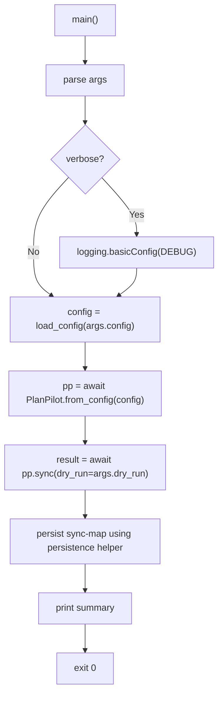

# CLI Module Spec

The CLI module (`src/planpilot/cli/`) is a thin shell wrapper around the SDK. It handles argument parsing, output formatting, command routing, and process exit behavior. It also owns when local artifacts are persisted via `planpilot.cli.persistence` helpers.

**CLI (L4)** — depends on SDK public API (`from planpilot import ...`) plus approved persistence helpers (`planpilot.cli.persistence.*`).

## Command Structure

```
planpilot [--version]
planpilot sync --config <path> (--dry-run | --apply) [--verbose]
planpilot clean [--config <path>] (--dry-run | --apply) [--all] [--verbose]
planpilot init [--output <path>] [--defaults]
planpilot map sync --config <path> (--dry-run | --apply) [--plan-id <id>] [--verbose]
```

v2 uses a subcommand pattern to allow future expansion.

### `sync` Subcommand

| Argument | Type | Required | Default | Description |
|----------|------|----------|---------|-------------|
| `--config` | `str` | No | `./planpilot.json` | Path to `planpilot.json` config file |
| `--dry-run` | flag | One of | — | Preview mode — uses `DryRunProvider` (no auth/network, no provider mutations) |
| `--apply` | flag | these | — | Apply mode — create/update items in provider |
| `--verbose`, `-v` | flag | No | `False` | Enable debug-level logging to stderr |

`--dry-run` / `--apply` are mutually exclusive and one is required. Explicit mode prevents accidental mutations.

## Execution Flow



## Output Format

### Success Summary

```
planpilot - sync complete (apply)

  Plan ID:   a1b2c3d4e5f6
  Target:    owner/repo
  Board:     https://github.com/orgs/owner/projects/1

  Items:     20 total (2 epics, 6 stories, 12 tasks)
  Created:   1 (1 story)
  Matched:   19 (2 epics, 5 stories, 12 tasks)

  Sync map:  /abs/path/to/sync-map.json           (apply mode)
  Sync map:  /abs/path/to/sync-map.json.dry-run   (dry-run mode)

  [dry-run] No changes were made
```

This summary is human-oriented and not a stable machine contract. Automation should use SDK return objects (`SyncResult`).

**Computing "Matched" counts:** Group `sync_map.entries` by `entry.item_type`, then subtract `items_created` counts.

### Error Output

All errors go to stderr with user-friendly messages from `PlanPilotError` subclasses.

### `map sync` Subcommand

Reconcile local `sync-map.json` entries from provider metadata without mutating provider items.

| Argument | Type | Required | Default | Description |
|----------|------|----------|---------|-------------|
| `--config` | `str` | No | `./planpilot.json` | Path to `planpilot.json` config file |
| `--dry-run` | flag | One of | — | Preview reconciliation only (no writes) |
| `--apply` | flag | these | — | Persist reconciled sync-map and local plan files |
| `--plan-id` | `str` | No | auto | Explicit remote plan ID to reconcile |
| `--verbose`, `-v` | flag | No | `False` | Enable debug-level logging to stderr |

Plan ID selection rules:

- When `--plan-id` is provided, it is used directly.
- When omitted, `map sync` discovers remote plan IDs from metadata:
  - one candidate: auto-select
  - multiple candidates with interactive TTY: prompt to select
  - multiple candidates without TTY: fail and require `--plan-id`
  - zero candidates: fail with remediation guidance

`map sync` never creates/updates/deletes provider items. In apply mode, it writes local artifacts only:

- reconciled `sync-map.json`
- local plan files at configured `plan_paths` (bootstrapped from remote metadata/body)

### `clean` Subcommand

Delete provider issues discovered from planpilot metadata.

| Argument | Type | Required | Default | Description |
|----------|------|----------|---------|-------------|
| `--config` | `str` | No | `./planpilot.json` | Path to `planpilot.json` config file |
| `--dry-run` | flag | One of | — | Preview deletions only (no provider writes) |
| `--apply` | flag | these | — | Execute issue deletions |
| `--all` | flag | No | `False` | Target all planpilot-managed issues by label, regardless of current plan hash |
| `--verbose`, `-v` | flag | No | `False` | Enable debug-level logging to stderr |

`clean` always discovers through the real provider. In default mode it targets issues matching the current computed plan hash. With `--all`, it targets all planpilot metadata-managed issues.

### `init` Subcommand

Interactively generate a `planpilot.json` config file.

| Argument | Type | Required | Default | Description |
|----------|------|----------|---------|-------------|
| `--output`, `-o` | `str` | No | `planpilot.json` | Output file path |
| `--defaults` | flag | No | `False` | Generate config with auto-detected defaults (no prompts) |

**Interactive mode** (default): step-by-step wizard using [questionary](https://github.com/tmbo/questionary) prompts. Asks for provider, target repo, board URL, plan layout, paths, auth strategy, and advanced options.

**Defaults mode** (`--defaults`): auto-detects the git remote for `target`, scans for existing plan files, and writes a config with sensible defaults. No user interaction required.

Both modes refuse to overwrite an existing file unless the user confirms (interactive) or a different `--output` path is specified (defaults).

`init` emits explicit defaults for important runtime fields (for example `sync_path`, `label`, `validation_mode`, and `max_concurrent`) so generated configs are predictable.

The `init` command calls the SDK scaffold functions (`detect_target`, `detect_plan_paths`, `scaffold_config`) which are also available programmatically.

## Exit Codes

| Code | Meaning |
|------|---------|
| `0` | Success |
| `2` | Usage/argument error or user abort (argparse, init cancelled, file exists) |
| `3` | Config or plan validation failure |
| `4` | Authentication/provider/network failure |
| `5` | Sync/reconciliation failure |
| `1` | Unexpected internal failure |

## Design Decisions

| Decision | Rationale |
|----------|-----------|
| Config-file driven (not arg-driven) | Config file is shareable, versionable, used by both CLI and SDK |
| `--dry-run` / `--apply` on CLI | Per-invocation choice, not persisted config |
| Subcommand pattern | Future expansion without breaking existing usage |
| No `--provider`, `--target`, etc. | All in config file. CLI stays minimal |
| `--verbose` is CLI-only | Logging level is a runtime concern |
| Renderer hardcoded to "markdown" | Renderer selection could be added to config later |
| No `--json` output mode in v2 | Machine consumers should use SDK APIs |

## File Structure

```
src/planpilot/
├── cli/parser.py          # build_parser()
├── cli/app.py             # main() routing and exit code mapping
├── cli/commands/*.py      # sync, clean, init, map-sync command handlers
├── cli/persistence/*.py   # local sync-map and remote-plan persistence helpers
└── __main__.py            # python -m planpilot support
```
