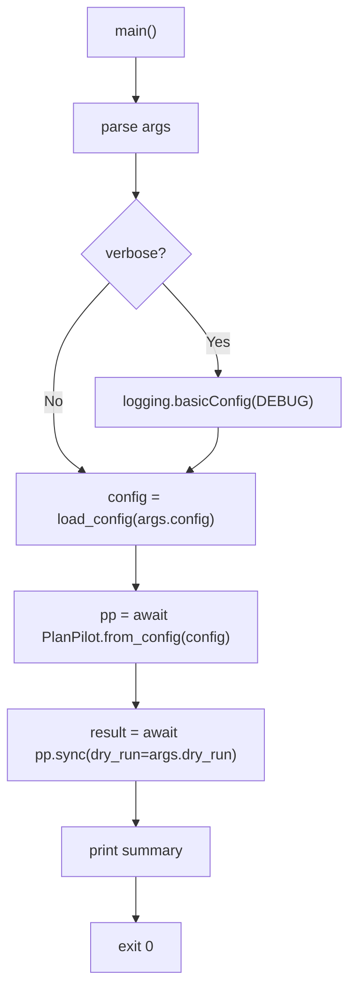

# CLI Module Spec

The CLI module (`cli.py`) is a thin shell wrapper around the SDK. It handles argument parsing, output formatting, and the async runtime boundary. No business logic — everything delegates to the SDK's public API.

**CLI (L4)** — depends only on the SDK's public API (`from planpilot import ...`).

## Command Structure

```
planpilot [--version]
planpilot sync --config <path> (--dry-run | --apply) [--verbose]
planpilot init [--output <path>] [--defaults]
```

v2 uses a subcommand pattern to allow future expansion.

### `sync` Subcommand

| Argument | Type | Required | Default | Description |
|----------|------|----------|---------|-------------|
| `--config` | `str` | Yes | — | Path to `planpilot.json` config file |
| `--dry-run` | flag | One of | — | Preview mode — uses `DryRunProvider` (no auth/network, no provider mutations) |
| `--apply` | flag | these | — | Apply mode — create/update items in provider |
| `--verbose`, `-v` | flag | No | `False` | Enable debug-level logging to stderr |

`--dry-run` / `--apply` are mutually exclusive and one is required. Explicit mode prevents accidental mutations.

## Execution Flow



## Output Format

### Success Summary

```
planpilot - sync complete (apply)

  Plan ID:   a1b2c3d4e5f6
  Target:    owner/repo
  Board:     https://github.com/orgs/owner/projects/1

  Created:   2 epic(s), 5 story(s), 12 task(s)
  Existing:  0 epic(s), 1 story(s), 3 task(s)

  Epic   E1      #42    https://github.com/owner/repo/issues/42
  Epic   E2      #43    https://github.com/owner/repo/issues/43
  Story  S1      #44    https://github.com/owner/repo/issues/44
  ...

  Sync map:  /abs/path/to/sync-map.json           (apply mode)
  Sync map:  /abs/path/to/sync-map.json.dry-run   (dry-run mode)

  [dry-run] No changes were made
```

This summary is human-oriented and not a stable machine contract. Automation should use SDK return objects (`SyncResult`).

**Computing "Existing" counts:** Group `sync_map.entries` by `entry.item_type`, subtract `items_created` counts. Only displayed when > 0.

### Item Table

| Column | Source | Description |
|--------|--------|-------------|
| Type | `PlanItemType` name | "Epic", "Story", "Task" |
| ID | `sync_map.entries` dict key | Plan-level item ID |
| Key | `SyncEntry.key` | Provider-assigned key (e.g. `#42`) |
| URL | `SyncEntry.url` | Full URL to the item |

### Error Output

All errors go to stderr with user-friendly messages from `PlanPilotError` subclasses.

### `init` Subcommand

Interactively generate a `planpilot.json` config file.

| Argument | Type | Required | Default | Description |
|----------|------|----------|---------|-------------|
| `--output`, `-o` | `str` | No | `planpilot.json` | Output file path |
| `--defaults` | flag | No | `False` | Generate config with auto-detected defaults (no prompts) |

**Interactive mode** (default): step-by-step wizard using [questionary](https://github.com/tmbo/questionary) prompts. Asks for provider, target repo, board URL, plan layout, paths, auth strategy, and advanced options.

**Defaults mode** (`--defaults`): auto-detects the git remote for `target`, scans for existing plan files, and writes a config with sensible defaults. No user interaction required.

Both modes refuse to overwrite an existing file unless the user confirms (interactive) or a different `--output` path is specified (defaults).

The `init` command calls the SDK scaffold functions (`detect_target`, `detect_plan_paths`, `scaffold_config`) which are also available programmatically.

## Exit Codes

| Code | Meaning |
|------|---------|
| `0` | Success |
| `2` | Usage/argument error or user abort (argparse, init cancelled, file exists) |
| `3` | Config or plan validation failure |
| `4` | Authentication/provider/network failure |
| `5` | Sync/reconciliation failure |
| `1` | Unexpected internal failure |

## Design Decisions

| Decision | Rationale |
|----------|-----------|
| Config-file driven (not arg-driven) | Config file is shareable, versionable, used by both CLI and SDK |
| `--dry-run` / `--apply` on CLI | Per-invocation choice, not persisted config |
| Subcommand pattern | Future expansion without breaking existing usage |
| No `--provider`, `--target`, etc. | All in config file. CLI stays minimal |
| `--verbose` is CLI-only | Logging level is a runtime concern |
| Renderer hardcoded to "markdown" | Renderer selection could be added to config later |
| No `--json` output mode in v2 | Machine consumers should use SDK APIs |

## File Structure

```
src/planpilot/
├── cli.py                 # build_parser, main, _run_sync, _run_init, _format_summary
├── scaffold.py            # detect_target, detect_plan_paths, scaffold_config, write_config, create_plan_stubs
└── __main__.py            # python -m planpilot support
```
