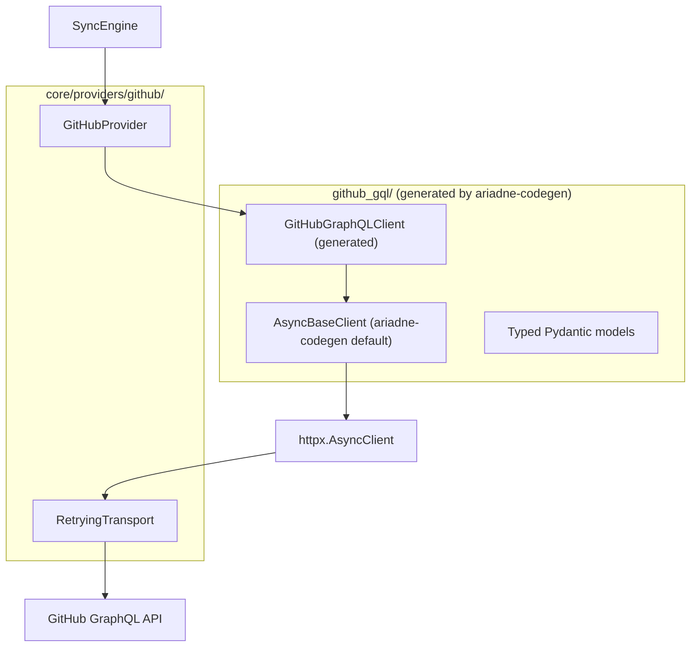
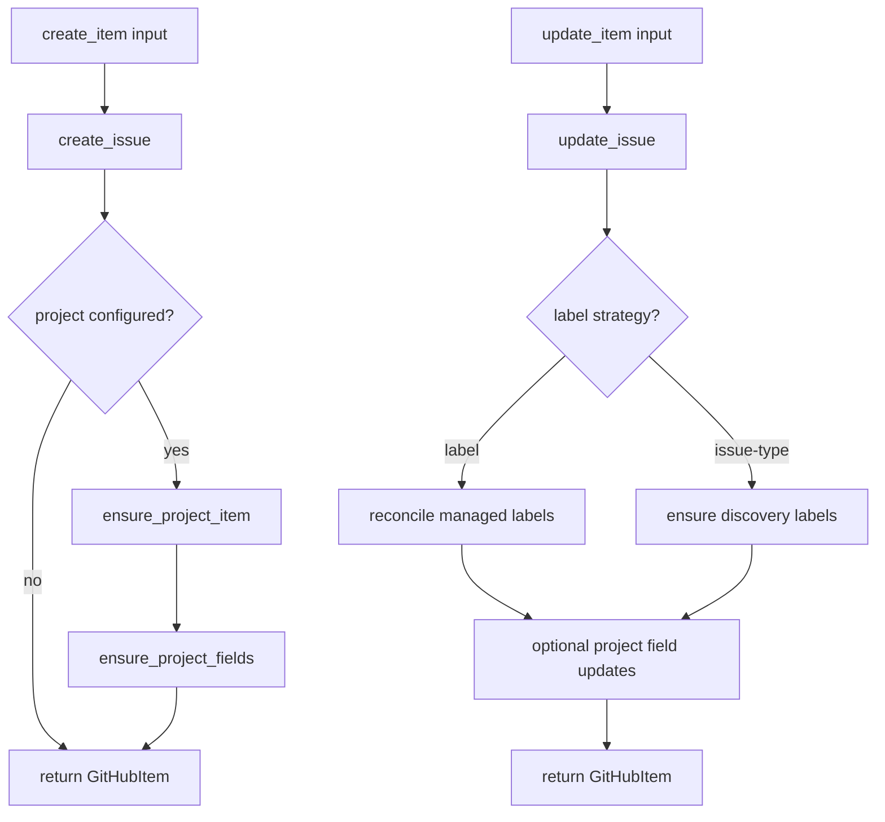

# GitHub Provider - Implementation Design

Full implementation details for the GitHub provider. For the provider contract and generic adapter patterns, see [providers.md](providers.md). For the ariadne-codegen technology decision, see [ADR-001](../decisions/001-ariadne-codegen.md).

## Architecture



- **`GitHubGraphQLClient`** (generated) - Typed async client with one method per operation. Inherits from ariadne-codegen's default `AsyncBaseClient`.
- **`RetryingTransport`** (`_retrying_transport.py`) - httpx transport wrapper that adds retry, backoff, and rate-limit handling to every HTTP request transparently.
- **`GitHubProvider`** - Thin adapter that calls `self._client.create_issue(...)` etc. No raw GraphQL strings, no `dict[str, Any]` parsing.

The provider contains **zero inline GraphQL**. All operations are defined in `.graphql` files and accessed through the generated client's typed methods.

## Requirements

| Operation | GraphQL Operation | Notes |
|-----------|-------------------|-------|
| Fetch repo context | `FetchRepo` | Repo ID, labels, issue types |
| Fetch org project | `FetchOrgProject` | Project ID for org-owned projects |
| Fetch user project | `FetchUserProject` | Project ID for user-owned projects |
| Fetch project fields | `FetchProjectFields` | Field IDs, single-select options, iterations |
| Search issues | `SearchIssues` | By label + body text (discovery), paginated |
| Get single issue | `GetIssue` | Fetch by node ID |
| Find labels | `FindLabels` | Search labels by name on repository |
| Fetch project items | `FetchProjectItems` | Build issue-to-project-item map, paginated |
| Fetch relations | `FetchRelations` | Parent + blockedBy relations |
| Create issue | `CreateIssue` | Atomic: supports `labelIds`, `issueTypeId`, `projectV2Ids`, `parentIssueId` |
| Update issue | `UpdateIssue` | Supports `issueTypeId`, `labelIds` in same mutation |
| Close issue | `CloseIssue` | Soft delete with `stateReason` support |
| Delete issue | `DeleteIssue` | Permanent delete for clean workflow |
| Create label | `CreateLabel` | Bootstrap missing labels |
| Add labels | `AddLabels` | `addLabelsToLabelable` |
| Remove labels | `RemoveLabels` | `removeLabelsFromLabelable` |
| Add to project | `AddProjectItem` | `addProjectV2ItemById` |
| Set project field | `UpdateProjectField` | `updateProjectV2ItemFieldValue` |
| Add sub-issue | `AddSubIssue` | With `replaceParent` support |
| Remove sub-issue | `RemoveSubIssue` | Remove parent-child relation |
| Add blocked-by | `AddBlockedBy` | Set dependency relation |
| Remove blocked-by | `RemoveBlockedBy` | Remove dependency relation |

**Total: 9 queries + 13 mutations + 1 shared fragment = 23 `.graphql` files**

All operations are GraphQL. Discovery uses the GraphQL `search` query (full-text matching on titles and bodies; use `in:body` qualifier for body-only matches).

## Key Optimizations

### Operation flow (create/update)



### Atomic Issue Creation

`CreateIssueInput` supports `labelIds`, `projectV2Ids`, `issueTypeId`, and `parentIssueId` directly. The previous implementation required 5+ sequential API calls per new issue:

```
create_issue -> set_issue_type -> add_labels (x N) -> add_project_item -> set_project_fields
```

The optimized flow sets labels, issue type, and project in a single `createIssue` mutation. Only project field assignment (e.g. Size) requires follow-up calls:

```
create_issue(labelIds, issueTypeId, projectV2Ids) -> get_project_item_id -> set_project_fields
```

**5+ API calls reduced to 1-3** per new issue (1 if no project fields, 3 with Size).

For the `label` strategy, the type label (e.g. `type:epic`) is included in `labelIds` so it is also set atomically - no separate `addLabels` call is needed.

### Atomic Issue Update

`UpdateIssueInput` supports both `issueTypeId` and `labelIds`. For the `issue-type` strategy, the type is set atomically in the `updateIssue` mutation - no separate call. For the `label` strategy, labels can also be set atomically via `updateIssue` using `labelIds`. Separate `addLabelsToLabelable` calls are only needed when adding labels outside of the update flow (e.g. discovery labels).

### Shared IssueCore Fragment

A shared `IssueCore` fragment avoids duplicating issue field selections across operations:

```graphql
fragment IssueCore on Issue {
  id
  number
  url
  title
  body
  labels(first: 100) {
    nodes { id name }
  }
}
```

Used by `CreateIssue`, `UpdateIssue`, `SearchIssues`, `GetIssue`.

### Bug Fix: Issue Type Assignment

The previous implementation incorrectly used `updateIssueType` to assign an issue type to an issue. That mutation edits a type **definition**, not assigns a type to an issue. The fix: use `updateIssue(input: { issueTypeId: ... })` which correctly sets the type on a specific issue. With atomic creation, the type is set at creation time and no separate mutation is needed.

## Retry and Rate-Limit Policy

Retry logic lives in `_retrying_transport.py` - an httpx transport wrapper injected when constructing the `httpx.AsyncClient`. Every HTTP request made by the generated client automatically gets retry handling.

| Failure class | Retry? | Notes |
|---------------|--------|-------|
| Network timeout / connection reset | Yes | Exponential backoff |
| HTTP 502/503/504 | Yes | Respect `Retry-After` |
| HTTP 429 / secondary rate limit | Yes | Respect `Retry-After` + shared pause |
| GraphQL schema/validation errors | No | Operation/spec mismatch |
| Authentication/authorization failures | No | Requires config/token fix |

**Per-call retry parameters:**
- Max retries: 3
- Backoff: bounded exponential (1s, 2s, 4s) with jitter
- Log each retry with attempt number

### Shared Rate-Limit Pause

When any concurrent request receives a 429, the transport updates a shared pause deadline and blocks all queued requests via `asyncio.Event` until that deadline passes. Concurrent 429s extend pause windows, never shorten them.

## Core Classes

### GitHubProvider

```python
class GitHubProvider(Provider):
    def __init__(self, *, target: str, token: str, board_url: str,
                 label: str, field_config: FieldConfig | None) -> None: ...
```

**`__aenter__` setup:**
1. Create `httpx.AsyncClient` with `RetryingTransport` and auth headers
2. Construct `GitHubGraphQLClient` with the httpx client
3. Resolve repo context (repo ID, issue type IDs, resolve/create label)
4. Resolve project context (parse `board_url`, resolve owner type, fetch project ID)
5. Resolve project fields via `FetchProjectFields` (Size field ID + options, Status, Priority, Iteration)
6. Resolve create-type policy from `FieldConfig`
7. Store in `GitHubProviderContext`

### GitHubItem

```python
class GitHubItem(Item):
    async def reconcile_relations(self, *, parent: Item | None, blockers: list[Item]) -> None:
        """Reconcile parent/blocker relations (add missing, remove stale)."""
```

### GitHubProviderContext

```python
class GitHubProviderContext(ProviderContext):
    repo_id: str
    label_id: str
    issue_type_ids: dict[str, str]
    project_owner_type: str              # "org" | "user"
    project_id: str | None
    project_item_ids: dict[str, str]
    status_field: ResolvedField | None
    priority_field: ResolvedField | None
    iteration_field: ResolvedField | None
    size_field_id: str | None
    size_options: list[dict[str, str]]
    supports_sub_issues: bool
    supports_blocked_by: bool
    supports_discovery_filters: bool
    supports_issue_type: bool
    create_type_strategy: str            # "issue-type" | "label"
    create_type_map: dict[str, str]
```

Concurrency note:
- Immutable-after-enter fields: resolved IDs, capability booleans, create-type strategy/map
- Mutable cache fields: `project_item_ids`, relation cache snapshots
- Mutable caches must be guarded by provider-local locks through the full check-then-mutate sequence (lock must be held from cache read through API call and cache write to prevent duplicate requests)

## Authentication

Token resolution is handled by the auth module (see [auth.md](auth.md) for `TokenResolver` ABC, concrete resolvers, factory, and auth flow diagram). The provider receives a resolved token string - it does not know which resolver was used.

### Required Token Permissions (GitHub)

| Capability | Required permission |
|------------|---------------------|
| Issue create/update/label | Repository Issues write |
| Project item and field mutations | Projects write |
| Org project metadata reads | Organization metadata/read access |
| Discovery + relation queries/mutations | GraphQL access with above permissions |

Provider setup resolves repository/project context and validates required combinations (for example create-type strategy vs available issue types). Missing permissions still surface as explicit provider/auth errors.

## Codegen Setup

Uses ariadne-codegen (see [ADR-001](../decisions/001-ariadne-codegen.md) for rationale and full configuration).

### Developer workflow

**Adding a new operation:**

1. Write a `.graphql` file in `core/providers/github/operations/`
2. Run `poe gen-client`
3. Use the new typed method on `GitHubGraphQLClient` in provider code
4. Run `poe typecheck` - mypy validates end-to-end

**Modifying an existing operation:**

1. Edit the `.graphql` file
2. Run `poe gen-client`
3. Fix type errors in provider code

**Updating the GitHub schema:**

1. Run `poe gen-gql` (downloads schema + regenerates client)
2. Fix any codegen or type errors

See [ADR-001](../decisions/001-ariadne-codegen.md) for the full `poe` task reference.

## Create Type Strategy and Compatibility

| Strategy | Behavior |
|----------|----------|
| `issue-type` | Set `issueTypeId` in `createIssue` / `updateIssue` mutations |
| `label` | Map `EPIC/STORY/TASK` to labels (e.g. `type:epic`) |

**Compatibility rules:**
- Project owner type resolved from `board_url` (`/orgs/` vs `/users/`)
- Org-owned projects may use either strategy (subject to capability checks)
- User-owned projects must use `label` strategy in v2 launch
- Unsupported combinations fail at provider setup

### Project URL Owner Resolution

| URL Shape | Owner Type |
|-----------|-----------|
| `https://github.com/orgs/<org>/projects/<n>` | Organization |
| `https://github.com/users/<user>/projects/<n>` | User |

Any other URL shape is a `ProjectURLError`.

## Capability Gating for Relations

Relation mutations (`addSubIssue`, `addBlockedBy`) are gated through provider context capability flags. Relation calls raise `ProviderCapabilityError` when unsupported.

## Pagination Requirements

Must paginate: repo issue types, label lookups, search results, project items, relation fetches.

Rules: cursor until `hasNextPage == false`, bounded page size (50-100), max-page safety budget with loud failure on exceed, discovery must fail if pagination truncates results.

## Mapper

| Function | Purpose |
|----------|---------|
| `parse_project_url(url)` | Extract org/user and project number |
| `resolve_option_id(options, name)` | Case-insensitive option ID lookup |
| `build_parent_map(data)` | Parse sub-issue API response |
| `build_blocked_by_map(data)` | Parse blocked-by API response |

Metadata parsing (`PLAN_ID`/`ITEM_ID`) is **not** a provider concern - it is an engine-internal utility.

## File Structure

```
src/planpilot/core/providers/github/
├── __init__.py
├── provider.py                  # GitHubProvider (thin adapter)
├── item.py                      # GitHubItem
├── models.py                    # GitHubProviderContext
├── mapper.py                    # Utility functions
├── _retrying_transport.py       # httpx transport with retry/rate-limit
├── schema.graphql               # Vendored GitHub schema
├── operations/                  # .graphql operation files (23 files)
│   ├── fragments.graphql        # Shared IssueCore fragment
│   ├── fetch_repo.graphql
│   ├── fetch_org_project.graphql
│   ├── fetch_user_project.graphql
│   ├── fetch_project_fields.graphql
│   ├── search_issues.graphql
│   ├── get_issue.graphql
│   ├── find_labels.graphql
│   ├── fetch_project_items.graphql
│   ├── fetch_relations.graphql
│   ├── create_issue.graphql
│   ├── update_issue.graphql
│   ├── close_issue.graphql
│   ├── delete_issue.graphql
│   ├── create_label.graphql
│   ├── add_labels.graphql
│   ├── remove_labels.graphql
│   ├── add_project_item.graphql
│   ├── update_project_field.graphql
│   ├── add_sub_issue.graphql
│   ├── remove_sub_issue.graphql
│   ├── add_blocked_by.graphql
│   └── remove_blocked_by.graphql
└── github_gql/                  # Generated by ariadne-codegen (committed)
    ├── __init__.py
    ├── client.py                # GitHubGraphQLClient
    ├── async_base_client.py     # Default ariadne-codegen base
    ├── fragments.py             # IssueCore Pydantic model
    ├── enums.py
    ├── input_types.py
    ├── operations.py            # Extracted GQL strings
    └── ...                      # Per-operation Pydantic models
```
