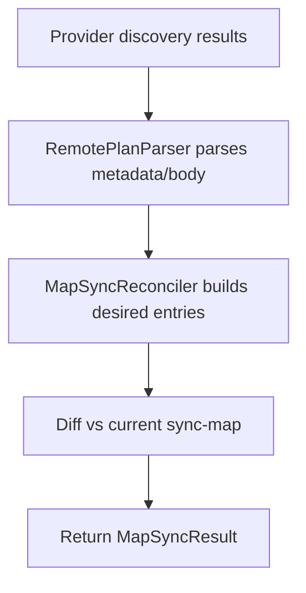

# Map Sync Module Spec

The map-sync module (`core/map_sync/`) reconciles local sync-map and plan artifacts from provider-discovered metadata without mutating provider state.

## Responsibilities

- Parse metadata markers from discovered provider items.
- Reconcile discovered state into `SyncMap` entries.
- Build `PlanItem` objects from remote item content for local bootstrap.
- Return deterministic diffs (`added`, `updated`, `removed`) to callers.

## Core pieces

| Component | Responsibility |
|---|---|
| `load_sync_map(...)` | Load current local sync-map with safe default behavior |
| `RemotePlanParser` | Parse plan fields from metadata/body |
| `MapSyncReconciler` | Compute reconciled entries and remote-plan item set |

## Runtime flow

## Guarantees

- No provider mutations in map-sync path.
- Reconciled output is deterministic for the same discovery input.
- Caller owns persistence policy (CLI writes local files in apply mode).

## Related docs

- `docs/design/map-sync.md`
- `docs/modules/sdk.md`
- `docs/modules/cli.md`
