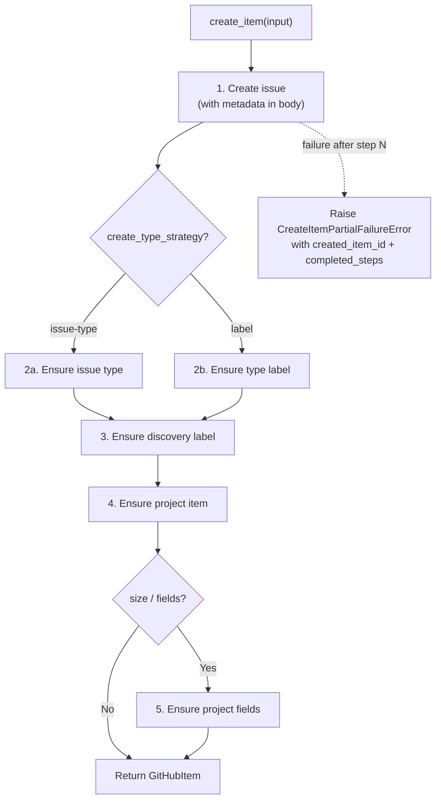

# Providers Module Spec

The providers module (`core/providers/`) contains concrete implementations of the `Provider` ABC and a factory for instantiation by name. Each provider adapts an external issue-tracking system (GitHub, Jira, Linear) to the provider contract.

This is a Core module. It primarily depends on Contracts (see [contracts.md](../design/contracts.md) for `Provider`, `Item`, and input/filter type definitions) plus approved Core utilities used by provider internals.

Third-party/runtime dependencies (for example httpx and generated GraphQL client code) are expected in this module.

**Module-level base class:** `ProviderContext` (defined in `core/providers/base.py`) is a base class concrete providers subclass to store resolved IDs, field mappings, and provider-specific state. Opaque to engine and SDK.

## Required Discovery Capabilities

Providers must support discovery semantics used by the engine:

- `search_items()` must apply `labels` and `body_contains` as a conjunctive filter
- `search_items()` must use provider-native search semantics with mandatory pagination
- `search_items()` may execute partitioned queries and must return the de-duplicated union
- Discovery must fail fast if search limits/caps would truncate results (no silent partial discovery)
- If a provider cannot satisfy these semantics, it must fail fast in `__aenter__` with `ProviderCapabilityError`

## Partial Failure Error Contract

`create_item()` is multi-step and may fail after an item already exists remotely:

```python
class CreateItemPartialFailureError(ProviderError):
    created_item_id: str | None
    created_item_key: str | None
    created_item_url: str | None
    completed_steps: tuple[str, ...]   # canonical step names
    retryable: bool
```

Canonical step names: `issue_created`, `issue_type_set`, `labels_set`, `project_item_added`, `project_fields_set`.

## Key Design: `create_item()` is Idempotent Multi-Step

In v2, `create_item()` handles everything the v1 engine orchestrated across multiple calls, as a re-runnable workflow:



**Required behavior:**
- Each sub-step must be safe to retry (`ensure_*` semantics)
- Partial failures must raise `CreateItemPartialFailureError` with created item identity + `completed_steps`
- Re-running sync must converge to one correctly configured item, not duplicates
- Metadata must be present in body at issue creation time so discovery can find partially configured items

## Key Design: Reconciliation Ownership

`update_item()` applies only plan-authoritative fields: `title`, `body`, `item_type`, `labels`, `size`.

- **Labels:** Additive (`ensure label present`), not replace-all. Provider must preserve non-PlanPilot labels.
- **Provider-authoritative after create:** `status`, `priority`, `iteration` from `field_config` are creation defaults, not continuously enforced.

## Concurrency and Retry Contract

The engine dispatches concurrent provider calls gated by `config.max_concurrent`. The provider must satisfy these concurrency and reliability requirements:

### Concurrency Safety

- All `Provider` methods must be safe for concurrent invocation from the engine
- Multiple `create_item()`, `update_item()`, and relation calls may be in-flight simultaneously
- Provider context setup fields (resolved IDs, capabilities, static mappings) must be immutable after `__aenter__`
- Mutable caches are allowed, but must be synchronized (lock/atomic update) and safe for concurrent readers/writers

### Retry Responsibility

The provider owns per-call reliability. The engine does not retry — it calls once and expects the provider to handle transient failures transparently.

| Responsibility | Owner |
|---------------|-------|
| Dispatch concurrency (`max_concurrent`) | Engine |
| Per-call retries and backoff | Provider |
| Rate-limit coordination across calls | Provider |
| Connection pooling | Provider |
| Timeout per operation | Provider |

### Required Retry Behavior

- Retry transient failures (network errors, 5xx, rate limits) with bounded exponential backoff
- Respect `Retry-After` headers when present
- Do **not** retry permanent failures (auth errors, schema/validation errors)
- Log retry attempts with operation name and attempt count
- Cap total retries per call (e.g. 3-5 attempts)
- On rate-limit (429), coordinate pause across all concurrent in-flight calls via a race-safe shared coordinator

### Connection Pooling

Provider transport clients must use connection pooling (e.g. httpx `AsyncClient`) with configurable limits. Connections are established in `__aenter__` and released in `__aexit__`.

## Provider Factory

```python
PROVIDERS: dict[str, type[Provider]] = {
    "github": GitHubProvider,
    "dry-run": DryRunProvider,
}

def create_provider(
    name: str, *, target: str, token: str, board_url: str,
    label: str = "planpilot", field_config: FieldConfig | None = None,
    **kwargs: object,
) -> Provider:
    """Create a provider instance by name.

    Raises:
        ValueError: If name is not in PROVIDERS.
    """
```

## GitHub Provider

Launch provider for GitHub Issues + Projects v2. Uses ariadne-codegen + httpx for typed async GraphQL (see [ADR-001](../decisions/001-ariadne-codegen.md) for rationale).

See [github-provider.md](github-provider.md) for full implementation details: core classes, authentication, codegen setup, operational hardening, operations inventory, and file structure.

## DryRunProvider

`DryRunProvider` is an in-memory provider used by `sync(dry_run=True)`.

- No auth/token resolution required
- No network calls
- Implements provider methods with deterministic placeholders and no-op relation mutations
- Enables renderer/context flow without mutating external systems

## Adding a New Provider

1. Create `core/providers/jira/` package
2. Implement `JiraProvider(Provider)` with all abstract methods
3. Implement `JiraItem(Item)` with `set_parent()` and `add_dependency()`
4. Create API transport client
5. Add to factory mapping in `core/providers/factory.py`

No changes needed to engine, SDK, CLI, renderers, or any other module.
