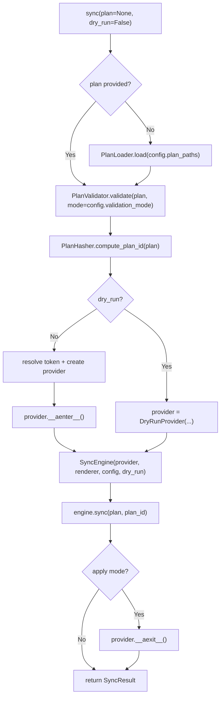
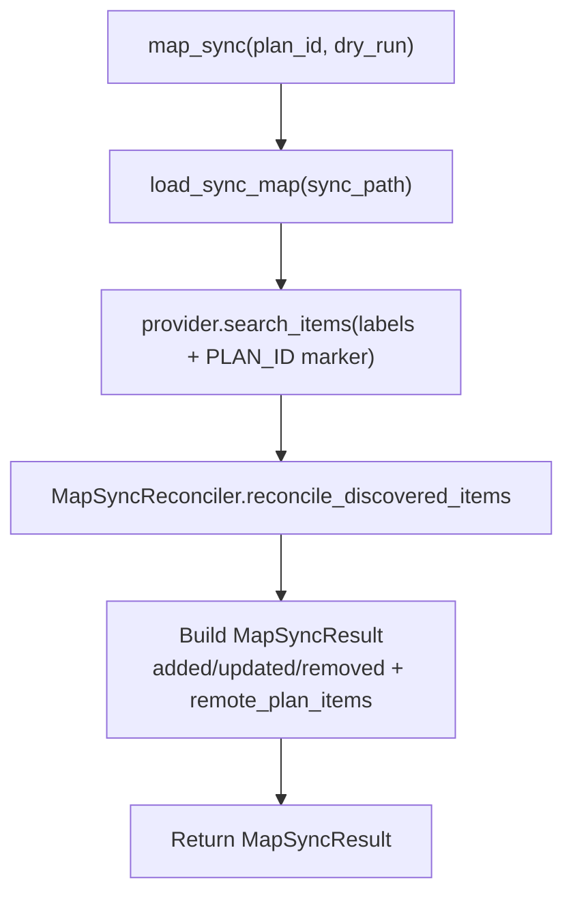
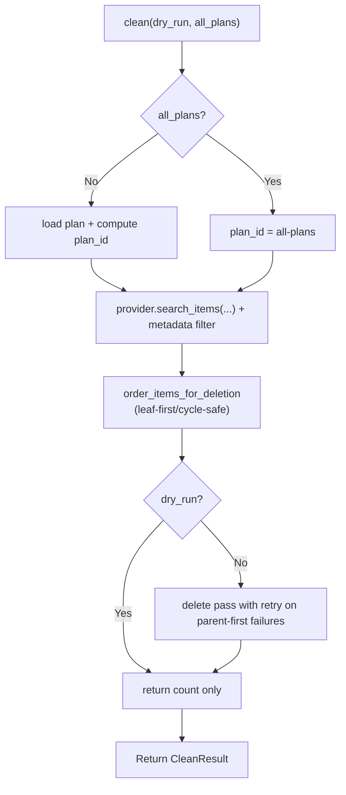

# SDK Module Spec

The SDK module (`sdk.py`) is PlanPilot's public API surface and **composition root** — the only place that sees all Core modules and wires them together. External callers (CLI, scripts, CI integrations) interact exclusively through the SDK.

The SDK contains no business logic — pure orchestration and wiring.

**SDK (L3)** — depends on Core and Contracts (see [contracts.md](../design/contracts.md) for type definitions).

## PlanPilot Class

```python
class PlanPilot:
    """PlanPilot SDK — the public API for programmatic plan syncing."""

    def __init__(self, *, provider: Provider | None, renderer: BodyRenderer,
                 config: PlanPilotConfig, progress: SyncProgress | None = None) -> None:
        """Initialize with injected dependencies (advanced/testing)."""

    @classmethod
    async def from_config(cls, config: PlanPilotConfig, *,
                           renderer_name: str = "markdown",
                           progress: SyncProgress | None = None) -> PlanPilot:
        """Create PlanPilot from config (recommended).

        1. Build renderer via create_renderer(renderer_name)
        2. Defer provider/auth construction to sync() mode branch
        3. Return PlanPilot(provider=None, renderer, config)
        """

    async def sync(self, plan: Plan | None = None, *,
                   dry_run: bool = False) -> SyncResult:
        """Execute the full sync pipeline.

        Raises:
            PlanLoadError, PlanValidationError, ProviderError, SyncError
        """
    async def discover_remote_plan_ids(self) -> list[str]:
        """Discover unique PLAN_ID values from provider item metadata."""

    async def map_sync(self, *, plan_id: str, dry_run: bool = False) -> MapSyncResult:
        """Reconcile local sync-map and bootstrap local plan from remote metadata."""

    async def clean(self, *, dry_run: bool = False, all_plans: bool = False) -> CleanResult:
        """Delete planpilot-managed provider items for current plan or all plans."""
```

### `sync()` Lifecycle



1. **Load plan** (if not provided) — `PlanLoader().load(config.plan_paths)`
2. **Validate plan** — `PlanValidator().validate(plan, mode=config.validation_mode)`
3. **Compute plan ID** — `PlanHasher().compute_plan_id(plan)` -> 12-char hex hash
4. **Choose provider by mode**
   - `dry_run=True`: use `DryRunProvider` (no token, no network)
   - `dry_run=False`: resolve token + build configured provider
5. **Enter provider for apply mode** — `async with provider` manages auth + context resolution
6. **Construct + run engine** — `SyncEngine(provider, renderer, config, dry_run).sync(plan, plan_id)`
7. **Exit provider in apply mode** — `__aexit__` ensures cleanup even on error
8. **Return result**

`sync()` and `map_sync()` are side-effect free for local file persistence. They return domain results only.
CLI (or other callers) persist artifacts explicitly through persistence modules (for CLI, `planpilot.cli.persistence.*`).

**Provider lifecycle:** `sync()` manages provider construction and lifecycle internally. Callers never manage `async with`.

**Error handling:** In apply mode, if engine/provider raises, `__aexit__` is still called. Exception propagates after cleanup.

## `discover_remote_plan_ids()`

Discovers unique `PLAN_ID` values from provider metadata blocks. This is used by CLI `map sync` when `--plan-id` is omitted.

- Uses real provider discovery (`search_items(labels=[config.label])`)
- Parses item bodies for metadata blocks
- Returns sorted, unique plan IDs
- Emits progress phases when `progress` is configured

This method does not mutate provider items or local files.

## `map_sync()` Lifecycle

`map_sync()` reconciles local sync-map state with provider metadata for one selected `plan_id`.



Important ownership rule:

- SDK `map_sync()` returns `MapSyncResult` only.
- Local persistence (writing sync-map and reconstructed plan files) is caller-owned. The CLI performs this in apply mode via `planpilot.cli.persistence.*`.

## `clean()` Lifecycle

`clean()` discovers planpilot-managed items and optionally deletes them.



Important semantics:

- Discovery always uses real provider access (even in dry-run) so previews are accurate.
- `all_plans=True` targets all items with planpilot metadata (by label + metadata parse).
- Deletion order is planner-driven to avoid relation constraint failures.

## load_config()

```python
def load_config(path: str | Path) -> PlanPilotConfig:
    """Load and validate a PlanPilot configuration from a JSON file.

    1. Resolve path to absolute
    2. Read JSON
    3. Parse via Pydantic
    4. Resolve all relative paths against config file's parent directory
    5. Validate provider-specific invariants (board_url, create-type strategy)
    6. Return validated config

    Raises:
        ConfigError: If loading or validation fails.
    """
```

## load_plan()

```python
def load_plan(*, unified: str | Path | None = None, epics: str | Path | None = None,
              stories: str | Path | None = None, tasks: str | Path | None = None) -> Plan:
    """Load a plan from explicit path inputs (convenience wrapper).

    Raises:
        PlanLoadError: If loading fails.
    """
```

## Scaffold Functions

Config scaffolding and environment detection helpers, defined in `core/config/scaffold.py` and re-exported via the public API.

### `detect_target() -> str | None`

Best-effort detection of `owner/repo` from the current git remote. Parses SSH and HTTPS formats. Returns `None` if not in a git repo, git is not installed, or the remote URL cannot be parsed.

### `detect_plan_paths(base: Path | None = None) -> PlanPaths | None`

Scans common directories (`.plans/`, `plans/`) for existing plan files. Returns a `PlanPaths` when a coherent set is found (all three split files or a unified file), or `None` otherwise.

### `scaffold_config(*, target, board_url, ...) -> dict`

Builds and validates a planpilot config dict. Accepts all config fields as keyword arguments with sensible defaults, validates through `PlanPilotConfig`, and returns a minimal JSON-serialisable dict with default-valued fields omitted. Raises `ConfigError` on validation failure.

### `write_config(config: dict, path: Path) -> None`

Writes a config dict to a JSON file, creating parent directories as needed.

### `create_plan_stubs(plan_paths: dict, *, base: Path | None = None) -> list[Path]`

Creates empty plan files for paths that don't already exist. Returns the list of created paths.

## Public API Surface (re-exports)

The SDK re-exports selected types so callers import from one place:

| Category | Types |
|----------|-------|
| **SDK** | `PlanPilot`, `load_config`, `load_plan` |
| **Scaffold** | `scaffold_config`, `detect_target`, `detect_plan_paths`, `write_config`, `create_plan_stubs` |
| **Config** | `PlanPilotConfig`, `PlanPaths`, `FieldConfig` |
| **Plan** | `Plan`, `PlanItem`, `PlanItemType` |
| **Sync** | `SyncResult`, `SyncMap`, `SyncEntry`, `MapSyncResult`, `CleanResult` |
| **Progress** | `SyncProgress`, `InitProgress` |
| **Contracts** | `Provider`, `BodyRenderer`, `RenderContext` |
| **Factories** | `create_provider`, `create_renderer`, `create_token_resolver` |
| **Exceptions** | `PlanPilotError`, `ConfigError`, `PlanLoadError`, `PlanValidationError`, `ProviderError`, `AuthenticationError`, `SyncError` |

## Programmatic Usage

```python
from planpilot import PlanPilot, PlanItemType, load_config

config = load_config("planpilot.json")
pp = await PlanPilot.from_config(config, renderer_name="markdown")
result = await pp.sync(dry_run=False)

print(f"Created {result.items_created[PlanItemType.EPIC]} epics")
print(f"Sync map: {result.sync_map.model_dump_json()}")
```

### Scaffold Usage

```python
from planpilot import detect_target, detect_plan_paths, scaffold_config, write_config
from pathlib import Path

target = detect_target() or "owner/repo"
plan_paths = detect_plan_paths()

config = scaffold_config(
    target=target,
    board_url="https://github.com/orgs/myorg/projects/1",
)
write_config(config, Path("planpilot.json"))
```

### Map Sync Usage

```python
from planpilot import PlanPilot, load_config

config = load_config("planpilot.json")
pp = await PlanPilot.from_config(config)

candidate_ids = await pp.discover_remote_plan_ids()
selected_plan_id = candidate_ids[0]

result = await pp.map_sync(plan_id=selected_plan_id, dry_run=True)
print(result.added, result.updated, result.removed)
```

### Clean Usage

```python
from planpilot import PlanPilot, load_config

config = load_config("planpilot.json")
pp = await PlanPilot.from_config(config)

preview = await pp.clean(dry_run=True)
print(f"Would delete: {preview.items_deleted}")

applied = await pp.clean(dry_run=False)
print(f"Deleted: {applied.items_deleted}")
```

## Design Decisions

| Decision | Rationale |
|----------|-----------|
| `PlanPilot.from_config()` is the default entrypoint | SDK remains composition root |
| `__init__` accepts injected dependencies | Advanced/testing scenarios |
| `sync()` manages provider lifecycle | Simple API — no `async with` boilerplate |
| `plan` parameter optional on `sync()` | Config-driven and programmatic usage both supported |
| SDK sync/map_sync workflows avoid local writes | Programmatic workflows return result objects only |
| Local artifact writes are explicit caller actions | CLI owns user-facing persistence decisions |
| `load_config()` is standalone, not a method | Used before `PlanPilot` construction |

## File Structure

```text
src/planpilot/
├── __init__.py            # Re-exports
├── sdk.py                 # PlanPilot, load_config(), load_plan()
├── core/config/loader.py  # load_config() implementation
└── core/config/scaffold.py # detect_target(), detect_plan_paths(), scaffold_config(), write_config(), create_plan_stubs()
```

## Related docs

- [SDK Reference](../reference/sdk-reference.md) — concise API lookup for SDK entrypoints and result objects
- [Troubleshooting](../guides/troubleshooting.md) — common runtime/config/auth failure paths
