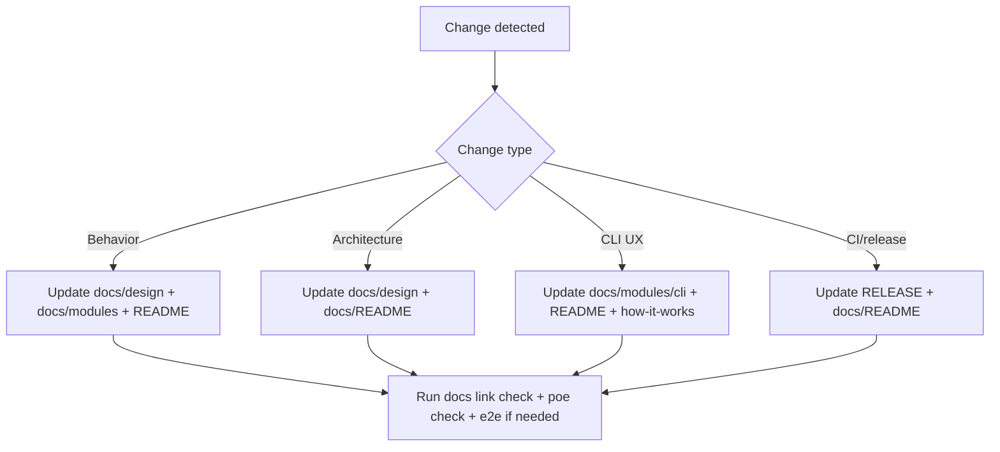

# Repo Review and Docs Plan (2026-02-13) [Historical]

> Superseded by `docs/plans/2026-02-13-docs-refresh-execution-plan.md`.

## Scope

Full repo review across code, workflows, tests, configuration, and documentation; then execute doc organization updates with clear ownership and diagram guidance.

## Review Findings

1. CI did not enforce workflow linting (`actionlint`) despite a local script.
2. Python version constraint was open-ended (`>=3.11`), which can allow unsupported major versions.
3. Typecheck policy was implicit (src-only) and not explicitly encoded in mypy config.
4. Documentation governance existed but needed a concrete update matrix across doc files.

## Planned Changes

- Add `actionlint` job in CI.
- Bound Python version to `<4.0` in packaging metadata.
- Encode src-only mypy scope in `pyproject.toml`.
- Add a docs plan index section and this plan artifact.
- Extend documentation architecture guidance with a docs update decision-flow diagram.

## Documentation Inventory and Actions

| File | Action |
|---|---|
| `README.md` | Update docs navigation to include docs architecture + plans |
| `CONTRIBUTING.md` | Update docs policy and verification references |
| `RELEASE.md` | Keep (no semantic release behavior changes in this step) |
| `docs/README.md` | Update navigation and add plans section |
| `docs/how-it-works.md` | Keep |
| `docs/AGENTS.md` | Keep |
| `docs/design/architecture.md` | Keep |
| `docs/design/contracts.md` | Keep |
| `docs/design/engine.md` | Keep |
| `docs/design/map-sync.md` | Keep |
| `docs/design/clean.md` | Keep |
| `docs/design/repository-layout.md` | Keep |
| `docs/design/documentation-architecture.md` | Update with decision-flow Mermaid diagram |
| `docs/modules/cli.md` | Keep |
| `docs/modules/sdk.md` | Keep |
| `docs/modules/providers.md` | Keep |
| `docs/modules/github-provider.md` | Keep |
| `docs/modules/plan.md` | Keep |
| `docs/modules/config.md` | Keep |
| `docs/modules/auth.md` | Keep |
| `docs/modules/renderers.md` | Keep |
| `docs/reference/plan-schemas.md` | Keep |
| `docs/testing/e2e.md` | Keep |
| `docs/decisions/001-ariadne-codegen.md` | Keep |
| `docs/plans/2026-02-13-repo-review-and-docs-plan.md` | Create |

## Diagram Plan (Mermaid)

## Execution Status

- [x] Repo review completed
- [x] Plan authored
- [ ] Planned changes implemented
- [ ] Verification rerun
- [ ] Final commit/push
