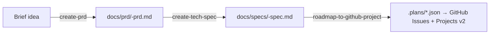

# Design: PRD and Tech Spec Skills

Two new skills that complete the planpilot product workflow: idea → PRD → tech spec → plans → GitHub sync.

## Skill Overview

| Skill | Input | Output | Purpose |
|-------|-------|--------|---------|
| `create-prd` | Brief idea from user | `docs/prd/<slug>-prd.md` | Guided Q&A to produce a structured PRD |
| `create-tech-spec` | PRD file + codebase | `docs/specs/<slug>-spec.md` | Codebase-aware architecture spec from PRD |

## Workflow Chain



Each skill is independent and can be invoked standalone. The chain is recommended but not enforced.

## Architecture Decision

**Approach chosen: Two independent skills** (over unified or orchestrator patterns).

Rationale:
- Matches existing single-skill-per-concern pattern (`roadmap-to-github-project`)
- Each skill is independently usable
- Clear separation of concerns
- Easy to maintain

---

## Skill 1: `create-prd`

**Path:** `skills/create-prd/SKILL.md`

### Input

Brief idea description from the user (text prompt). No files required.

### Output

`docs/prd/<slug>-prd.md` — Markdown with YAML frontmatter.

Slug is derived from the PRD title (lowercase, hyphenated). The `-prd.md` suffix identifies the artifact type.

### Frontmatter Schema

```yaml
---
title: "Feature Title"
status: draft | review | approved
created: YYYY-MM-DD
author: <user or auto>
tags: [tag1, tag2, ...]
---
```

### PRD Sections

1. **Overview** — what we're building, in one paragraph
2. **Motivation** — why this matters now (business case, opportunity, user pain)
3. **Goals & Non-Goals** — explicit in/out scope
4. **Target Audience** — who benefits and their context
5. **Requirements** — functional requirements (numbered, verifiable)
6. **Success Metrics** — how we measure success
7. **Diagrams** — flow diagrams, system context diagrams (mermaid)
8. **Constraints & Assumptions** — business/technical constraints
9. **Open Questions** — unresolved items for follow-up

### Workflow

1. User provides brief idea
2. Skill asks structured questions one at a time (motivation, audience, scope, requirements, success criteria)
3. After gathering enough context, generates the PRD draft
4. Presents draft for review, iterates on feedback
5. Saves final PRD to `docs/prd/`
6. Suggests: "Run `create-tech-spec` to generate a technical specification from this PRD"

---

## Skill 2: `create-tech-spec`

**Path:** `skills/create-tech-spec/SKILL.md`

### Input

- PRD file path (e.g., `docs/prd/user-auth-prd.md`)
- Access to the codebase for architecture analysis

### Output

`docs/specs/<slug>-spec.md` — Markdown with YAML frontmatter.

### Frontmatter Schema

```yaml
---
title: "Feature Title — Technical Specification"
status: draft | review | approved
created: YYYY-MM-DD
prd: docs/prd/<slug>-prd.md
author: <user or auto>
tags: [tag1, tag2, ...]
---
```

The `prd` field links back to the source PRD for traceability.

### Spec Sections

**Fixed sections (always present):**

1. **Overview** — summary of what's being built (derived from PRD)
2. **System Context** — how this fits into the existing architecture, with mermaid context diagram
3. **Technical Requirements** — PRD requirements translated into technical constraints

**Dynamic design sections (skill selects what's relevant based on PRD and codebase analysis):**

4. **Design sections** — chosen from a palette:
   - Components & Architecture (+ mermaid component/flowchart diagrams)
   - Data Model (+ mermaid ER diagrams)
   - API Design
   - Integration Points
   - State Management
   - Security Model
   - Performance Considerations

   Each section includes mermaid diagrams where they improve understanding. The skill analyzes the PRD requirements and codebase to determine which sections are relevant. A database-heavy feature gets Data Model + API Design; a UI feature gets Components + State Management; an integration feature gets Integration Points + Security Model.

**Fixed closing sections (always present):**

5. **Technical Decisions** — key technology choices with rationale
6. **Validation** — how to verify the implementation meets the spec (test strategy, acceptance criteria, verification commands)
7. **Risks & Mitigations** — technical risks identified during analysis
8. **Open Questions** — unresolved technical items

### Codebase Analysis Steps

Before generating the spec, the skill:

1. Reads project structure (key directories, entry points)
2. Identifies relevant existing modules that will be touched
3. Notes architectural patterns in use (layered architecture, async patterns, etc.)
4. Checks for existing similar features to maintain consistency
5. Maps PRD requirements to technical components

### Workflow

1. Skill reads the PRD file and parses frontmatter + sections
2. Analyzes the codebase (structure, patterns, relevant modules)
3. Maps PRD requirements to technical components
4. Determines which dynamic design sections are relevant
5. Generates the spec draft with mermaid diagrams
6. Presents draft for review, iterates on feedback
7. Saves final spec to `docs/specs/`
8. Suggests: "Run `roadmap-to-github-project` to decompose this spec into epics, stories, and tasks"

---

## File Naming Convention

| Artifact | Path | Example |
|----------|------|---------|
| PRD | `docs/prd/<slug>-prd.md` | `docs/prd/user-auth-prd.md` |
| Tech Spec | `docs/specs/<slug>-spec.md` | `docs/specs/user-auth-spec.md` |
| Plans | `.plans/*.json` | `.plans/epics.json` (existing convention) |

Slug: lowercase, hyphenated, derived from the document title. No date prefix — dates live in frontmatter.

## Diagram Policy

All diagrams use mermaid syntax for portability and version control friendliness. Both skills include diagrams where they improve understanding:

- PRD: flow diagrams, system context diagrams
- Tech Spec: context diagrams, component diagrams, ER diagrams, flowcharts

## Installation

Both skills follow the same installation pattern as `roadmap-to-github-project`:

```bash
# From repo
cp skills/create-prd/SKILL.md ~/.agents/skills/create-prd/SKILL.md
cp skills/create-tech-spec/SKILL.md ~/.agents/skills/create-tech-spec/SKILL.md

# From GitHub
curl -fsSL "https://raw.githubusercontent.com/aryeko/planpilot/v<VERSION>/skills/create-prd/SKILL.md" \
  -o ~/.agents/skills/create-prd/SKILL.md
curl -fsSL "https://raw.githubusercontent.com/aryeko/planpilot/v<VERSION>/skills/create-tech-spec/SKILL.md" \
  -o ~/.agents/skills/create-tech-spec/SKILL.md
```

INSTALL.md and INSTALL.agent.md will be updated to include all three skills.
