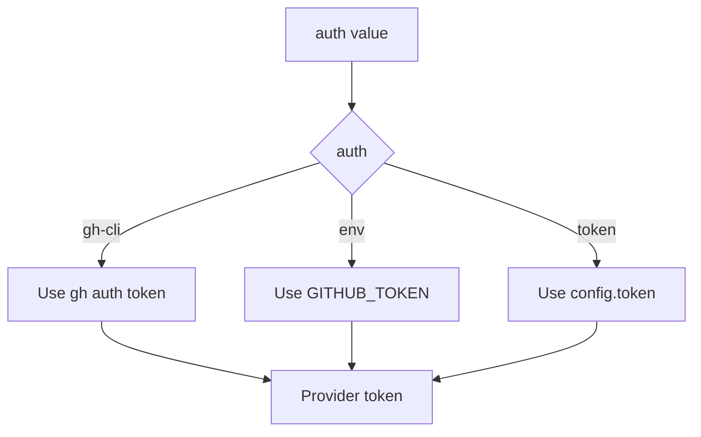

# Config Reference

Canonical reference for `planpilot.json`.

## Top-level schema

```json
{
  "provider": "github",
  "target": "owner/repo",
  "auth": "gh-cli",
  "token": null,
  "board_url": "https://github.com/orgs/owner/projects/1",
  "plan_paths": {
    "epics": ".plans/epics.json",
    "stories": ".plans/stories.json",
    "tasks": ".plans/tasks.json",
    "unified": null
  },
  "validation_mode": "strict",
  "sync_path": ".plans/sync-map.json",
  "label": "planpilot",
  "max_concurrent": 1,
  "field_config": {
    "status": "Backlog",
    "priority": "P1",
    "iteration": "active",
    "size_field": "Size",
    "size_from_tshirt": true,
    "create_type_strategy": "issue-type",
    "create_type_map": {
      "EPIC": "Epic",
      "STORY": "Story",
      "TASK": "Task"
    }
  }
}
```

## Auth resolution flow



## Field reference

| Field | Required | Notes |
|---|---|---|
| `provider` | Yes | `github` for current production path |
| `target` | Yes | Repository target, usually `owner/repo` |
| `auth` | No | `gh-cli` (default), `env`, or `token` |
| `token` | Conditional | Required only when `auth` is `token` |
| `board_url` | Yes | GitHub Projects v2 URL |
| `plan_paths` | Yes | Split files (`epics/stories/tasks`) or `unified` |
| `validation_mode` | No | `strict` (default) or `partial` |
| `sync_path` | No | Default from scaffold is `.plans/sync-map.json` |
| `label` | No | Discovery/ownership label, default `planpilot` |
| `max_concurrent` | No | Integer `1..10`; default `1` |
| `field_config` | No | Provider field and create-type preferences |

## Validation rules

- `auth="token"` requires non-empty `token`.
- `auth="gh-cli"` or `auth="env"` must not include `token`.
- `plan_paths.unified` cannot be set together with split paths.
- At least one plan path must be configured.
- For GitHub user-owned board URLs, `field_config.create_type_strategy` must be `label`.

## Path resolution

- Relative `plan_paths.*` and `sync_path` values resolve from the directory containing `planpilot.json`.
- Dry-run sync-map path is derived as `<sync_path>.dry-run`.

## Related

- [CLI Reference](./cli-reference.md)
- [SDK Reference](./sdk-reference.md)
- [Config Module Spec](../modules/config.md)
