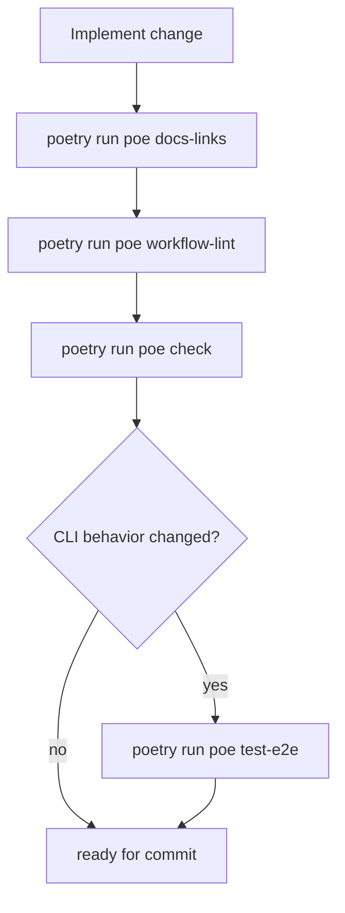

# Developer Workflow

Canonical local workflow before opening a PR.

## Verification flow



## Command matrix

| Command | Why it matters |
|---|---|
| `poetry run poe docs-links` | Prevent broken local markdown links in `README.md` and `docs/` |
| `poetry run poe workflow-lint` | Validate GitHub workflow YAML and expressions |
| `poetry run poe check` | Run lint + format-check + mypy + non-E2E tests |
| `poetry run poe test-e2e` | Validate CLI behavior through offline integration flows |
| `poetry run planpilot --help` | Sanity-check CLI entrypoint wiring |

## Recommended pre-PR sequence

```bash
poetry run poe docs-links
poetry run poe workflow-lint
poetry run poe check
poetry run poe test-e2e      # when CLI behavior changes
poetry run planpilot --help
```

## Failure triage

- `docs-links` fails: fix markdown targets or stale relative paths.
- `workflow-lint` fails: fix `.github/workflows/*.yml` syntax/expressions.
- `check` fails in mypy: fix runtime typing in `src/planpilot`.
- `check` fails in tests: fix implementation or test assumptions; avoid updating golden expectations blindly.
- `test-e2e` fails: inspect CLI summary/output contracts and command routing.

## Related

- [Contributing](../../CONTRIBUTING.md)
- [Workflows Reference](./workflows-reference.md)
- [E2E Testing](../testing/e2e.md)
