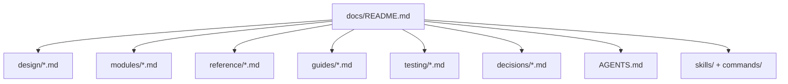

# Docs Inventory

Canonical inventory of documentation files, grouped by function.

## Navigation map

## Design docs (`docs/design/`)

| File | Purpose |
|---|---|
| `docs/design/architecture.md` | Layering, boundaries, and runtime architecture |
| `docs/design/contracts.md` | Shared contracts and type boundaries |
| `docs/design/engine.md` | Sync pipeline behavior and orchestration |
| `docs/design/map-sync.md` | Map sync semantics and lifecycle |
| `docs/design/clean.md` | Clean workflow behavior |
| `docs/design/repository-layout.md` | Source layout and ownership map |
| `docs/design/codemap.md` | Runtime package map and dependency direction |
| `docs/design/documentation-architecture.md` | Documentation IA and maintenance rules |

## Module specs (`docs/modules/`)

| File | Purpose |
|---|---|
| `docs/modules/cli.md` | CLI behaviors, args, and summaries |
| `docs/modules/sdk.md` | SDK facade and composition behavior |
| `docs/modules/providers.md` | Provider contracts and extension points |
| `docs/modules/github-provider.md` | GitHub adapter implementation notes |
| `docs/modules/plan.md` | Plan loading/validation/hash semantics |
| `docs/modules/config.md` | Config models and loader/scaffold behavior |
| `docs/modules/auth.md` | Auth resolver model and preflight behavior |
| `docs/modules/renderers.md` | Rendering contracts and markdown behavior |
| `docs/modules/map-sync.md` | Map sync implementation in core layer |
| `docs/modules/clean.md` | Clean implementation in core layer |

## Reference docs (`docs/reference/`)

| File | Purpose |
|---|---|
| `docs/reference/cli-reference.md` | CLI command and flag quick lookup |
| `docs/reference/sdk-reference.md` | SDK API quick lookup |
| `docs/reference/config-reference.md` | Config schema and field semantics |
| `docs/reference/exit-codes.md` | Process exit code mapping |
| `docs/reference/plan-schemas.md` | Plan input schemas and examples |
| `docs/reference/plugin-reference.md` | Claude Code plugin commands and skill install reference |
| `docs/reference/workflows-reference.md` | CI/release/security workflow contracts |
| `docs/reference/developer-workflow.md` | Local contributor verification flow |
| `docs/reference/docs-inventory.md` | This inventory page |

## Plugin and skills (`src/planpilot/skills/`, `src/planpilot/commands/`, `src/planpilot/.claude-plugin/`)

| File | Purpose |
|---|---|
| `src/planpilot/skills/INSTALL.md` | Manual skill install instructions |
| `src/planpilot/skills/INSTALL.agent.md` | Agent-driven self-install instructions |
| `src/planpilot/skills/create-prd/SKILL.md` | PRD generation skill definition |
| `src/planpilot/skills/create-tech-spec/SKILL.md` | Tech spec generation skill definition |
| `src/planpilot/skills/plan-sync/SKILL.md` | Plan sync skill definition |
| `src/planpilot/commands/prd.md` | `/planpilot:prd` command definition |
| `src/planpilot/commands/spec.md` | `/planpilot:spec` command definition |
| `src/planpilot/commands/sync.md` | `/planpilot:sync` command definition |
| `src/planpilot/.claude-plugin/plugin.json` | Plugin manifest (name, version, author, skills/commands) |
| `src/planpilot/.claude-plugin/marketplace.json` | Marketplace registry entry (owner, pip source) |

## Guides, testing, and decisions

| Area | Files |
|---|---|
| Guides | `docs/guides/troubleshooting.md`, `docs/guides/plugin-skills-guide.md` |
| Testing | `docs/testing/e2e.md` |
| Decisions | `docs/decisions/001-ariadne-codegen.md` |

## Internal/agent context

| File | Purpose |
|---|---|
| `docs/AGENTS.md` | Agent-facing docs knowledge base and lookup hints |

## Update rule of thumb

- Runtime behavior changes -> update `docs/design/*` and matching `docs/modules/*`.
- User-facing command/config/output changes -> update `docs/reference/*` and `README.md`.
- CI/release/security workflow changes -> update `docs/reference/workflows-reference.md` and `RELEASE.md`.
- Contributor process changes -> update `docs/reference/developer-workflow.md` and `CONTRIBUTING.md`.
- Plugin/skills changes -> update `skills/*/SKILL.md`, `commands/*.md`, `.claude-plugin/plugin.json`, `docs/guides/plugin-skills-guide.md`, and `docs/reference/plugin-reference.md`.
