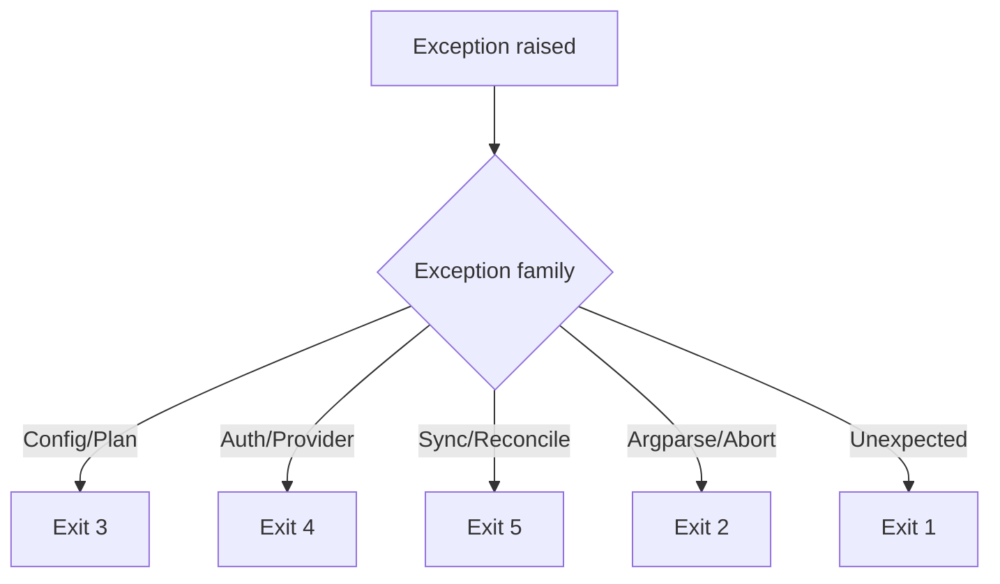

# Exit Codes

Canonical CLI process exit mapping.

## Table

| Code | Meaning | Typical sources |
|---|---|---|
| `0` | Success | Completed command |
| `2` | Usage error / user abort | Argparse failure, explicit user abort paths handled as usage |
| `3` | Config or plan failure | `ConfigError`, `PlanLoadError`, `PlanValidationError` |
| `4` | Auth/provider failure | `AuthenticationError`, `ProviderError`, `ProjectURLError` |
| `5` | Sync/reconciliation failure | `SyncError` and wrapped provider execution failures |
| `1` | Unexpected internal failure | Unhandled exceptions at CLI boundary |

## Exception flow

## Notes

- `map sync` and `clean` use the same exit-code contract as `sync`.
- Scripts should treat non-zero exits as failure and inspect stderr for details.

## Related

- [CLI Module Spec](../modules/cli.md)
- [Troubleshooting](../guides/troubleshooting.md)
