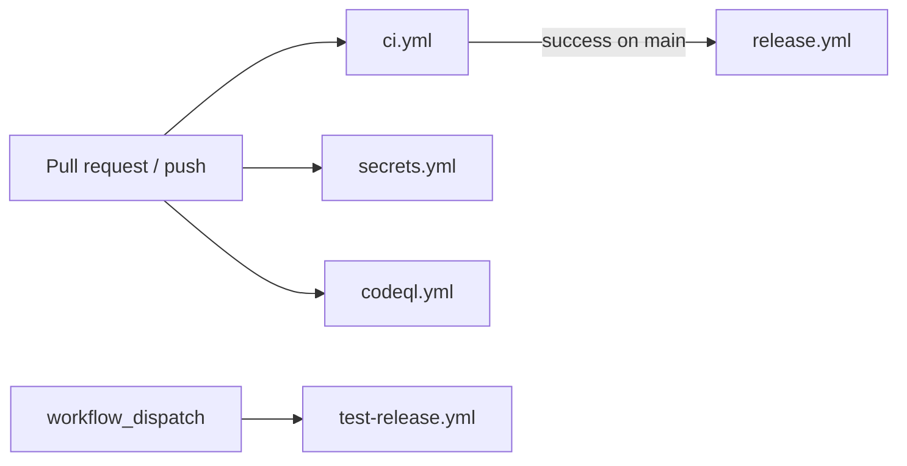
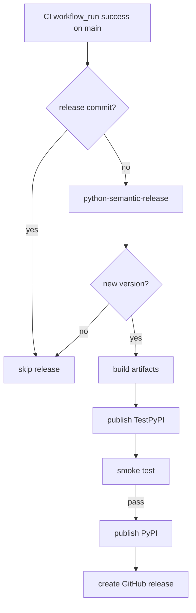

# Workflows Reference

Canonical reference for repository automation in `.github/workflows/`.

## Workflow topology

## Workflow inventory

| Workflow | Trigger | Purpose | Key gate |
|---|---|---|---|
| `ci.yml` | PRs + pushes to `main` | Lint, typecheck, tests, E2E, package checks | Fails fast on quality regressions |
| `release.yml` | `workflow_run` after CI success on `main` | Semantic versioning + TestPyPI/PyPI publish + GitHub release | Requires successful CI and release-commit recursion guard |
| `test-release.yml` | Manual dispatch | Preview semantic-release result without publishing | No-op semantic release mode |
| `secrets.yml` | PRs + pushes to `main` | Secret scanning with gitleaks | Detects leaked credentials early |
| `codeql.yml` | PRs, pushes to `main`, weekly schedule | Static security analysis | Uploads security alerts to GitHub Security tab |

## CI checks (from `ci.yml`)

- Commit message linting on pull requests
- Workflow linting (`actionlint`)
- Ruff lint + format check
- Docs local-link integrity (`poetry run poe docs-links`): scans all root-level `*.md` files and `docs/**/*.md`; exits 0 (success) when no broken links are found, exits 1 (failure) when broken links are detected; external URLs and anchor-only fragments are ignored; no dry-run mode
- Mypy type-check (`poetry run poe typecheck`)
- Unit/integration test matrix across Python 3.11-3.13
- E2E suite job
- Build + package metadata validation

## Release gates (from `release.yml`)

## Related

- [Release Guide](../../RELEASE.md)
- [Developer Workflow](./developer-workflow.md)
- [Troubleshooting](../guides/troubleshooting.md)
