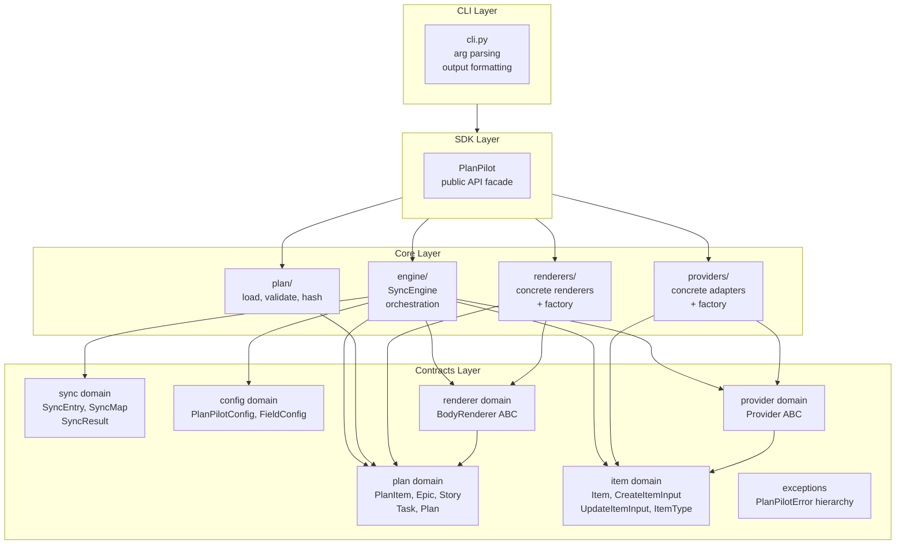
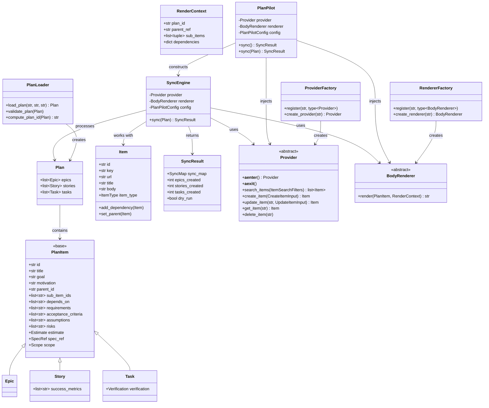
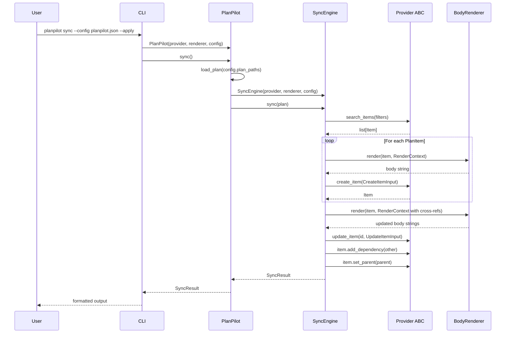

# PlanPilot v2 Architecture

## Design Principles

- **SDK-first** — The CLI is a thin wrapper around a fully-functional SDK. The SDK is the primary interface; programmatic usage is the default, CLI is convenience.

- **Layered dependencies** — Strict downward-only dependencies. Each layer depends only on the layer directly below it. No bypassing, no circular dependencies, no peer imports.

- **Adapter pattern** — Both providers (GitHub, Jira, Linear) and renderers (Markdown, wiki) are pluggable adapters. The core engine knows nothing about concrete implementations.

- **SOLID principles** — Object-oriented design throughout:
  - **Single Responsibility** — Each module has one clear purpose
  - **Open/Closed** — Extend via adapters, not by modifying core
  - **Liskov Substitution** — Any Provider/Renderer implementation works
  - **Interface Segregation** — Clean, focused ABCs
  - **Dependency Inversion** — Engine depends on abstractions, not concretes

- **Async-first** — All I/O operations are async. The SDK and engine are fully async-compatible.

## Layer Architecture



### Layer Descriptions

#### Contracts

The foundation — pure data types and abstract interfaces. Zero internal dependencies.

Organized into six domains, each with clear responsibilities. Domains may depend on other domains within the same layer (see dependency summary below).

#### 1. **plan** Domain

**Responsibility:** Represents the input structure — the plan entities (Epic, Story, Task) that users define in JSON files.

**Models:**
- `PlanItem` — Base class for all plan entities (Epic, Story, Task)
  - Common properties: `id`, `title`, `goal`, `motivation`, `spec_ref`, `scope`, `parent_id`, `sub_item_ids`, `depends_on`, `assumptions`, `risks`, `estimate`, `requirements`, `acceptance_criteria`
- `Epic` — Top-level roadmap epic (extends `PlanItem`)
  - Additional: (none — uses base properties only)
- `Story` — User story belonging to an epic (extends `PlanItem`)
  - Additional: `success_metrics`
- `Task` — Actionable task belonging to a story (extends `PlanItem`)
  - Additional: `verification`
- `Plan` — Container for epics, stories, and tasks

**Contracts:** None (pure data models)

**Dependencies:** None

#### 2. **item** Domain

**Responsibility:** Provider-agnostic work item abstraction. Defines what a work item looks like and how to create/update/search items, independent of any specific provider (GitHub, Jira, etc.).

**Models:**
- `Item` — Runtime work item with provider-bound operations (Active Record pattern)
- `CreateItemInput` — Fields required to create a new item
- `UpdateItemInput` — Fields for updating an existing item
- `ItemSearchFilters` — Filters for searching items
- `ItemType` — Enum: EPIC, STORY, TASK
- `ItemFields` — Base fields shared by inputs/filters

**Contracts:** None (Item is a concrete class, not an ABC)

**Dependencies:** None

#### 3. **sync** Domain

**Responsibility:** Sync state and results. Tracks what was synced and persists the mapping between plan entities and provider items.

**Models:**
- `SyncEntry` — Mapping entry for a single item (id, key, url)
- `SyncMap` — Full sync map (plan_id, target, epics/stories/tasks dicts)
- `SyncResult` — Return value from sync operations (sync_map + creation counts)

**Utilities:**
- `to_sync_entry(item: Item) -> SyncEntry` — Converts an Item to a SyncEntry for persistence

**Contracts:** None (pure data models)

**Dependencies:**
- Uses `item` domain: `to_sync_entry()` accepts an `Item`

#### 4. **config** Domain

**Responsibility:** Configuration for sync runs. Loadable from a JSON config file so the SDK and CLI share a single source of truth.

**Models:**
- `PlanPilotConfig` — Top-level configuration, loadable from `planpilot.json`:
  - `provider` — Provider name (e.g. "github")
  - `target` — Target designation (e.g. "owner/repo")
  - `board_url` — Board URL (optional)
  - `plan_paths` — Paths to plan JSON files (epics, stories, tasks)
  - `sync_path` — Path to write sync map
  - `label` — Label to apply to all items
  - `field_config` — Project field preferences
  - `dry_run` — Preview mode flag
- `FieldConfig` — Project field preferences (status, priority, iteration, size field)

**Contracts:** None (pure data models)

**Dependencies:** None

#### 5. **provider** Domain

**Responsibility:** Contract for external system adapters. Defines what any provider (GitHub, Jira, Linear) must be able to do.

**Models:**
- `ProviderContext` — Opaque provider context, subclassed by concrete providers to store resolved IDs, field mappings, and other provider-specific state

**Contracts:**
- `Provider` ABC — Abstract base class defining the provider interface:
  - `__aenter__()` / `__aexit__()` — Async context manager lifecycle
  - `search_items(ItemSearchFilters) -> list[Item]` — Search for items
  - `create_item(CreateItemInput) -> Item` — Create a new item
  - `update_item(str, UpdateItemInput) -> Item` — Update an existing item
  - `get_item(str) -> Item` — Fetch a single item
  - `delete_item(str)` — Delete an item

**Dependencies:**
- Depends on `item` domain: Uses `CreateItemInput`, `Item`, `UpdateItemInput`, `ItemSearchFilters` in method signatures

#### 6. **renderer** Domain

**Responsibility:** Contract for body formatting. Defines how issue/body content should be rendered in different markup formats. Uses a single unified method that renders any `PlanItem` — the renderer inspects which fields are present and skips empty ones.

**Models:**
- `RenderContext` — Resolved cross-references the engine computed for rendering:
  - `plan_id` — Deterministic plan hash for the marker comment
  - `parent_ref` — Human-readable reference to parent item (e.g. "#42")
  - `sub_items` — List of (key, title) tuples for child items
  - `dependencies` — Dict of {dep_id: issue_ref} for blocked-by links

**Contracts:**
- `BodyRenderer` ABC — Single-method contract for body rendering:
  - `render(item: PlanItem, context: RenderContext) -> str` — Render body for any plan item

**Design:** The renderer does not need to know if it's rendering an Epic, Story, or Task. It renders a `PlanItem` and its `RenderContext`. Fields that are empty/None are skipped. This fully decouples the renderer from specific plan entity types.

**Dependencies:**
- Depends on `plan` domain: Uses `PlanItem` in method signature

### Contract Dependencies Summary

```
plan domain          (no dependencies)
    ↑
renderer domain      (depends on plan — uses PlanItem)

item domain          (no dependencies)
    ↑
provider domain      (depends on item — uses Item, inputs)
    ↑
sync domain          (depends on item — to_sync_entry conversion)

config domain        (no dependencies)
```

**Key points:**
- `plan`, `item`, and `config` are independent foundations with no dependencies
- `renderer` domain depends on `plan` (uses `PlanItem` in method signature)
- `provider` domain depends on `item` (uses input/output types in method signatures)
- `sync` domain depends on `item` (for `to_sync_entry()` conversion)

#### Core

Four peer modules that contain all business logic. Each depends only on Contracts, never on each other.

**Modules:**

1. **`engine/`** — Sync orchestration
   - `SyncEngine` class — orchestrates the 5-phase sync pipeline
   - `discovery.py` — parse body markers, build existing item maps
   - `relations.py` — compute blocked-by roll-ups (story -> epic)

2. **`plan/`** — Plan file operations
   - `loader.py` — load JSON files into `Plan` objects
   - `validator.py` — validate referential integrity
   - `hasher.py` — compute deterministic plan ID

3. **`providers/`** — Concrete provider adapters
   - `github/` — GitHub implementation
   - `factory.py` — Provider registry and factory

4. **`renderers/`** — Concrete renderer implementations
   - `markdown.py` — Markdown renderer (GitHub-flavored)
   - `factory.py` — Renderer registry and factory

**Rules:**
- Each module depends only on Contracts
- No imports between Core modules
- Engine receives Provider and Renderer via dependency injection
- Factories are Core utilities, not SDK concerns

#### SDK

The public API surface. Wires Core modules together.

**Contents:**
- `PlanPilot` class — main facade
- Exposes provider/renderer factories as convenience functions
- Handles plan loading, dependency injection, engine construction

**Rules:**
- Depends on Core modules only
- No business logic — pure orchestration and wiring
- Public API is stable and well-documented

#### CLI

Thin shell wrapper. Depends only on SDK.

**Contents:**
- `cli.py` — argparse setup, output formatting
- Calls SDK with parsed arguments

**Rules:**
- Depends only on SDK
- Does not import Core modules or Contracts directly
- Could be deleted and SDK still works

## Dependency Rules

| Layer | Can Import From | Cannot Import From |
|-------|----------------|-------------------|
| **Contracts** | Other Contract domains (downward only), stdlib, third-party | Core, SDK, CLI |
| **Core** | Contracts only | Other Core modules, SDK, CLI |
| **SDK** | Core only | CLI |
| **CLI** | SDK only | Core, Contracts |

Strict one-level-down. No exceptions, no bypassing.

## Module Responsibilities

| Module | Responsibility | Layer |
|--------|---------------|-------|
| `plan` domain | Plan entity types: PlanItem, Epic, Story, Task, Plan | Contracts |
| `item` domain | Provider-agnostic work items: Item, CreateItemInput, UpdateItemInput, ItemType | Contracts |
| `sync` domain | Sync state: SyncEntry, SyncMap, SyncResult, to_sync_entry() | Contracts |
| `config` domain | Configuration: PlanPilotConfig, FieldConfig | Contracts |
| `provider` domain | Provider ABC (adapter contract for external systems) | Contracts |
| `renderer` domain | BodyRenderer ABC (body formatting contract) | Contracts |
| `exceptions` | Exception hierarchy: PlanPilotError, SyncError, ProviderError | Contracts |
| `engine/` | Sync orchestration (5-phase pipeline) | Core |
| `plan/` | Load, validate, hash plan files | Core |
| `providers/` | Concrete provider implementations + factory | Core |
| `renderers/` | Concrete renderer implementations + factory | Core |
| `sdk.py` | Public API facade, dependency wiring | SDK |
| `cli.py` | Arg parsing, output formatting | CLI |

## UML Class Diagram



## Data Flow



## Public API Surface

### Programmatic Usage

```python
from planpilot import PlanPilot, create_provider, create_renderer, load_config

# Load config from file
config = load_config("planpilot.json")

# Construct provider and renderer (by name, via factories)
provider = create_provider(config.provider, target=config.target, ...)
renderer = create_renderer("markdown")

# Create SDK instance and sync (loads plan from config.plan_paths)
pp = PlanPilot(provider=provider, renderer=renderer, config=config)
result = await pp.sync()

# Or pass a Plan directly for programmatic use
plan = load_plan("epics.json", "stories.json", "tasks.json")
result = await pp.sync(plan)

# Access results
print(f"Created {result.epics_created} epics")
print(f"Sync map: {result.sync_map.model_dump_json()}")
```

### CLI Usage

```bash
# Config-file driven (recommended)
planpilot sync --config planpilot.json --apply

# Override individual settings
planpilot sync --config planpilot.json --apply --dry-run
```

Example `planpilot.json`:

```json
{
  "provider": "github",
  "target": "owner/repo",
  "board_url": "https://github.com/orgs/owner/projects/1",
  "plan_paths": {
    "epics": "epics.json",
    "stories": "stories.json",
    "tasks": "tasks.json"
  },
  "sync_path": "sync-map.json",
  "label": "planpilot",
  "field_config": {
    "status": "Backlog",
    "priority": "P1",
    "iteration": "active",
    "size_field": "Size",
    "size_from_tshirt": true
  }
}
```

## Adapter Extension Guide

### Adding a New Provider

1. **Implement the Provider ABC:**

```python
# providers/jira/provider.py
from planpilot.contracts.provider import Provider
from planpilot.contracts.item import Item, CreateItemInput, UpdateItemInput, ItemSearchFilters

class JiraProvider(Provider):
    async def __aenter__(self) -> Provider:
        # Initialize Jira client, authenticate
        return self
    
    async def __aexit__(self, ...):
        # Cleanup
    
    async def search_items(self, filters: ItemSearchFilters) -> list[Item]:
        # Map filters to JQL, execute query, return Items
        ...
    
    async def create_item(self, input: CreateItemInput) -> Item:
        # Create Jira issue, map to Item
        ...
    
    # ... implement all abstract methods
```

2. **Register with factory:**

```python
# providers/jira/__init__.py
from planpilot.providers.factory import register
from planpilot.providers.jira.provider import JiraProvider

register("jira", JiraProvider)
```

3. **Use it:**

```python
provider = create_provider("jira", ...)
pp = PlanPilot(provider=provider, ...)
```

**No changes needed to:** Engine, SDK, CLI, or any other Core modules. Users set `"provider": "jira"` in config.

### Adding a New Renderer

1. **Implement the Renderer Protocol:**

```python
# renderers/wiki/renderer.py
from planpilot.contracts.renderer import BodyRenderer, RenderContext
from planpilot.contracts.plan import PlanItem

class WikiRenderer(BodyRenderer):
    def render(self, item: PlanItem, context: RenderContext) -> str:
        # Render in Jira/wiki format
        lines = [f"h1. {item.title}"]
        if item.goal:
            lines.append(f"\n{item.goal}")
        if context.sub_items:
            lines.append("\nh2. Sub-items")
            for key, title in context.sub_items:
                lines.append(f"* [{key}] {title}")
        # ... skip empty fields automatically
        return "\n".join(lines)
```

2. **Register with factory:**

```python
# renderers/wiki/__init__.py
from planpilot.renderers.factory import register
from planpilot.renderers.wiki.renderer import WikiRenderer

register("wiki", WikiRenderer)
```

3. **Use it:**

```python
renderer = create_renderer("wiki")
pp = PlanPilot(provider=provider, renderer=renderer, ...)
```

**No changes needed to:** Engine, SDK, or any other Core modules.

## Key Architectural Decisions

### Contracts as domain-organized vocabulary

Contracts are not a single `models/` bucket. They are organized into six focused domains (plan, item, sync, config, provider, renderer), each with clear responsibility and minimal cross-domain dependencies. This makes it obvious where a new type belongs and prevents the "models/ junk drawer" anti-pattern.

### Provider and Renderer ABCs live in Contracts, not Core

The interfaces define **what the system needs** from external adapters. They are part of the domain vocabulary alongside `Item` and `Plan`. Core contains only **how** — concrete implementations and factories.

### Engine and Providers are Core peers

The engine doesn't know any concrete provider exists. It receives a `Provider` (the ABC) and calls its methods. Concrete adapters implement `Provider` but don't know the engine exists. They communicate only through Contracts. This is dependency inversion.

### SDK is the composition root

The SDK is the only place that sees all Core modules and wires them together. Core modules never import each other — they are assembled by the SDK. This keeps coupling minimal and each Core module independently testable.

### CLI depends only on SDK

The CLI is pure I/O — argument parsing and output formatting. It never reaches into Core or Contracts directly. It calls the SDK, which handles everything. The CLI could be replaced with a web UI or a script and the SDK would work unchanged.
