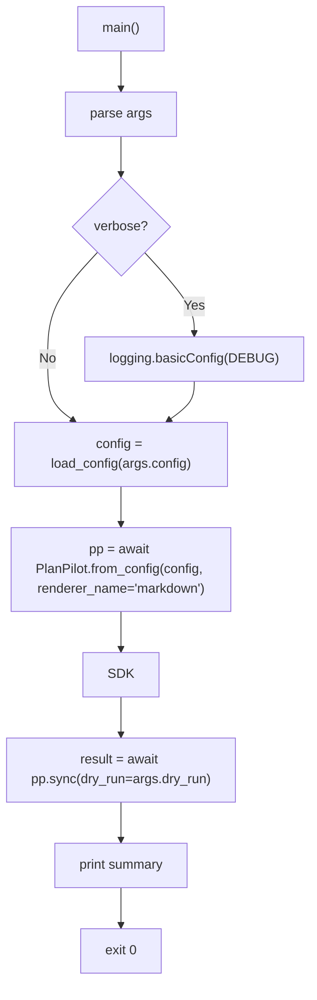

# CLI Module Spec

## Overview

The CLI module (`cli.py`) is a thin shell wrapper around the SDK. It handles argument parsing, output formatting, and the async runtime boundary. The CLI contains no business logic — it delegates everything to the SDK's public API.

In v2, the CLI shifts from argument-driven configuration to **config-file-driven** operation. The primary input is a `planpilot.json` file; CLI flags only provide mode selection (`--dry-run` / `--apply`) and runtime options (`--verbose`).

## Layer

**CLI (L4)** — the outermost layer. Depends only on the SDK's public API.

## Dependencies

| Source | Types/Functions Used |
|--------|---------------------|
| **SDK public API** | `PlanPilot`, `PlanItemType`, `SyncResult`, `PlanPilotConfig` |
| **SDK public API** | `load_config` |
| **SDK public API** | `PlanPilotError` (and subclasses) |
| **stdlib** | `argparse`, `asyncio`, `sys`, `logging` |

**Import rule:** The CLI imports only from the SDK's public API surface (i.e. `from planpilot import ...`). It does **not** import from Core modules or Contracts directly. All needed types are re-exported through the SDK.

## Command Structure

v2 uses a subcommand pattern to allow future expansion (e.g. `planpilot validate`, `planpilot status`):

```
planpilot [--version]
planpilot sync --config <path> (--dry-run | --apply) [--verbose]
```

### `sync` Subcommand

The primary (and initially only) subcommand. Syncs a plan to the configured provider.

| Argument | Type | Required | Default | Description |
|----------|------|----------|---------|-------------|
| `--config` | `str` | Yes | — | Path to `planpilot.json` config file |
| `--dry-run` | flag | One of | — | Preview mode — no provider mutations |
| `--apply` | flag | these | — | Apply mode — create/update items in provider |
| `--verbose`, `-v` | flag | No | `False` | Enable debug-level logging to stderr |

**`--dry-run` / `--apply`** are mutually exclusive and one is required. This carries forward from v1 — explicit mode prevents accidental mutations.

## Argument Parsing

```python
def build_parser() -> argparse.ArgumentParser:
    """Build the argument parser for the planpilot CLI.

    Returns:
        Configured ArgumentParser with sync subcommand.
    """

def _parse_args(argv: list[str] | None = None) -> argparse.Namespace:
    """Parse CLI arguments.

    Args:
        argv: Argument list (defaults to sys.argv[1:]).

    Returns:
        Parsed namespace.
    """
```

### Parser Structure

```python
parser = argparse.ArgumentParser(
    prog="planpilot",
    description="Sync plan epics/stories/tasks to issue trackers and project boards.",
)
parser.add_argument("--version", action="version", version=f"%(prog)s {__version__}")

subparsers = parser.add_subparsers(dest="command", required=True)

# sync subcommand
sync_parser = subparsers.add_parser("sync", help="Sync a plan to the configured provider")
sync_parser.add_argument("--config", required=True, help="Path to planpilot.json config file")

mode = sync_parser.add_mutually_exclusive_group(required=True)
mode.add_argument("--dry-run", action="store_true", help="Preview changes without mutations")
mode.add_argument("--apply", action="store_true", help="Apply changes (mutating mode)")

sync_parser.add_argument("--verbose", "-v", action="store_true", help="Enable debug logging")
```

## Execution Flow



### `_run_sync()` — Async Entrypoint

```python
async def _run_sync(args: argparse.Namespace) -> None:
    """Execute the sync pipeline from parsed CLI arguments.

    Args:
        args: Parsed CLI namespace.
    """
    config = load_config(args.config)
    pp = await PlanPilot.from_config(config, renderer_name="markdown")
    result = await pp.sync(dry_run=args.dry_run)

    print(_format_summary(result, config))
```

### `main()` — Sync Entrypoint

```python
def main() -> int:
    """Entry point for the planpilot CLI command.

    Returns:
        Exit code:
            0 success
            2 usage/argparse failure
            3 config/plan validation failure
            4 auth/provider/network failure
            5 sync/reconciliation failure
            1 unexpected internal error
    """
    args = _parse_args()

    if args.verbose:
        logging.basicConfig(
            level=logging.DEBUG,
            format="%(name)s %(message)s",
            stream=sys.stderr,
        )

    try:
        asyncio.run(_run_sync(args))
        return 0
    except (ConfigError, PlanLoadError, PlanValidationError) as exc:
        print(f"error: {exc}", file=sys.stderr)
        return 3
    except (AuthenticationError, ProviderError) as exc:
        print(f"error: {exc}", file=sys.stderr)
        return 4
    except SyncError as exc:
        print(f"error: {exc}", file=sys.stderr)
        return 5
    except PlanPilotError as exc:
        print(f"error: {exc}", file=sys.stderr)
        return 1
```

## Output Formatting

### Success Summary

```python
def _format_summary(result: SyncResult, config: PlanPilotConfig) -> str:
    """Format a human-readable execution summary.

    Args:
        result: The sync result.
        config: The config used for the run.

    Returns:
        Multi-line summary string.
    """
```

**Output format:**

```
planpilot - sync complete (apply)

  Plan ID:   a1b2c3d4e5f6
  Target:    owner/repo
  Board:     https://github.com/orgs/owner/projects/1

  Created:   2 epic(s), 5 story(s), 12 task(s)
  Existing:  0 epic(s), 1 story(s), 3 task(s)

  Epic   E1      #42    https://github.com/owner/repo/issues/42
  Epic   E2      #43    https://github.com/owner/repo/issues/43
  Story  S1      #44    https://github.com/owner/repo/issues/44
  ...

  Sync map:  /abs/path/to/sync-map.json

  [dry-run] No changes were made  (only in dry-run mode)
```

**Changes from v1 summary format:**

| v1 | v2 | Rationale |
|----|-----|-----------|
| `Repo: owner/repo` | `Target: owner/repo` | Provider-agnostic terminology |
| `Project: <url>` | `Board: <url>` | Provider-agnostic terminology |
| Separate counters per entity | `items_created: dict[PlanItemType, int]` | Unified counter |
| `#{issue_number}` column | `entry.key` column | Provider-agnostic key (GitHub uses `#N`, Jira uses `PROJ-N`) |

**Computing "Existing" counts:** `SyncResult` provides `items_created: dict[PlanItemType, int]` and `sync_map.entries: dict[str, SyncEntry]`. The CLI computes total items per type by grouping `sync_map.entries` by `entry.item_type`, then subtracts `items_created` counts to derive "existing" counts. The "Existing" line is only displayed when the count is > 0.

### Item Table

Items are displayed grouped by type (epics, stories, tasks), using the `SyncEntry` fields:

| Column | Source | Description |
|--------|--------|-------------|
| Type | `PlanItemType` name | "Epic", "Story", "Task" |
| ID | `sync_map.entries` dict key | Plan-level item ID |
| Key | `SyncEntry.key` | Provider-assigned key (e.g. `#42`) |
| URL | `SyncEntry.url` | Full URL to the created/existing item |

### Error Output

All errors go to stderr. `PlanPilotError` subclasses provide user-friendly messages:

```
error: Plan validation failed:
  - Item S1 references non-existent parent E99
  - Item T3 depends on non-existent item T99
```

Exit codes are intentionally differentiated for automation:

| Code | Meaning |
|------|---------|
| `0` | Success |
| `2` | Usage/argument parsing failure (argparse) |
| `3` | Config or plan validation failure |
| `4` | Authentication/provider/network failure |
| `5` | Sync/reconciliation failure |
| `1` | Unexpected internal failure |

## File Structure

```
src/planpilot/
├── cli.py                 # build_parser, main, _run_sync, _format_summary
└── __main__.py            # python -m planpilot support
```

`__main__.py` remains unchanged:

```python
from planpilot.cli import main

raise SystemExit(main())
```

## Design Decisions

| Decision | Rationale |
|----------|-----------|
| Config-file driven (not arg-driven) | Config file is shareable, versionable, and used by both CLI and SDK. Reduces CLI arg sprawl |
| `--dry-run` / `--apply` still on CLI | Mode is a per-invocation choice, not persisted config. Passed to `sync(dry_run=...)` |
| Subcommand pattern | Future expansion (`planpilot validate`, `planpilot status`) without breaking existing usage |
| No `--provider`, `--target`, etc. | All in config file. CLI stays minimal |
| `--verbose` is CLI-only | Logging level is a runtime concern. SDK uses standard `logging` module |
| Renderer hardcoded to "markdown" | GitHub is the primary provider; renderer selection could be added to config later |
| Error handling maps known failure classes to stable exit codes | Automation can distinguish validation/auth/sync failures without parsing stderr |

## Changes from v1

| v1 | v2 | Rationale |
|----|-----|-----------|
| All config via CLI flags (`--repo`, `--project-url`, `--epics-path`, etc.) | Config via `--config <path>`, mode via `--dry-run`/`--apply` | Simpler CLI, config file is source of truth |
| CLI imports Core modules directly (`SyncEngine`, `GitHubProvider`) | CLI imports only from SDK (`PlanPilot`, `load_config`, etc.) | Clean layer boundary |
| CLI constructs engine directly | CLI uses SDK facade | SDK is composition root |
| No subcommands | `planpilot sync` subcommand | Extensible for future commands |
| `SyncConfig.verbose` in config | `--verbose` CLI flag only | Logging is a runtime concern |
| Summary uses `issue_number`, `repo`, `project_url` | Summary uses `key`, `target`, `board_url` | Provider-agnostic |
