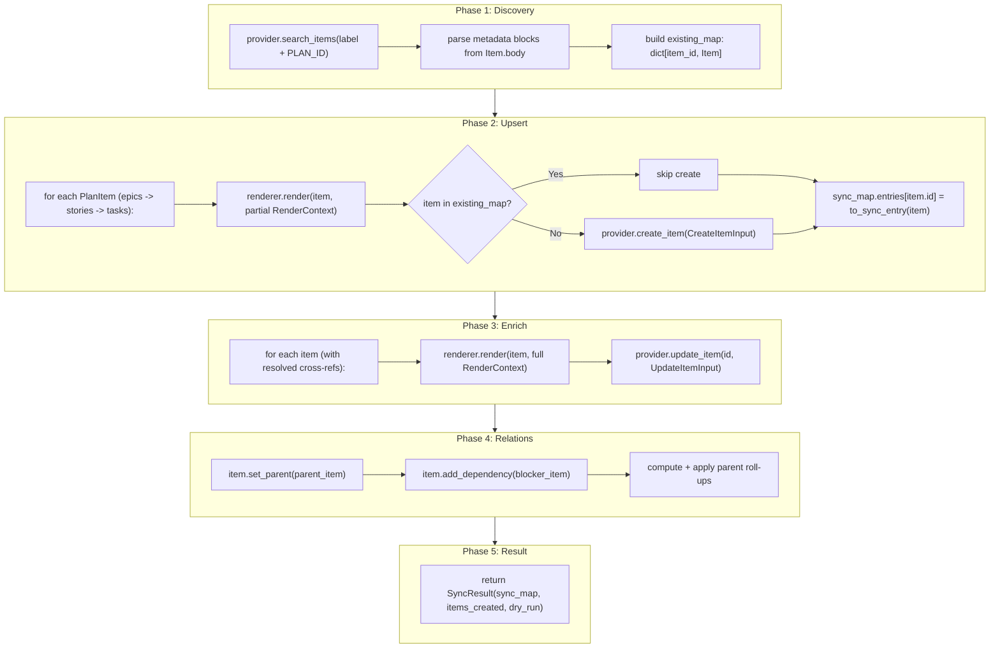
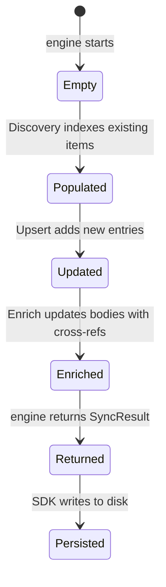

# Engine Module Spec

The engine module (`engine/`) orchestrates the sync pipeline. It receives a `Plan`, a `Provider`, and a `BodyRenderer` via dependency injection and runs a multi-phase sync that creates/updates work items in the external system.

The engine is the primary consumer of all Contracts (see [contracts.md](contracts.md) for type definitions).

## SyncEngine Class

```python
class SyncEngine:
    def __init__(
        self,
        provider: Provider,
        renderer: BodyRenderer,
        config: PlanPilotConfig,
        *,
        dry_run: bool = False,
    ) -> None: ...

    async def sync(self, plan: Plan, plan_id: str) -> SyncResult: ...
```

The engine receives a fully constructed `Provider` (already authenticated via `__aenter__`), a `BodyRenderer`, config, and a `dry_run` flag. The `Plan` and its deterministic `plan_id` are passed to `sync()` — the SDK handles plan loading and hash computation.

## Sync Pipeline



In dry-run mode, only Upsert runs (with placeholder entries, no API calls). Discovery, Enrich, and Relations are skipped. The SDK persists dry-run output to `<sync_path>.dry-run`.

## Phase 1: Discovery

**Goal:** Find items that already exist in the provider for this plan, so we can skip re-creating them.

**Source of truth:** Provider-search-first. The sync map is persisted output/cache, not the canonical source for finding existing items.

```python
filters = ItemSearchFilters(
    labels=[config.label],
    body_contains=f"PLAN_ID:{plan_id}",
)
existing_items: list[Item] = await provider.search_items(filters)
```

The engine parses the metadata block from each `Item.body` to extract `plan_id` and `item_id`. Items whose `plan_id` matches are indexed into `existing_map: dict[str, Item]`.

**Capability requirement:** Providers must support discovery filters (`labels` + `body_contains`). If unsupported, provider setup fails fast with `ProviderCapabilityError`.

**Metadata marker (renderer-agnostic):**

```text
PLANPILOT_META_V1
PLAN_ID:<plan_id>
ITEM_ID:<item_id>
END_PLANPILOT_META
```

This block must appear verbatim at the top of rendered item bodies for all renderers.

## Phase 2: Upsert

**Goal:** For each PlanItem, create it if it doesn't exist.

**Processing order:** Topologically sorted — epics first, then stories, then tasks — with parents before children within each level.

```python
# Build partial render context (no cross-refs yet)
context = RenderContext(
    plan_id=plan_id,
    parent_ref=parent_entry.key,
    sub_items=[],
    dependencies={},
)
body = renderer.render(plan_item, context)

if plan_item.id in existing_map:
    item = existing_map[plan_item.id]
else:
    input = CreateItemInput(
        title=plan_item.title,
        body=body,
        item_type=plan_item.type,
        labels=[config.label],
        size=plan_item.estimate.tshirt if plan_item.estimate else None,
    )
    try:
        item = await provider.create_item(input)
    except CreateItemPartialFailureError as exc:
        raise SyncError(...) from exc

sync_map.entries[plan_item.id] = to_sync_entry(item)
```

**Dry-run behavior:** Skips all provider calls and creates placeholder `SyncEntry` objects with `key="dry-run"`, `url="dry-run"`.

## Phase 3: Enrich

**Goal:** Reconcile existing items with plan-authoritative fields (now that all items exist and have keys).

```python
# Build full render context with resolved cross-refs
context = RenderContext(
    plan_id=plan_id,
    parent_ref=parent_entry.key,
    sub_items=sorted([(child_entry.key, child_item.title) for child in children], key=lambda p: (p[0], p[1])),
    dependencies={dep_id: sync_map.entries[dep_id].key for dep_id in sorted(plan_item.depends_on)},
)
body = renderer.render(plan_item, context)

await provider.update_item(entry.id, UpdateItemInput(
    title=plan_item.title, body=body, item_type=plan_item.type,
    labels=[config.label],
    size=plan_item.estimate.tshirt if plan_item.estimate else None,
))
```

**Reconciliation ownership:**
- **Plan-authoritative:** `title`, `body`, `item_type`, `labels`, `size`, relations
- **Labels:** Additive (`ensure config.label present`), not replace-all
- **Provider-authoritative after create:** `status`, `priority`, `iteration` — not overwritten by Enrich

## Phase 4: Relations

**Goal:** Set up parent/child hierarchy and blocked-by dependency links.

```python
await item.set_parent(parent_item)       # for items with parent_id
await item.add_dependency(blocker_item)   # for direct deps + roll-ups
```

**Roll-up logic:** If a child in parent A depends on a child in parent B (A != B), then parent A is blocked by parent B. This rolls up recursively (task deps -> story level, story deps -> epic level). Cyclic edges are de-duplicated and skipped with warnings.

**Note:** The engine stores `Item` objects (not just `SyncEntry`) during upsert for use in relation calls.

## Phase 5: Result

The engine returns `SyncResult` and does **not** persist the sync map to disk — that is the SDK's responsibility.

```python
return SyncResult(sync_map=sync_map, items_created=counters, dry_run=self._dry_run)
```

Sync map persistence (apply mode -> `config.sync_path`, dry-run -> `<sync_path>.dry-run`) is handled by the SDK.

## Sync Map Lifecycle



## Internal Utilities

| Utility | Signature | Purpose |
|---------|-----------|---------|
| `parse_metadata_block` | `(body: str) -> dict[str, str]` | Extract PLAN_ID, ITEM_ID from metadata block |
| `compute_parent_blocked_by` | `(items: list[PlanItem], item_type: PlanItemType) -> set[tuple[str, str]]` | Roll up child deps to parent level |
