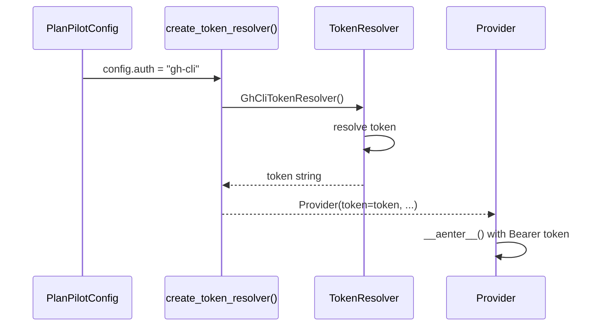

# Auth Module Spec

The auth module (`auth/`) handles token resolution for provider authentication. It abstracts how tokens are obtained so that providers receive a resolved token string without caring about the source.

This is a Core module. It depends only on the Contracts layer (see [contracts.md](../design/contracts.md) for `PlanPilotConfig`).

## TokenResolver ABC

```python
class TokenResolver(ABC):
    @abstractmethod
    async def resolve(self) -> str:
        """Resolve and return an authentication token.

        Raises:
            AuthenticationError: If token resolution fails.
        """
```

The resolver is called once during SDK setup (before provider construction). The returned token is passed to the provider factory.

## Concrete Resolvers

| `auth` value | Resolver | Behavior |
|-------------|----------|----------|
| `"gh-cli"` (default) | `GhCliTokenResolver` | Runs `gh auth token --hostname <host>` as a single subprocess call |
| `"env"` | `EnvTokenResolver` | Reads the `GITHUB_TOKEN` environment variable |
| `"token"` | `StaticTokenResolver` | Uses the `token` field from `PlanPilotConfig` directly |

All resolvers raise `AuthenticationError` on failure (missing token, subprocess error, empty env var).

### GhCliTokenResolver

Uses the GitHub CLI's stored credentials. Requires `gh` to be installed and authenticated. The hostname is derived from `config.target`.

### EnvTokenResolver

Reads from `GITHUB_TOKEN` env var. Fails if the variable is unset or empty. Suitable for CI environments.

### StaticTokenResolver

Uses the `config.token` field directly. Config validation ensures `token` is non-empty when `auth="token"` (see [config.md](config.md) Auth/Token validation rules).

## Auth Flow



Token resolution happens in the SDK's `PlanPilot.from_config()`, before the provider is constructed. The provider never knows which resolver was used.

## Token Resolver Factory

```python
RESOLVERS: dict[str, type[TokenResolver]] = {
    "gh-cli": GhCliTokenResolver,
    "env": EnvTokenResolver,
    "token": StaticTokenResolver,
}

def create_token_resolver(config: PlanPilotConfig) -> TokenResolver:
    """Create a token resolver from config.auth setting.

    Raises:
        ConfigError: If config.auth is not a registered resolver name.
    """
```

## Design Decisions

| Decision | Rationale |
|----------|-----------|
| Auth is a separate Core module, not part of providers | Auth is orthogonal to transport — any provider needs a token |
| Resolver is async | Future resolvers may need I/O (e.g. OAuth device flow) |
| Single `resolve()` call, no refresh | v2 scope; token refresh can be added later |
| Factory keyed by `config.auth` string | Open for extension without modifying existing resolvers |

## File Structure

```
auth/
├── __init__.py        # Package init
├── base.py            # TokenResolver ABC
├── factory.py         # create_token_resolver factory
├── gh_cli.py          # GhCliTokenResolver
├── env.py             # EnvTokenResolver
└── static.py          # StaticTokenResolver
```
