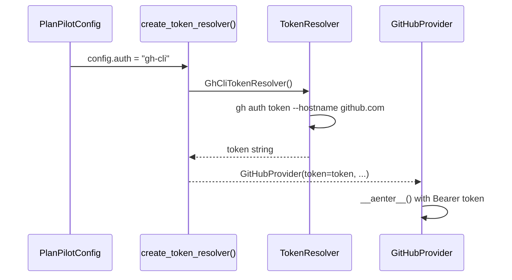

# GitHub Provider — Implementation Design

Full implementation details for the GitHub provider. For the provider contract and generic adapter patterns, see [providers.md](providers.md). For the ariadne-codegen technology decision, see [ADR-001](../decisions/001-ariadne-codegen.md).

## Requirements

| Operation | API | Notes |
|-----------|-----|-------|
| Fetch repo context | GraphQL | Repo ID, issue types, labels |
| Create label (if missing) | GraphQL | Bootstrap discovery label |
| Create issue | GraphQL | `createIssue` mutation |
| Update issue | GraphQL | `updateIssue` mutation (title/body, additive labels) |
| Update issue type | GraphQL | `updateIssueType` (when `create_type_strategy=issue-type`) |
| Search issues | GraphQL | By label + body text (discovery) |
| Add label | GraphQL | `addLabelsToLabelable` |
| Add to project | GraphQL | `addProjectV2ItemById` |
| Set project field | GraphQL | `updateProjectV2ItemFieldValue` |
| Fetch project fields | GraphQL | Field IDs, options, iterations |
| Fetch project items | GraphQL | Build/refresh issue->project item map |
| Add sub-issue | GraphQL | `addSubIssue` (confirmed in public schema) |
| Add blocked-by | GraphQL | `addBlockedBy` (confirmed in public schema) |
| Fetch relations | GraphQL | `parent`, `blockedBy` on Issue type |

All operations are GraphQL. Discovery uses the GraphQL `search` query and must fail fast on result-cap limits/truncation.

## Core Classes

### GitHubProvider

```python
class GitHubProvider(Provider):
    def __init__(self, *, target: str, token: str, board_url: str,
                 label: str, field_config: FieldConfig | None) -> None: ...
```

**`__aenter__` setup:**
1. Initialize generated GraphQL client with token
2. Resolve repo context (repo ID, issue type IDs, resolve/create label)
3. Resolve project context (parse `board_url`, resolve owner type, fetch fields)
4. Discovery and relation capability checks
5. Resolve create-type policy from `FieldConfig`
6. Store in `GitHubProviderContext`

### GitHubItem

```python
class GitHubItem(Item):
    async def set_parent(self, parent: Item) -> None:
        """Idempotent. Raises ProviderCapabilityError if unavailable."""

    async def add_dependency(self, blocker: Item) -> None:
        """Idempotent. Raises ProviderCapabilityError if unavailable."""
```

### GitHubProviderContext

```python
class GitHubProviderContext(ProviderContext):
    repo_id: str
    label_id: str
    issue_type_ids: dict[str, str]
    project_owner_type: str              # "org" | "user"
    project_id: str | None
    project_item_ids: dict[str, str]
    status_field: ResolvedField | None
    priority_field: ResolvedField | None
    iteration_field: ResolvedField | None
    size_field_id: str | None
    size_options: list[dict[str, str]]
    supports_sub_issues: bool
    supports_blocked_by: bool
    supports_discovery_filters: bool
    supports_issue_type: bool
    create_type_strategy: str            # "issue-type" | "label"
    create_type_map: dict[str, str]
```

## Authentication (Token Resolution)

Token resolution is orthogonal to the provider. The provider receives a resolved token.



```
auth/
├── base.py            # TokenResolver ABC
├── gh_cli.py          # Shell out to `gh auth token --hostname <host>` once
├── env.py             # Read GITHUB_TOKEN env var
└── static.py          # Direct injection (testing, CI)
```

| `auth` value | Resolver | Notes |
|-------------|----------|-------|
| `"gh-cli"` (default) | `GhCliTokenResolver` | Single subprocess call |
| `"env"` | `EnvTokenResolver` | Reads `GITHUB_TOKEN` env var |
| `"token"` | `StaticTokenResolver` | From config `token` field |

### Required Token Permissions

| Capability | Required permission |
|------------|---------------------|
| Issue create/update/label | Repository Issues write |
| Project item and field mutations | Projects write |
| Org project metadata reads | Organization metadata/read access |
| Discovery + relation queries/mutations | GraphQL access with above permissions |

Provider startup must execute capability probes and return explicit missing-permission errors.

## Token Resolver Factory

```python
RESOLVERS: dict[str, type[TokenResolver]] = {
    "gh-cli": GhCliTokenResolver,
    "env": EnvTokenResolver,
    "token": StaticTokenResolver,
}

def create_token_resolver(config: PlanPilotConfig) -> TokenResolver:
    """Create a token resolver from config.auth setting."""
```

## Codegen Setup

Uses ariadne-codegen (see [ADR-001](../decisions/001-ariadne-codegen.md) for rationale).

**Schema source:** [octokit/graphql-schema](https://github.com/octokit/graphql-schema)

```toml
# pyproject.toml
[tool.ariadne-codegen]
schema_path = "src/planpilot/providers/github/schema.graphql"
queries_path = "src/planpilot/providers/github/operations/"
target_package_name = "github_gql"
target_package_path = "src/planpilot/providers/github/"
async_client = true
include_all_inputs = false
include_all_enums = false
include_comments = "stable"
```

**Developer workflow — adding a new operation:**
1. Write `.graphql` file in `operations/`
2. Run `ariadne-codegen`
3. Use the generated typed method in provider code
4. mypy validates everything end-to-end

## Operational Hardening

### Idempotent Multi-Step Create

See the [create_item() workflow diagram](providers.md#key-design-create_item-is-idempotent-multi-step) in providers.md.

On partial failure, provider errors include: `created_item_id`, `created_item_key`, `created_item_url`, `completed_steps`, `retryable`.

Metadata must be present in the body at issue-creation time so discovery can recover from partial setup.

### Create Type Strategy and Compatibility

| Strategy | Behavior |
|----------|----------|
| `issue-type` | Map `EPIC/STORY/TASK` to provider issue types (`updateIssueType`) |
| `label` | Map `EPIC/STORY/TASK` to labels (e.g. `type:epic`) |

**Compatibility rules:**
- Project owner type resolved from `board_url` (`/orgs/` vs `/users/`)
- Org-owned projects may use either strategy (subject to capability checks)
- User-owned projects must use `label` strategy in v2 launch
- Unsupported combinations fail at provider setup

### Project URL Owner Resolution

| URL Shape | Owner Type |
|-----------|-----------|
| `https://github.com/orgs/<org>/projects/<n>` | Organization |
| `https://github.com/users/<user>/projects/<n>` | User |

Any other URL shape is a `ProjectURLError`.

### Capability Gating for Relations

Relation mutations (`addSubIssue`, `addBlockedBy`) may be unavailable. Provider startup detects capabilities via probe queries and caches booleans in context. Relation calls raise `ProviderCapabilityError` when unsupported.

### Retry and Rate-Limit Policy

| Failure class | Retry? | Notes |
|---------------|--------|-------|
| Network timeout / connection reset | Yes | Exponential backoff |
| HTTP 502/503/504 | Yes | Respect `Retry-After` |
| HTTP 429 / secondary rate limit | Yes | Respect `Retry-After`, reduce concurrency |
| GraphQL transient errors | Yes | Parse `errors[*].extensions` |
| GraphQL schema/validation errors | No | Operation/spec mismatch |
| Authentication/authorization failures | No | Requires config/token fix |

Additional rules: bounded exponential backoff, log retry attempts with operation name, cap concurrent in-flight operations via semaphore.

### Pagination Requirements

Must paginate: repo issue types, label lookups, search results, project items, relation fetches.

Rules: cursor until `hasNextPage == false`, bounded page size (50-100), max-page safety budget with loud failure on exceed, discovery must fail if pagination truncates results.

### Project Field Type Handling

`updateProjectV2ItemFieldValue` requires type-specific payloads. Implementation must branch by field kind (single-select, iteration, number) and validate config values before mutation.

## Mapper

| Function | Purpose |
|----------|---------|
| `parse_project_url(url)` | Extract org/user and project number |
| `resolve_option_id(options, name)` | Case-insensitive option ID lookup |
| `build_parent_map(data)` | Parse sub-issue API response |
| `build_blocked_by_map(data)` | Parse blocked-by API response |

Metadata parsing (`PLAN_ID`/`ITEM_ID`) is **not** a provider concern — it is an engine-internal utility.

## File Structure

```
providers/github/
├── __init__.py
├── provider.py              # GitHubProvider
├── item.py                  # GitHubItem
├── models.py                # GitHubProviderContext
├── mapper.py                # Utility functions
├── schema.graphql           # Vendored GitHub schema
├── operations/              # .graphql operation files
│   ├── fetch_repo.graphql
│   ├── create_label.graphql
│   ├── fetch_project.graphql
│   ├── fetch_project_items.graphql
│   ├── search_issues.graphql
│   ├── create_issue.graphql
│   ├── update_issue.graphql
│   ├── add_project_item.graphql
│   ├── update_project_field.graphql
│   ├── add_sub_issue.graphql
│   ├── add_blocked_by.graphql
│   └── fetch_relations.graphql
└── github_gql/              # Generated by ariadne-codegen (committed)
    ├── client.py
    ├── input_types.py
    ├── enums.py
    └── ...
```
