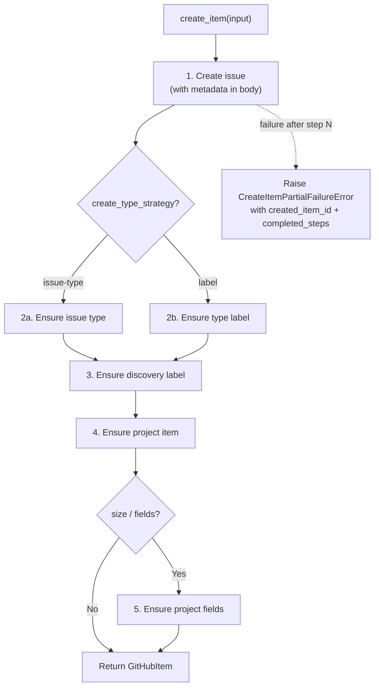

# Providers Module Spec

The providers module (`providers/`) contains concrete implementations of the `Provider` ABC and a factory for instantiation by name. Each provider adapts an external issue-tracking system (GitHub, Jira, Linear) to the provider contract.

This is a Core module. It depends only on the Contracts layer (see [contracts.md](../design/contracts.md) for `Provider`, `Item`, and input/filter type definitions).

Third-party/runtime dependencies (e.g. httpx, generated GraphQL client) are allowed; "depends only on Contracts" means no imports from other PlanPilot internal layers.

**Module-level base class:** `ProviderContext` (defined in `providers/base.py`, Core layer) is a base class that concrete providers subclass to store resolved IDs, field mappings, and other provider-specific state. Opaque to the engine and SDK.

## Required Discovery Capabilities

Providers must support discovery semantics used by the engine:

- `search_items()` must apply `labels` and `body_contains` as a conjunctive filter
- `search_items()` must use provider-native search semantics with mandatory pagination
- Discovery must fail fast if search limits/caps would truncate results (no silent partial discovery)
- If a provider cannot satisfy these semantics, it must fail fast in `__aenter__` with `ProviderCapabilityError`

## Partial Failure Error Contract

`create_item()` is multi-step and may fail after an item already exists remotely:

```python
class CreateItemPartialFailureError(ProviderError):
    created_item_id: str | None
    created_item_key: str | None
    created_item_url: str | None
    completed_steps: tuple[str, ...]   # canonical step names
    retryable: bool
```

Canonical step names: `issue_created`, `issue_type_set`, `labels_set`, `project_item_added`, `project_fields_set`.

## Key Design: `create_item()` is Idempotent Multi-Step

In v2, `create_item()` handles everything the v1 engine orchestrated across multiple calls, as a re-runnable workflow:



**Required behavior:**
- Each sub-step must be safe to retry (`ensure_*` semantics)
- Partial failures must raise `CreateItemPartialFailureError` with created item identity + `completed_steps`
- Re-running sync must converge to one correctly configured item, not duplicates
- Metadata must be present in body at issue creation time so discovery can find partially configured items

## Key Design: Reconciliation Ownership

`update_item()` applies only plan-authoritative fields: `title`, `body`, `item_type`, `labels`, `size`.

- **Labels:** Additive (`ensure label present`), not replace-all. Provider must preserve non-PlanPilot labels.
- **Provider-authoritative after create:** `status`, `priority`, `iteration` from `field_config` are creation defaults, not continuously enforced.

## Provider Factory

```python
PROVIDERS: dict[str, type[Provider]] = {
    "github": GitHubProvider,
}

def create_provider(
    name: str, *, target: str, token: str, board_url: str,
    label: str = "planpilot", field_config: FieldConfig | None = None,
    **kwargs: object,
) -> Provider:
    """Create a provider instance by name.

    Raises:
        ValueError: If name is not in PROVIDERS.
    """
```

## GitHub Provider

Concrete implementation for GitHub Issues + Projects v2. Uses ariadne-codegen for typed async GraphQL (see [ADR-001](../decisions/001-ariadne-codegen.md) for rationale). Full implementation details in [github-provider.md](github-provider.md).

### File Structure

```
providers/github/
├── __init__.py         # Package init
├── provider.py         # GitHubProvider (implements Provider ABC)
├── item.py             # GitHubItem (implements Item relation methods)
├── mapper.py           # Generated types -> domain model mappers
├── models.py           # GitHubProviderContext
├── schema.graphql      # GitHub's public GraphQL schema (vendored)
├── operations/         # .graphql operation files (source of truth)
│   ├── fetch_repo.graphql
│   ├── create_issue.graphql
│   └── ...
└── github_gql/         # Generated by ariadne-codegen (committed)
    ├── client.py       # Typed async client (httpx-based)
    ├── input_types.py
    └── ...
```

### GitHubProvider

```python
class GitHubProvider(Provider):
    def __init__(self, *, target: str, token: str, board_url: str,
                 label: str, field_config: FieldConfig | None) -> None: ...
```

**`__aenter__` setup:**
1. Initialize generated GraphQL client with token
2. Resolve repo context (repo ID, issue type IDs, resolve/create label)
3. Resolve project context (parse `board_url`, resolve owner type, fetch fields)
4. Discovery and relation capability checks
5. Resolve create-type policy from `FieldConfig`
6. Store in `GitHubProviderContext`

### GitHubItem

```python
class GitHubItem(Item):
    async def set_parent(self, parent: Item) -> None:
        """Idempotent. Raises ProviderCapabilityError if unavailable."""

    async def add_dependency(self, blocker: Item) -> None:
        """Idempotent. Raises ProviderCapabilityError if unavailable."""
```

### GitHubProviderContext

```python
class GitHubProviderContext(ProviderContext):
    repo_id: str
    label_id: str
    issue_type_ids: dict[str, str]
    project_owner_type: str              # "org" | "user"
    project_id: str | None
    project_item_ids: dict[str, str]
    status_field: ResolvedField | None
    priority_field: ResolvedField | None
    iteration_field: ResolvedField | None
    size_field_id: str | None
    size_options: list[dict[str, str]]
    supports_sub_issues: bool
    supports_blocked_by: bool
    supports_discovery_filters: bool
    supports_issue_type: bool
    create_type_strategy: str            # "issue-type" | "label"
    create_type_map: dict[str, str]
```

### Operations

| Operation File | Type | Purpose |
|---------------|------|---------|
| `fetch_repo.graphql` | Query | Fetch repo ID, issue types, label |
| `create_label.graphql` | Mutation | Create label if missing during setup |
| `fetch_project.graphql` | Query | Fetch project fields, options, iterations |
| `fetch_project_items.graphql` | Query | Fetch all project item mappings |
| `search_issues.graphql` | Query | Search issues by label + body text |
| `create_issue.graphql` | Mutation | Create issue |
| `update_issue.graphql` | Mutation | Update issue title/body (and additive labels) |
| `add_project_item.graphql` | Mutation | Add issue to project board |
| `update_project_field.graphql` | Mutation | Set project field value |
| `update_issue_type.graphql` | Mutation | Set issue type (when strategy is `issue-type`) |
| `add_sub_issue.graphql` | Mutation | Create parent/child relationship |
| `add_blocked_by.graphql` | Mutation | Create blocked-by relationship |
| `fetch_relations.graphql` | Query | Batch fetch parents + blocked-by |

## Adding a New Provider

1. Create `providers/jira/` package
2. Implement `JiraProvider(Provider)` with all abstract methods
3. Implement `JiraItem(Item)` with `set_parent()` and `add_dependency()`
4. Create API transport client
5. Add to factory mapping in `providers/factory.py`

No changes needed to engine, SDK, CLI, renderers, or any other module.
