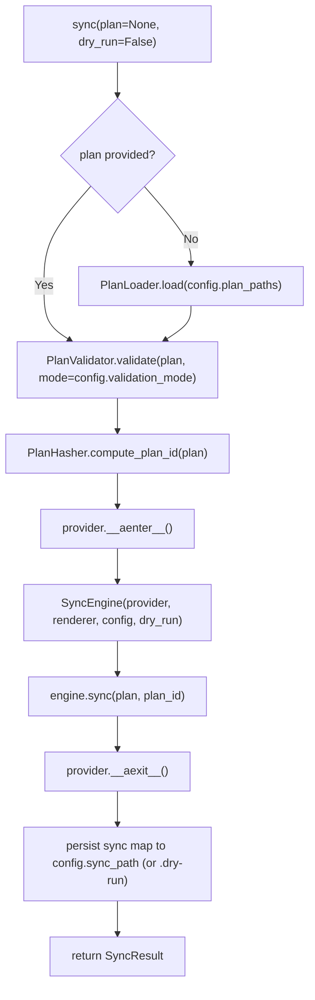

# SDK Module Spec

The SDK module (`sdk.py`) is PlanPilot's public API surface and **composition root** — the only place that sees all Core modules and wires them together. External callers (CLI, scripts, CI integrations) interact exclusively through the SDK.

The SDK contains no business logic — pure orchestration and wiring.

**SDK (L3)** — depends on Core and Contracts (see [contracts.md](../design/contracts.md) for type definitions).

## PlanPilot Class

```python
class PlanPilot:
    """PlanPilot SDK — the public API for programmatic plan syncing."""

    def __init__(self, *, provider: Provider, renderer: BodyRenderer,
                 config: PlanPilotConfig) -> None:
        """Initialize with injected dependencies (advanced/testing)."""

    @classmethod
    async def from_config(cls, config: PlanPilotConfig, *,
                          renderer_name: str = "markdown") -> PlanPilot:
        """Create PlanPilot from config (recommended).

        1. Resolve token via create_token_resolver(config)
        2. Build provider via create_provider(...)
        3. Build renderer via create_renderer(renderer_name)
        4. Return PlanPilot(provider, renderer, config)
        """

    async def sync(self, plan: Plan | None = None, *,
                   dry_run: bool = False) -> SyncResult:
        """Execute the full sync pipeline.

        Raises:
            PlanLoadError, PlanValidationError, ProviderError, SyncError
        """
```

### `sync()` Lifecycle



1. **Load plan** (if not provided) — `PlanLoader().load(config.plan_paths)`
2. **Validate plan** — `PlanValidator().validate(plan, mode=config.validation_mode)`
3. **Compute plan ID** — `PlanHasher().compute_plan_id(plan)` -> 12-char hex hash
4. **Enter provider** — `async with provider` manages auth + context resolution
5. **Construct + run engine** — `SyncEngine(provider, renderer, config, dry_run).sync(plan, plan_id)`
6. **Exit provider** — `__aexit__` ensures cleanup even on error
7. **Persist sync map** — apply mode -> `config.sync_path`, dry-run -> `<sync_path>.dry-run`
8. **Return result**

**Provider lifecycle:** `sync()` manages `__aenter__`/`__aexit__` internally. Callers don't need `async with`.

**Error handling:** If engine/provider raises, `__aexit__` is still called. Exception propagates after cleanup.

## load_config()

```python
def load_config(path: str | Path) -> PlanPilotConfig:
    """Load and validate a PlanPilot configuration from a JSON file.

    1. Resolve path to absolute
    2. Read JSON
    3. Parse via Pydantic
    4. Resolve all relative paths against config file's parent directory
    5. Validate provider-specific invariants (board_url, create-type strategy)
    6. Return validated config

    Raises:
        ConfigError: If loading or validation fails.
    """
```

## load_plan()

```python
def load_plan(*, unified: str | Path | None = None, epics: str | Path | None = None,
              stories: str | Path | None = None, tasks: str | Path | None = None) -> Plan:
    """Load a plan from explicit path inputs (convenience wrapper).

    Raises:
        PlanLoadError: If loading fails.
    """
```

## Public API Surface (re-exports)

The SDK re-exports selected types so callers import from one place:

| Category | Types |
|----------|-------|
| **SDK** | `PlanPilot`, `load_config`, `load_plan` |
| **Config** | `PlanPilotConfig`, `PlanPaths`, `FieldConfig` |
| **Plan** | `Plan`, `PlanItem`, `PlanItemType` |
| **Sync** | `SyncResult`, `SyncMap`, `SyncEntry` |
| **Contracts** | `Provider`, `BodyRenderer`, `RenderContext` |
| **Factories** | `create_provider`, `create_renderer`, `create_token_resolver` |
| **Exceptions** | `PlanPilotError`, `ConfigError`, `PlanLoadError`, `PlanValidationError`, `ProviderError`, `AuthenticationError`, `SyncError` |

## Programmatic Usage

```python
from planpilot import PlanPilot, PlanItemType, load_config

config = load_config("planpilot.json")
pp = await PlanPilot.from_config(config, renderer_name="markdown")
result = await pp.sync(dry_run=False)

print(f"Created {result.items_created[PlanItemType.EPIC]} epics")
print(f"Sync map: {result.sync_map.model_dump_json()}")
```

## Design Decisions

| Decision | Rationale |
|----------|-----------|
| `PlanPilot.from_config()` is the default entrypoint | SDK remains composition root |
| `__init__` accepts injected dependencies | Advanced/testing scenarios |
| `sync()` manages provider lifecycle | Simple API — no `async with` boilerplate |
| `plan` parameter optional on `sync()` | Config-driven and programmatic usage both supported |
| SDK persists sync map, not engine | Engine is pure orchestration (no I/O) |
| `load_config()` is standalone, not a method | Used before `PlanPilot` construction |

## File Structure

```
src/planpilot/
├── __init__.py            # Re-exports
├── sdk.py                 # PlanPilot, load_config(), load_plan()
```
