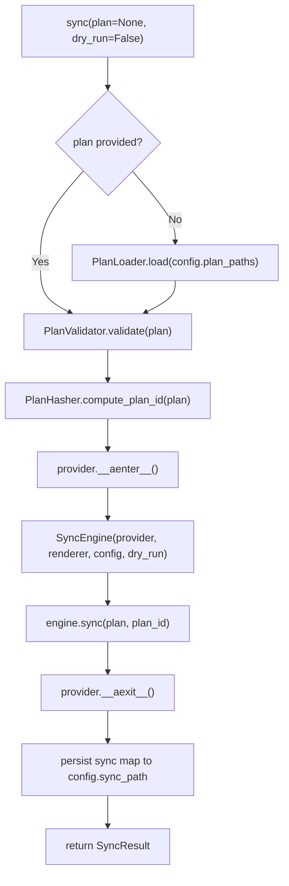

# SDK Module Spec

## Overview

The SDK module (`sdk.py`) is PlanPilot's public API surface. It is the **composition root** — the only place that sees all Core modules and wires them together. External callers (CLI, scripts, CI integrations) interact exclusively through the SDK.

The SDK contains no business logic. It is pure orchestration and wiring: load config, construct dependencies, run the engine, persist results.

## Layer

**SDK (L3)** — depends on Core and Contracts.

## Dependencies

| Layer | Module | Types/Functions Used |
|-------|--------|---------------------|
| **Contracts** | config | `PlanPilotConfig`, `PlanPaths` |
| **Contracts** | plan | `Plan`, `PlanItemType` |
| **Contracts** | sync | `SyncResult`, `SyncMap` |
| **Contracts** | provider | `Provider` |
| **Contracts** | renderer | `BodyRenderer` |
| **Contracts** | exceptions | `PlanPilotError`, `ConfigError` |
| **Core** | engine | `SyncEngine` |
| **Core** | plan | `PlanLoader`, `PlanValidator`, `PlanHasher` |
| **Core** | providers | `create_provider` (factory) |
| **Core** | renderers | `create_renderer` (factory) |
| **Core** | auth | `create_token_resolver` (factory) |

No dependency on CLI.

## PlanPilot Class

The main facade class. Standard usage is `PlanPilot.from_config(...)`, which keeps composition in the SDK. Direct dependency injection via `__init__` remains available for advanced/testing scenarios.

```python
class PlanPilot:
    """PlanPilot SDK — the public API for programmatic plan syncing.

    Wires Core modules together and manages the full sync lifecycle:
    plan loading, validation, hashing, engine execution, and result
    persistence.

    Usage:
        config = load_config("planpilot.json")
        pp = await PlanPilot.from_config(config, renderer_name="markdown")
        result = await pp.sync()
    """

    def __init__(
        self,
        *,
        provider: Provider,
        renderer: BodyRenderer,
        config: PlanPilotConfig,
    ) -> None:
        """Initialize PlanPilot with injected dependencies.

        Args:
            provider: Provider instance (not yet entered).
            renderer: Body renderer instance.
            config: Validated configuration.
        """

    @classmethod
    async def from_config(
        cls,
        config: PlanPilotConfig,
        *,
        renderer_name: str = "markdown",
    ) -> PlanPilot:
        """Create PlanPilot from config.

        SDK-owned composition flow:
        1. Resolve token via create_token_resolver(config)
        2. Build provider via create_provider(...)
        3. Build renderer via create_renderer(renderer_name)
        4. Return PlanPilot(provider, renderer, config)
        """

    async def sync(
        self,
        plan: Plan | None = None,
        *,
        dry_run: bool = False,
    ) -> SyncResult:
        """Execute the full sync pipeline.

        Args:
            plan: Optional pre-loaded Plan. If None, loads from
                config.plan_paths using PlanLoader.
            dry_run: If True, no provider mutations are performed.
                The engine runs in preview mode with placeholder entries.

        Returns:
            SyncResult with sync map, creation counts, and dry-run flag.

        Raises:
            PlanLoadError: If plan files cannot be loaded.
            PlanValidationError: If plan fails validation.
            ProviderError: If provider operations fail.
            SyncError: If engine encounters a non-recoverable failure.
        """
```

### `sync()` Lifecycle



**Step-by-step:**

1. **Load plan** (if not provided) — `PlanLoader().load(config.plan_paths)` reads JSON files into a `Plan` object
2. **Validate plan** — `PlanValidator().validate(plan)` checks relational integrity
3. **Compute plan ID** — `PlanHasher().compute_plan_id(plan)` produces deterministic 12-char hex hash
4. **Enter provider** — `async with provider` manages authentication and context resolution
5. **Construct engine** — `SyncEngine(provider, renderer, config, dry_run)`
6. **Run sync** — `engine.sync(plan, plan_id)` executes the multi-phase pipeline
7. **Exit provider** — `__aexit__` ensures cleanup even on error
8. **Persist sync map** — Write `result.sync_map` to `config.sync_path` as JSON
9. **Return result** — Caller receives `SyncResult` for inspection/display

**Provider lifecycle:** The SDK manages the provider's async context manager internally. The caller does **not** need to enter the provider context — `sync()` calls `__aenter__` before engine execution and `__aexit__` after completion (or on error). This keeps the public API simple:

```python
# Caller does NOT do:  async with provider: ...
# Instead, sync() handles it:
result = await pp.sync()  # provider lifecycle managed internally
```

**Error handling:** If the engine or provider raises during execution, `__aexit__` is still called (via `async with`). The exception propagates to the caller after cleanup.

**Sync map persistence:** After the engine returns `SyncResult`, the SDK writes `result.sync_map.model_dump_json(indent=2)` to `config.sync_path`. Persistence is skipped if `config.sync_path` is unset. Otherwise, the sync map is always written — including in dry-run mode, so users can inspect the projected output.

## Public API Surface

### Re-exported Types

The SDK re-exports selected Contracts types so that CLI and external callers can import everything from the SDK package without reaching into Contracts directly:

```python
# planpilot/__init__.py (SDK public API)
from planpilot.sdk import PlanPilot
from planpilot.contracts.config import PlanPilotConfig, PlanPaths, FieldConfig
from planpilot.contracts.plan import Plan, PlanItem, PlanItemType
from planpilot.contracts.sync import SyncResult, SyncMap, SyncEntry
from planpilot.contracts.provider import Provider
from planpilot.contracts.renderer import BodyRenderer, RenderContext
from planpilot.exceptions import (
    PlanPilotError,
    ConfigError,
    PlanLoadError,
    PlanValidationError,
    ProviderError,
    AuthenticationError,
    SyncError,
)

# Factory convenience functions (re-exported from Core)
from planpilot.providers.factory import create_provider
from planpilot.renderers.factory import create_renderer
from planpilot.auth.factory import create_token_resolver

# Config/plan loaders (SDK functions)
from planpilot.sdk import load_config, load_plan
```

### Convenience Functions

These are top-level SDK functions, not methods on `PlanPilot`:

```python
def load_config(path: str | Path) -> PlanPilotConfig:
    """Load and validate a PlanPilot configuration from a JSON file.

    Args:
        path: Path to the config JSON file.

    Returns:
        Validated PlanPilotConfig with resolved paths.

    Raises:
        ConfigError: If loading or validation fails.
    """

def load_plan(*paths: str | Path) -> Plan:
    """Load a plan from one or more JSON files.

    Convenience wrapper around PlanLoader for programmatic use.
    Accepts individual file paths (multi-file mode) or a single
    path (unified mode).

    Args:
        *paths: One or more paths to plan JSON files.

    Returns:
        Validated Plan instance.

    Raises:
        PlanLoadError: If loading fails.
    """
```

## Programmatic Usage Examples

### Standard config-file flow (recommended)

```python
from planpilot import PlanPilot, PlanItemType, load_config

config = load_config("planpilot.json")
pp = await PlanPilot.from_config(config, renderer_name="markdown")
result = await pp.sync()

print(f"Created {result.items_created[PlanItemType.EPIC]} epics")
```

### Pre-loaded plan

```python
from planpilot import PlanPilot, load_config, load_plan

config = load_config("planpilot.json")
plan = load_plan("epics.json", "stories.json", "tasks.json")

pp = await PlanPilot.from_config(config, renderer_name="markdown")
result = await pp.sync(plan=plan)
```

### Dry-run mode

```python
from planpilot import PlanPilot, load_config

config = load_config("planpilot.json")
pp = await PlanPilot.from_config(config, renderer_name="markdown")
result = await pp.sync(dry_run=True)
assert result.dry_run is True
```

## File Structure

```
src/planpilot/
├── __init__.py            # Re-exports: PlanPilot, types, factories, load_config
├── sdk.py                 # PlanPilot class, load_config(), load_plan()
```

## Design Decisions

| Decision | Rationale |
|----------|-----------|
| `PlanPilot.from_config()` is the default entrypoint | SDK remains composition root; CLI and most callers avoid Core wiring details |
| `PlanPilot.__init__` still accepts injected provider/renderer | Advanced/testing scenarios still support explicit dependency injection |
| `sync()` manages provider lifecycle internally | Simple API — caller doesn't need `async with` boilerplate |
| `plan` parameter is optional on `sync()` | Supports both config-driven (load from paths) and programmatic (pass Plan directly) usage |
| SDK persists sync map, not engine | Engine is pure orchestration (no I/O). Persistence is an SDK concern |
| `load_config()` is a standalone function, not a method | It's used before `PlanPilot` construction, so it can't be an instance method |
| Re-exports in `__init__.py` | CLI and external callers import from one place. Contracts are accessible without knowing the internal package structure |
| Factory functions are still re-exported | Advanced callers can opt into manual composition when needed |

## Changes from v1

| v1 | v2 | Rationale |
|----|-----|-----------|
| No SDK layer — CLI constructs engine directly | SDK is the composition root | Programmatic usage is first-class |
| `SyncEngine.sync()` handles everything (plan loading, hashing, sync) | SDK handles plan loading/hashing, engine handles sync only | Separation of concerns — engine has no I/O |
| CLI imports Core modules directly | CLI imports only from SDK public API | Clean layer boundary |
| No `load_config()` | `load_config()` reads JSON config file | Config-file driven workflow |
| `SyncConfig` built from argparse only | `PlanPilotConfig` loadable from JSON, overridable via `model_copy()` | SDK callers don't use CLI |
| No re-exports | `__init__.py` re-exports all public types | Single import source for external callers |
