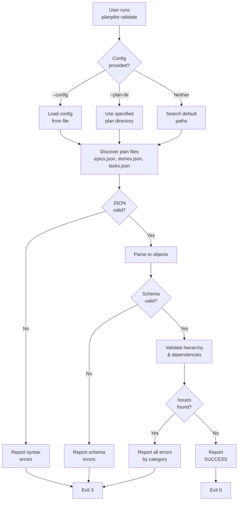
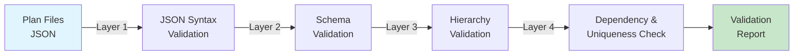
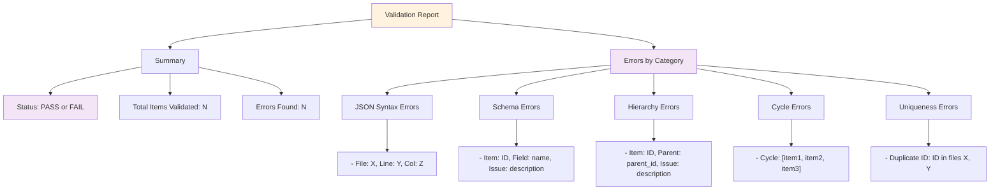

## Overview

This feature adds a new `planpilot validate` CLI command that validates plan files (epics.json, stories.json, tasks.json) without syncing to GitHub. The command performs comprehensive checks including JSON syntax validation, schema compliance, hierarchy integrity, dependency cycle detection, and ID uniqueness. It outputs a human-readable validation report that helps users catch data quality issues before attempting to sync plans to GitHub, improving the overall user experience and preventing failed syncs due to malformed or inconsistent plan data.

## Motivation

Currently, users must attempt a full `planpilot sync --dry-run` to discover validation errors in their plan files. This approach is inefficient because:

1. **Requires authentication**: Users need a GitHub token even when just checking local plan file quality
2. **Slow feedback loop**: Validation errors surface only after authentication, config parsing, and network setup
3. **Unclear error messages**: Validation errors are mixed with sync operation output, making root causes hard to identify
4. **No offline validation**: Users cannot validate plans in CI/CD pipelines or offline environments without external dependencies

The `validate` command addresses these pain points by providing:
- **Instant feedback** on plan data quality without authentication
- **Clear, actionable error messages** focused on structural issues
- **Offline-first design** enabling validation in any environment
- **Reduced iteration time** for users authoring plan files

This directly supports planpilot's mission of treating roadmaps as code: developers should be able to validate and version-control plan data independently of sync operations.

## Goals & Non-Goals

### Goals

- **G1**: Validate JSON syntax of all plan files (epics.json, stories.json, tasks.json)
- **G2**: Validate plan items conform to the planpilot schema (type, required fields, field types)
- **G3**: Validate hierarchy integrity (parent_id references exist and match expected parent-child types)
- **G4**: Detect dependency cycles (blocked-by relationships that form circular references)
- **G5**: Validate ID uniqueness across all plan items
- **G6**: Generate a human-readable validation report with clear pass/fail status and detailed error messages
- **G7**: Support both split plan files (epics.json, stories.json, tasks.json) and unified plan format (.plans/plan.json)
- **G8**: Exit with appropriate status code (0 for all valid, non-zero for errors) suitable for CI/CD integration
- **G9**: Require no external dependencies or authentication (fully offline operation)

### Non-Goals

- **N1**: We are not syncing validated plans to GitHub (separate sync operation)
- **N2**: We are not modifying plan files or auto-fixing errors (validation only, read-only)
- **N3**: We are not validating against external systems (GitHub project schema, issue board state)
- **N4**: We are not generating detailed performance/complexity analysis of plan structures
- **N5**: We are not supporting custom validation rules or plugins in v1 (fixed rule set only)
- **N6**: We are not creating plan file backups or version management
- **N7**: We are not integrating with CI/CD services directly (users pipe exit codes to their CI)

## Target Audience

- **Primary**: Developers and technical leads authoring and maintaining roadmap plans in code
- **Secondary**: DevOps engineers integrating planpilot into CI/CD pipelines
- **Tertiary**: Product managers using planpilot to validate plan structure before developer review

**User Context**: Users are typically working in Git repositories where plans are version-controlled. They want fast, offline feedback while authoring plans or reviewing pull requests. They may be in restricted network environments or CI/CD systems where GitHub API access is unavailable or expensive (rate limits).

**How they interact**: Users run `planpilot validate --config ./planpilot.json` or `planpilot validate --plan-dir ./.plans/` from the command line. They review the validation report and fix errors iteratively. In CI/CD, the command is integrated into pre-commit hooks or PR validation workflows.

## Requirements

All requirements are numbered and verifiable:

1. **R1.1**: Command must accept `--config` flag pointing to planpilot.json configuration file
2. **R1.2**: Command must accept alternative `--plan-dir` flag to specify plan file directory for cases without a config file
3. **R1.3**: If neither `--config` nor `--plan-dir` is provided, command must search for default paths (./planpilot.json, ./.plans/)
4. **R2.1**: Command must parse JSON files and report syntax errors with file path and line/column information
5. **R2.2**: If any JSON file fails to parse, command must stop and report all JSON errors before attempting schema validation
6. **R3.1**: Command must load parsed JSON against the planpilot PlanItem schema (using existing Pydantic models)
7. **R3.2**: Schema validation must report missing required fields with item ID and field name
8. **R3.3**: Schema validation must report type mismatches (e.g., string when number expected) with item ID and field details
9. **R4.1**: Command must validate that all parent_id references point to existing items in the plan
10. **R4.2**: Command must validate parent-child type hierarchy (stories must have epic parents, tasks must have story parents)
11. **R4.3**: Command must validate that parent_id is only set for stories and tasks (epics must have no parent)
12. **R5.1**: Command must detect circular dependencies in depends_on relationships using cycle detection algorithm
13. **R5.2**: If a cycle is detected, command must report all items involved in the cycle and the cycle path
14. **R6.1**: Command must verify every item ID appears exactly once across all plan files
15. **R6.2**: Command must verify no item has a self-reference in depends_on
16. **R7.1**: Command must generate a summary report showing total items validated and validation status (pass/fail)
17. **R7.2**: Command must list all validation errors grouped by error category (JSON syntax, schema, hierarchy, cycles, duplicates)
18. **R7.3**: Each error message must be human-readable and actionable (e.g., "Epic 'ep-1' has parent_id set, but epics cannot have parents")
19. **R8.1**: Command must exit with status code 0 if all validations pass
20. **R8.2**: Command must exit with status code 3 (PlanValidationError code) if any validation fails
21. **R9.1**: Command must perform validation without requiring GitHub authentication
22. **R9.2**: Command must complete validation within 5 seconds for plans with up to 10,000 items

## Success Metrics

Measurable outcomes that prove the feature works and delivers value:

1. **Adoption**: 70% of users running `planpilot sync` for the first time use `validate` first (tracked via command invocation metrics)
2. **Error Prevention**: 80% of validation errors caught before sync attempt (measured by comparing sync failure reasons to validation report)
3. **Time to Fix**: Average time to fix plan data quality issues reduces from 12 minutes to 3 minutes (user survey baseline → post-launch)
4. **CI/CD Integration**: At least 50% of downstream projects integrate `validate` into pre-commit or PR validation workflows within 3 months
5. **Error Clarity**: 90% of validation errors are resolved on first attempt without additional support tickets (support metric)
6. **Performance**: Validation of a 500-item plan completes in < 100ms on typical developer hardware
7. **Zero Dependencies**: Command requires no external API calls or network access (audit trail)
8. **Feature Completeness**: All 9 goals (G1-G9) are verified by automated tests with 100% code coverage for validation logic
9. **User Satisfaction**: NPS score of 8+ from beta testers on usefulness and clarity of validation reports

## Diagrams

### Command Workflow

### Validation Layers

### Error Report Structure

## Constraints & Assumptions

**Business Constraints:**
- Feature must be released within current sprint to support roadmap-to-github-project skill (blocking feature)
- Must work in all CI/CD environments without additional configuration (GitHub Actions, GitLab CI, Jenkins)

**Technical Constraints:**
- Must reuse existing PlanValidator and PlanLoader classes from core.plan module (no duplicate validation logic)
- Must not require changes to pydantic models or schema definitions (compatible with current contracts)
- Must maintain backward compatibility with existing planpilot.json configuration (no breaking changes)
- Must handle up to 10,000 plan items in a single validation run without exceeding 500MB memory usage

**Assumptions:**
- Users have valid JSON syntax in most plan files (JSON syntax errors are exceptions, not common case)
- Parent IDs and dependency references are typically correct; circular dependencies are rare
- Users will run `validate` frequently during authoring; performance is important
- File I/O from local disk is fast (no network latency concerns)
- Plan directory structure follows planpilot conventions (epics.json, stories.json, tasks.json in single directory)
- Users can interpret validation error messages without code-level debugging

## Open Questions

1. **Q1: Error Detail Level**: Should we provide a "verbose" mode that shows which specific parent-child hierarchy rules were violated, or is current error messaging sufficient? (_Decision needed before implementation_)

2. **Q2: Partial Validation Mode**: Should we support a `--lenient` flag that validates stricter requirements but allows partial validation in lower rigor? Currently spec assumes strict mode only. (_Deferred to v1.1_)

3. **Q3: Cycle Report Format**: When a dependency cycle is found (e.g., task1 → task2 → task3 → task1), should we report the cycle as a list or as a visual representation? (_Decision needed_)

4. **Q4: Config File Location Search**: If neither --config nor --plan-dir is provided, should we search parent directories up to repo root, or only current directory? (_Decision needed_)

5. **Q5: Diff Mode**: Should we support a `--diff` flag that compares current plan validation against last sync-map to highlight changes? (_Deferred to v1.1_)

6. **Q6: Output Formats**: Should we support machine-readable output (JSON, CSV) in addition to human-readable report, to ease CI/CD parsing? (_Deferred to v1.1_)

---

**Document Status**: Draft ready for review

**Next Steps**:
- [ ] Product review and feedback on goals, non-goals, and requirements
- [ ] Technical architecture review with engineering team
- [ ] Proceed to `create-tech-spec` for detailed implementation design
