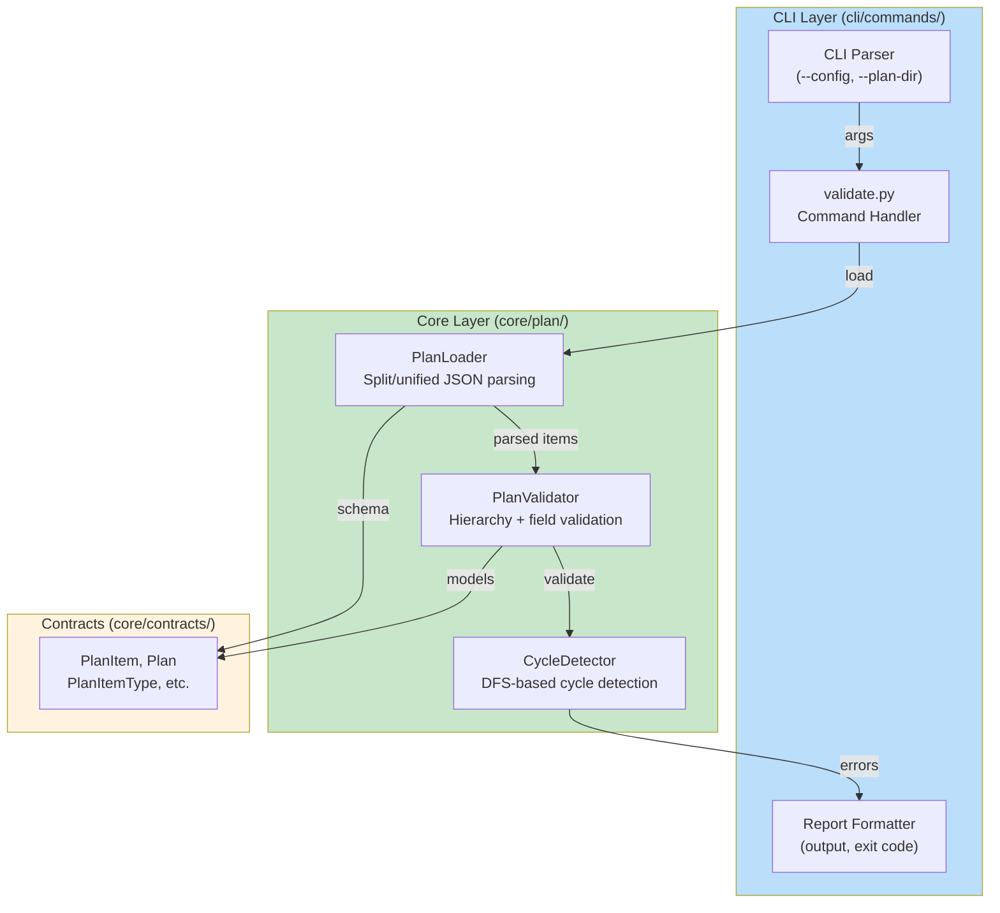
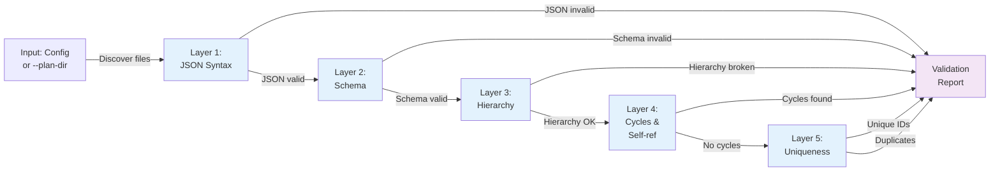
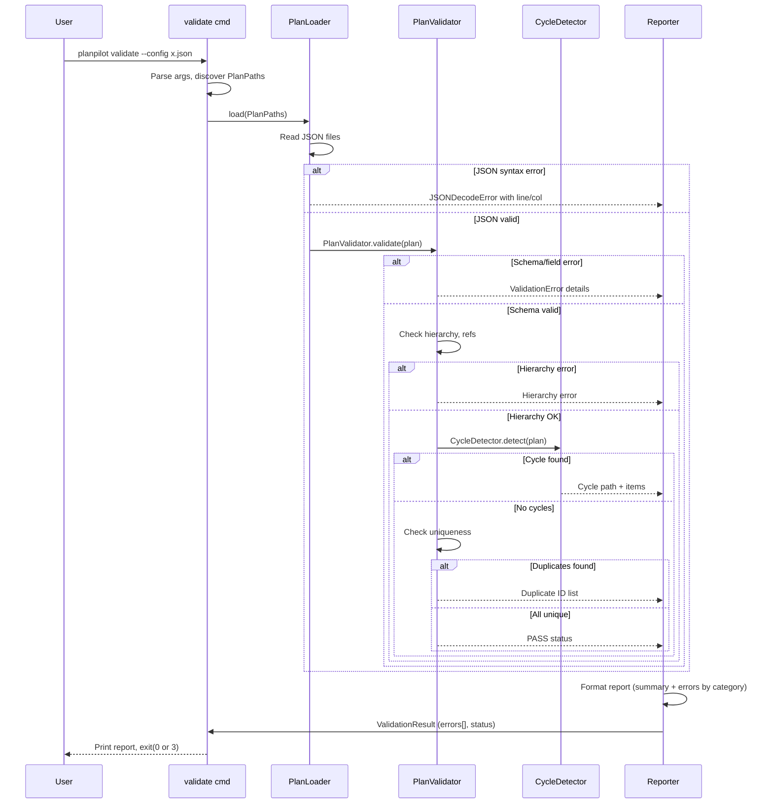

## Overview

The `planpilot validate` command is a new CLI tool that validates plan JSON files (epics.json, stories.json, tasks.json, or unified plan.json) offline without requiring GitHub authentication. It performs five layers of validation: JSON syntax, Pydantic schema compliance, hierarchy integrity, dependency cycle detection, and ID uniqueness. The command outputs a structured validation report categorized by error type and exits with appropriate status codes (0 for success, 3 for validation failures) suitable for CI/CD integration. This feature enables fast, offline feedback during plan authoring while supporting existing planpilot architecture patterns (Pydantic models, PlanLoader, PlanValidator, layered CLI structure).

## System Context

The `validate` command integrates into planpilot's layered architecture as a lightweight, offline-only CLI operation that reuses existing core validation infrastructure. Unlike the `sync` command, it does not require authentication, provider initialization, or async operations—it is a synchronous, purely local command that surfaces validation errors before users attempt expensive sync operations.

```mermaid
graph TB
    User["👤 User<br/>runs planpilot validate"]

    ValidateCmd["CLI: validate<br/>command"]
    ConfigLoader["ConfigLoader<br/>(core/config)"]
    PlanLoader["PlanLoader<br/>(core/plan)"]
    PlanValidator["PlanValidator<br/>(core/plan)"]
    JSONParser["JSON Parser<br/>(Python)"]
    ReportFormatter["Report Formatter<br/>(CLI output)"]

    LocalFS["Local Plan Files<br/>epics.json, stories.json, tasks.json"]
    ConfigFile["planpilot.json<br/>or --plan-dir"]

    User -->|CLI args| ValidateCmd
    ValidateCmd -->|--config| ConfigLoader
    ValidateCmd -->|--plan-dir| ConfigLoader
    ConfigLoader -->|PlanPaths| PlanLoader
    ValidateCmd -->|PlanPaths| PlanLoader

    PlanLoader -->|reads| LocalFS
    PlanLoader -->|JSON parse| JSONParser
    JSONParser -->|raw items| PlanValidator
    PlanValidator -->|validate| ReportFormatter

    ValidateCmd -->|read| ConfigFile
    ReportFormatter -->|human-readable| User

    style User fill:#e8f5e9
    style ValidateCmd fill:#bbdefb
    style LocalFS fill:#fff3e0
    style ReportFormatter fill:#f3e5f5
```



### Positioning in Existing Architecture

**Layered Architecture**: planpilot uses three layers (CLI, Core, Contracts). The validate command follows this pattern:
- **CLI Layer** (`cli/commands/validate.py`): Parses arguments, loads config, orchestrates workflow, formats output
- **Core Layer** (`core/plan/`): Reuses PlanLoader and PlanValidator; no new core logic needed
- **Contract Layer** (`core/contracts/`): Uses existing PlanItem, Plan, PlanItemType models; no schema changes

**Comparison to sync command**:
- `sync` is async (auth, network I/O), error codes 3-5 per app.py mapping
- `validate` is synchronous (local only), error code 3 for validation failures (same as sync)
- Both use PlanLoader and PlanValidator for consistency
- Both load config optionally; validate also supports `--plan-dir` bypass

**Reusable Components**:
- `PlanLoader`: Already handles split/unified plan formats, JSON parsing with error context
- `PlanValidator`: Already implements hierarchy, dependency, and field validation
- `PlanPaths`: Existing contract for plan directory structure
- `PlanPilotConfig`: Existing config model; validate uses it but makes it optional

### No Schema Changes Required

The validate command uses existing Pydantic models (PlanItem, Plan, PlanItemType, Estimate, Verification, etc.) without modification. JSON syntax and schema validation errors bubble up from existing PlanLoader and Pydantic ValidationError handling.

---

## Technical Requirements

Each technical requirement traces back to one or more PRD requirements (R prefix). Technical requirements are numbered TR.

| TR | Description | PRD Link | Details |
|---|---|---|---|
| **TR1.1** | Command must accept `--config` flag with path to planpilot.json | R1.1 | Parse flag, load config via existing ConfigLoader, derive PlanPaths from config.plan_paths |
| **TR1.2** | Command must accept alternative `--plan-dir` flag to directly specify plan directory | R1.2 | Parse flag, construct PlanPaths from directory (search for epics.json, stories.json, tasks.json) |
| **TR1.3** | Command must search default paths if neither flag provided | R1.3 | Attempt ./planpilot.json first, then ./.plans/ for split/unified files; error if none found |
| **TR2.1** | JSON parsing errors must be reported with file path and line/column info | R2.1, R2.2 | Catch json.JSONDecodeError, extract line/col from exception, report before schema validation |
| **TR2.2** | Command must halt and report all JSON errors before attempting schema validation | R2.2 | Collect errors in first pass; fail fast if JSON invalid |
| **TR3.1** | Schema validation via Pydantic ValidationError from existing PlanLoader | R3.1 | Reuse PlanLoader.load() which raises PlanLoadError wrapping ValidationError; extract field/item context |
| **TR3.2** | Schema errors must report item ID and field name | R3.2 | Parse Pydantic error details (item ID from field path, field name from error location) |
| **TR3.3** | Schema errors must report type mismatches with item ID and field details | R3.3 | Include expected vs actual type from Pydantic error context |
| **TR4.1** | Validate all parent_id references exist and point to valid items | R4.1 | Call PlanValidator (already implements this check via _validate_parent_and_hierarchy) |
| **TR4.2** | Validate parent-child type hierarchy (story→epic, task→story) | R4.2 | PlanValidator already enforces; report errors from _validate_parent_and_hierarchy |
| **TR4.3** | Validate epics have no parent_id set | R4.3 | PlanValidator._validate_required_fields already checks this |
| **TR5.1** | Detect circular dependencies via cycle detection algorithm | R5.1 | Extend PlanValidator with new _detect_cycles() method using depth-first search (DFS) with visit tracking |
| **TR5.2** | Report all items in cycle and cycle path | R5.2 | DFS algorithm returns list of items forming cycle; format as readable path (item1 → item2 → item3 → item1) |
| **TR6.1** | Verify every item ID is unique across all plan files | R6.1 | PlanValidator._index_items already detects duplicates; report count and files |
| **TR6.2** | Verify no self-references in depends_on | R6.2 | Add check in cycle detection or new _validate_self_references() method |
| **TR7.1** | Generate summary report: total items validated, pass/fail status | R7.1 | Format output with item counts and status badge (PASS/FAIL) |
| **TR7.2** | Group errors by category (JSON, schema, hierarchy, cycles, uniqueness) | R7.2 | Collect errors by type; format with section headers in report |
| **TR7.3** | Error messages must be human-readable and actionable | R7.3 | Example: "Epic 'ep-1' has parent_id set, but epics cannot have parents" (reuse PlanValidator messages) |
| **TR8.1** | Exit code 0 if all validations pass | R8.1 | Return 0 from command handler |
| **TR8.2** | Exit code 3 if any validation fails | R8.2 | Return 3 from command handler (matches ConfigError, PlanLoadError, PlanValidationError mapping in app.py) |
| **TR9.1** | Perform validation without GitHub authentication | R9.1 | No auth resolver, no network calls; local I/O only |
| **TR9.2** | Validation completes within 5 seconds for up to 10,000 items | R9.2 | Synchronous operation; cycle detection is O(V + E) where V=items, E=dependencies; target <100ms for 500-item plan |

---

## Components & Architecture

The validate command integrates into the existing CLI layer without requiring new core components. It reuses existing validation infrastructure (PlanLoader, PlanValidator) and extends it minimally with cycle detection logic.

### Component Diagram



### Validation Pipeline



### Extension Point: Cycle Detection

The validate command adds cycle detection to PlanValidator. This is implemented as a new method (not in existing validator) because:

1. **Cycle detection is expensive** (O(V+E) with DFS): sync operations don't need it; validate exposes it to users for data quality checks
2. **Separate concern**: Existing validator focuses on schema/hierarchy; cycle detection is a higher-level integrity check
3. **Reusability**: Could be called from sync validation in future without affecting current sync path

**Approach**: Add `CycleDetector` helper class or `_detect_cycles()` method to validate command:
- Builds adjacency list from depends_on relationships
- Uses DFS with visit states (unvisited, visiting, visited) to detect back edges
- Reports cycle path with all items involved

---

## API Design

The validate command follows planpilot's existing CLI patterns established by `sync` and `clean` commands.

### Command-Line Interface

```bash
# With config file
planpilot validate --config ./planpilot.json

# With explicit plan directory
planpilot validate --plan-dir ./.plans/

# With verbose logging
planpilot validate --config ./planpilot.json --verbose

# CI/CD integration (check exit code)
planpilot validate --plan-dir ./.plans/ && echo "Valid" || echo "Invalid"
```

### Parser Definition

Added to `cli/parser.py` in `build_parser()`:

```python
validate_parser = subparsers.add_parser("validate", help="Validate plan JSON files")
validate_parser.add_argument("--config", default=None, help="Path to planpilot.json")
validate_parser.add_argument("--plan-dir", default=None, help="Path to plan directory")
validate_parser.add_argument("--verbose", "-v", action="store_true", help="Enable debug logging")

# Validation: must provide --config OR --plan-dir, or neither (search defaults)
# Parser structure allows both to be optional; command validates this at runtime
```

### Command Handler Signature

```python
def run_validate(args: argparse.Namespace) -> int:
    """
    Returns:
        0: All validations passed
        3: Validation errors found
        1: Unexpected error
    """
```

### Validation Report Output

Human-readable format printed to stdout:

```
planpilot - validation report

Summary:
  Status:        PASS
  Total Items:   127
  Errors:        0

Breakdown:
  Epics:         20
  Stories:       42
  Tasks:         65

[No errors detected]

Exit code: 0
```

With errors:

```
planpilot - validation report

Summary:
  Status:        FAIL
  Total Items:   125 (2 failed)
  Errors:        4

Breakdown:
  Epics:         20
  Stories:       40
  Tasks:         65

JSON Syntax Errors:
  - File: .plans/tasks.json, Line 42, Col 15: Unexpected token

Schema Validation Errors:
  - Item: task-12, Field: goal, Error: Value is required and cannot be empty
  - Item: story-5, Field: type, Error: Expected 'STORY' but got 'story'

Hierarchy Errors:
  - Item: task-8 → Parent: story-999, Error: Parent does not exist

Dependency Cycle Errors:
  - Cycle: task-1 → task-2 → task-3 → task-1 (4 items in cycle)

Uniqueness Errors:
  - Duplicate ID: epic-1 in files [epics.json, ./epics-backup.json]
  - Self-reference: task-5 depends on itself

Exit code: 3
```

### Sequence Diagram: Error Resolution Flow



---

## Technical Decisions

| Decision | Rationale | Alternatives Considered | Trade-offs |
|----------|-----------|-------------------------|------------|
| **Reuse PlanLoader/PlanValidator** | These components already exist, are well-tested, and contain all validation logic needed. Duplication would be unmaintainable. | Reimplementing validation in validate.py | Coupling to core layer, but that's already the architecture pattern. Benefits: single source of truth for validation rules. |
| **Separate cycle detection from PlanValidator** | Cycle detection is a higher-level check not needed by sync (which only cares about local hierarchy). Keeping it separate allows validate to expose advanced checks without affecting sync path. | Add _detect_cycles() to PlanValidator | Separate method is clearer; sync could adopt it later if needed. Adds one new method to validate command. |
| **Synchronous command (no async)** | Validate is purely local I/O (no network). Async adds complexity for no benefit. | Async with asyncio like sync command | Simpler code, faster startup, clearer error handling. No performance impact for local files. |
| **Exit code 3 for validation failures** | app.py already maps PlanValidationError to exit code 3. Validate errors are validation failures (same category as PlanValidationError). | Exit code 1 or 2 | Consistency with existing error mapping. Users can rely on exit code 3 for validation-specific failures. |
| **Optional --config and --plan-dir** | Allows flexibility: users with config files use --config; users without can use --plan-dir. Both optional enables search for defaults (like sync does). | Require one of them | More user-friendly for both CLI power users and CI/CD scripts. Mirrors sync command pattern. |
| **Categorized error output** | Users see errors grouped by type (JSON, schema, hierarchy, cycles). Easier to understand and fix when errors are organized. | Single flat list of errors | Reduces cognitive load; users can focus on one error category at a time. Report is still human-readable. |

---

## Validation

### Test Strategy

**Unit Tests** (test_validate_command.py and test_cycle_detector.py):
1. **Config/path resolution**:
   - --config provided: load and use config.plan_paths
   - --plan-dir provided: scan directory for split/unified files
   - Neither provided: search defaults (./planpilot.json, ./.plans/)
   - Invalid paths: report clear error

2. **JSON syntax validation**:
   - Valid JSON: proceed to schema
   - Invalid JSON: report line/col, exit 3
   - Missing files: report file not found

3. **Schema validation**:
   - Valid items: proceed to hierarchy
   - Missing required fields (goal, requirements, acceptance_criteria): report field name
   - Type mismatches (string vs number): report expected vs actual
   - Invalid enum (type != EPIC/STORY/TASK): report invalid value

4. **Hierarchy validation**:
   - Valid parent refs: pass
   - Missing parent: report "parent does not exist"
   - Wrong parent type (story→story instead of story→epic): report hierarchy rule violation
   - Epic with parent_id: report "epics cannot have parents"

5. **Cycle detection**:
   - No dependencies: no cycles
   - Linear chain (a→b→c): no cycles
   - Valid DAG (multiple parents, no back edges): no cycles
   - Simple cycle (a→b→a): detect and report [a, b, a]
   - Complex cycle (a→b→c→d→b): detect and report [b, c, d, b]
   - Self-reference (a→a): detect as cycle

6. **Uniqueness validation**:
   - All unique IDs: pass
   - Duplicate IDs: report which files contain duplicate
   - Self-reference in depends_on: report as self-reference error

7. **Report formatting**:
   - PASS report: contains status, item counts, breakdown by type
   - FAIL report: contains status, error count, errors grouped by category
   - Each error message: clear, actionable, includes item ID and specific issue

**Integration Tests** (test_validate_integration.py):
1. End-to-end with real JSON files:
   - Load real split plan (3 files) with valid data: exit 0
   - Load real split plan with JSON syntax error: exit 3, report error
   - Load real split plan with schema error: exit 3, report field error
   - Load real split plan with cycle: exit 3, report cycle path
   - Load unified plan.json: exit 0 (same validation as split)

2. Config file integration:
   - Load valid planpilot.json: use plan_paths from config
   - Load invalid planpilot.json: report config error

3. CLI argument parsing:
   - --config alone: load config
   - --plan-dir alone: scan directory
   - --config and --plan-dir: --plan-dir takes precedence
   - Neither: search defaults, report error if not found
   - --verbose: enable debug logging (info level logs)

**E2E Tests** (test_validate_e2e.py):
1. Run CLI with test fixtures:
   - `planpilot validate --plan-dir ./test-fixtures/valid-plan/`: exit 0
   - `planpilot validate --plan-dir ./test-fixtures/invalid-json/`: exit 3
   - `planpilot validate --plan-dir ./test-fixtures/cycle-deps/`: exit 3
   - Verify exit codes and stderr output match expected report

### Acceptance Criteria (from PRD)

Each PRD goal becomes acceptance criteria:

| Goal | Acceptance Criteria | Test Fixture |
|------|-------------------|--------------|
| **G1**: JSON syntax validation | Error reported with file path and line/col; command exits 3 | invalid.json with syntax error at line 42 |
| **G2**: Schema compliance | Missing fields and type mismatches reported; exit 3 | item missing `goal`, string type for numeric field |
| **G3**: Hierarchy integrity | parent_id refs validated; type hierarchy enforced; epics have no parent | story with non-epic parent; task with non-story parent; epic with parent |
| **G4**: Dependency cycles | Circular depends_on detected; all items in cycle reported | task-1→2→3→1; self-reference |
| **G5**: ID uniqueness | Duplicate IDs detected and reported | same ID in two files |
| **G6**: Human-readable report | Report grouped by error type; clear error messages; status badge | run on plan with 3 errors, verify report format |
| **G7**: Split + unified support | Both formats validated identically | run on .plans/split/ and .plans/plan.json |
| **G8**: Exit codes | 0 for pass, 3 for fail | verify exit codes with different test cases |
| **G9**: Offline operation | No network calls, no auth required | run in disconnected environment; verify no network activity |

### Verification Commands

```bash
# Unit tests
pytest src/planpilot/cli/commands/test_validate_command.py -v

# Integration tests
pytest src/planpilot/cli/commands/test_validate_integration.py -v

# E2E tests
pytest tests/e2e/test_validate_e2e.py -v

# Manual verification
planpilot validate --plan-dir ./test-fixtures/valid-plan/
echo $?  # Should print 0

planpilot validate --plan-dir ./test-fixtures/invalid-json/
echo $?  # Should print 3

# Performance test (5-second requirement for 10k items)
time planpilot validate --plan-dir ./test-fixtures/large-plan-10k/
# Expected: ~1-2 seconds on modern hardware
```

---

## Risks & Mitigations

| Risk | Likelihood | Impact | Mitigation |
|------|-----------|--------|-----------|
| **Cycle detection performance on large plans** | Medium | Medium | DFS is O(V+E); with 10k items and ~20% dependency rate, ~2k edges = 12k ops. Should be <100ms. Test with 10k-item fixture to confirm. Add logging to report cycle detection time in verbose mode. |
| **Complex cycle paths are hard to understand** | Medium | Low | Report cycle as visual path (a→b→c→a) not just list. Add item titles if available (from goal field) to help users understand. Consider future enhancement: visualization. |
| **Users confused by --config vs --plan-dir precedence** | Low | Low | Documentation: --plan-dir overrides config. Help text in parser. Error message if both provided. |
| **Inconsistent error messages across validation layers** | Medium | Low | Standardize error format: "Item: {id}, Field: {field}, Error: {msg}". Reuse existing PlanValidator error messages (already human-readable). Add tests to verify message consistency. |
| **PlanLoader/PlanValidator changes break validate** | Low | High | Tight coupling to core layer. Mitigate: validate has test coverage for all integration points; if validator changes, tests will catch breakage. Consider core layer backward compatibility contract. |
| **Report formatting differs from user expectations** | Low | Low | Beta test with sample users (support team, power users). Adjust report format based on feedback before release. |

---

## Open Questions

1. **Q1: Verbose error messages**: Should `--verbose` mode expand error messages with additional context (e.g., show surrounding JSON, suggest fixes)? Or only enable debug logging of internal steps?
   - **Current approach**: --verbose enables debug logging (info level), not enhanced error messages
   - **Alternative**: Implement `--explain` flag for detailed error context
   - **Decision needed before implementation**

2. **Q2: Large plan handling**: For plans >10k items, should we implement streaming validation (process file in chunks) or accept single-pass in-memory approach?
   - **Current approach**: Single-pass in-memory (simpler, meets 5-second SLA)
   - **Alternative**: Streaming for very large plans
   - **Decision**: Monitor performance in beta; streaming can be deferred to v1.1 if needed

3. **Q3: Output machine-readable format**: Should we support `--format json` or `--format csv` for CI/CD parsing?
   - **Current approach**: Human-readable text only; CI/CD users parse exit codes
   - **Alternative**: JSON output with structured errors
   - **Decision deferred to v1.1** per PRD Q6

4. **Q4: Partial validation mode**: Should `--lenient` flag allow skipping strict checks (e.g., accept missing optional fields)?
   - **Current approach**: Strict mode only (as per PRD non-goal N5)
   - **Alternative**: Support multiple strictness levels
   - **Decision deferred to v1.1** per PRD Q2

5. **Q5: Cycle report format**: Visual or text? Include item titles (goal) or just IDs?
   - **Current approach**: Text format with IDs; consider adding titles if available
   - **Example**: `Cycle: epic-1 (Q1 Planning) → epic-2 (Q2 Planning) → epic-1`
   - **Decision needed before implementation**

---

## Open Tasks for Implementation

These items should be tracked in the implementation roadmap:

1. Implement `CycleDetector` helper (new file or method in validate command)
2. Extend CLI parser with `validate` command definition
3. Implement command handler (`run_validate()`) in `cli/commands/validate.py`
4. Add integration to `cli/__init__.py` and `cli/app.py` (error mapping)
5. Implement report formatter with category grouping
6. Write comprehensive unit + integration + E2E tests
7. Test performance with 10k-item fixture
8. Gather beta feedback on report format and error clarity

---

## References

- **Existing PlanValidator**: `src/planpilot/core/plan/validator.py`
- **PlanLoader**: `src/planpilot/core/plan/loader.py`
- **Contracts (PlanItem, Plan)**: `src/planpilot/core/contracts/plan.py`
- **CLI app.py (error mapping)**: `src/planpilot/cli/app.py`
- **Sync command pattern**: `src/planpilot/cli/commands/sync.py`
- **Clean command pattern**: `src/planpilot/cli/commands/clean.py`

