# Create Technical Specification

## Overview

Codebase-aware skill that reads a PRD and the existing codebase to produce an architecture-level technical specification with dynamic design sections and mermaid diagrams. The spec bridges product requirements and implementation, documenting how the feature will be built while maintaining alignment with existing architectural patterns.

## Skill Invocation Gate (MANDATORY)

Before any action, list available skills and invoke all that apply. If installed and applicable, you MUST use them. Process skills take priority over implementation skills.

## Prerequisites

Must be run inside a project directory with codebase access. The agent reads project files to understand the existing architecture, patterns, and code structure.

## When to Use

- User has a PRD and wants a technical specification
- User wants to design the technical approach for a feature
- User wants architecture-level documentation before implementation
- User wants to understand how a feature fits into the existing codebase

Do **not** use when: the user doesn't have a PRD yet (use `create-prd` first), the user needs to generate `.plans` JSON (use `plan-sync` instead), or the user is ready to implement (the spec is a design document, not an implementation guide).

## Inputs

- **PRD file path** (e.g., `docs/prd/user-auth-prd.md`) — the source Product Requirements Document
- **Codebase access** — the agent reads project structure, existing modules, and architectural patterns

## Outputs

- `docs/specs/<slug>-spec.md` — Markdown technical specification with YAML frontmatter, fixed and dynamic sections, and mermaid diagrams

---

## Frontmatter Schema

Every technical specification must include YAML frontmatter with these fields:

```yaml
---
title: "Feature Title — Technical Specification"
status: draft | review | approved
created: YYYY-MM-DD
prd: docs/prd/<slug>-prd.md
author: <user or auto-detected>  # optional
tags: [tag1, tag2]
---
```

| Field | Type | Required | Description |
|-------|------|----------|-------------|
| `title` | string | yes | Feature name with "— Technical Specification" suffix |
| `status` | enum | yes | `draft`, `review`, or `approved` |
| `created` | string | yes | ISO 8601 date (YYYY-MM-DD) |
| `prd` | string | yes | Path to source PRD (e.g., `docs/prd/user-auth-prd.md`) |
| `author` | string | no | User name or auto-detected from git config |
| `tags` | array | no | Technical categorization tags (e.g., `[backend, database, api]`) |

The `prd` field is mandatory and links back to the source PRD for traceability.

---

## Specification Template — Structure

Every spec includes three categories of sections:

### Fixed Opening Sections (always present)

1. **Overview** — summary of what's being built, derived from PRD
2. **System Context** — how this fits into the existing architecture. MUST include a mermaid context diagram showing the new feature's relationship to existing system components.
3. **Technical Requirements** — PRD requirements translated into technical constraints. Each PRD requirement becomes one or more technical requirements.

### Dynamic Design Sections (include only relevant ones)

The agent analyzes the PRD requirements and codebase to determine which sections apply. Each section MUST include mermaid diagrams where they improve understanding.

**Components & Architecture**
- Use when: feature involves new/modified components, layering changes, or component interactions
- Content: new components and their responsibilities, interfaces, interactions with existing system
- Diagram: mermaid component diagram or flowchart
- Example: UI component library feature, microservice addition, plugin system

**Data Model**
- Use when: feature requires schema changes, new entities, relationships, or data storage patterns
- Content: new entities, properties, relationships, constraints, migration strategy
- Diagram: mermaid ER diagram
- Example: user authentication (users table), multi-tenancy (organization tables), event logging

**API Design**
- Use when: feature exposes or modifies endpoints, request/response contracts, or API versioning
- Content: endpoint specs, HTTP methods, request/response shapes, error handling, versioning strategy
- Diagram: mermaid sequence diagram for complex interaction patterns
- Example: REST API feature, webhook system, GraphQL schema changes

**Integration Points**
- Use when: feature depends on external systems, services, third-party APIs, or cross-service communication
- Content: external dependencies, integration patterns, data exchange, error handling for external failures
- Diagram: mermaid component diagram showing external system connections
- Example: payment provider integration, OAuth integration, message queue integration

**State Management**
- Use when: feature has complex state flows, lifecycle management, or persistence strategy
- Content: state machines, transitions, event handling, persistence mechanism
- Diagram: mermaid state diagram
- Example: workflow engine, async job processing, session management

**Security Model**
- Use when: feature involves authentication, authorization, data protection, or compliance requirements
- Content: auth strategy, permission model, encryption, audit logging, compliance considerations
- Diagram: mermaid sequence diagram for auth flows or component diagram for security boundaries
- Example: role-based access control, encryption at rest, PII handling

**Performance Considerations**
- Use when: feature has scalability requirements, caching needs, or performance constraints
- Content: scalability approach, caching strategy, query optimization, load handling
- Diagram: mermaid flowchart for caching/optimization patterns
- Example: real-time features, high-traffic endpoints, batch processing

### Fixed Closing Sections (always present)

1. **Technical Decisions** — key technology choices with rationale. Each decision includes: what was chosen, alternatives considered, why the choice was made.
2. **Validation** — how to verify the implementation meets the spec. Includes test strategy (unit, integration, e2e), acceptance criteria (derived from PRD requirements), and verification commands where applicable.
3. **Risks & Mitigations** — technical risks identified during analysis with mitigation strategies. Include: risk description, likelihood/impact assessment, and mitigation approach.
4. **Open Questions** — unresolved technical items that need answers before or during implementation. Frame as questions requiring follow-up.

---

## Codebase Analysis Steps

Before generating the spec, the agent must:

1. **Project Structure** — understand key directories, entry points, build system, deployment model
2. **Existing Modules** — identify which modules the feature will touch or extend
3. **Architectural Patterns** — document patterns in use (layered architecture, async patterns, dependency injection, middleware chains, etc.)
4. **Similar Features** — examine existing similar features to maintain consistency and avoid reinventing patterns
5. **Requirement Mapping** — translate each PRD requirement into technical components and constraints
6. **Integration Analysis** — identify all integration points with existing code, external services, and databases

Record findings for reference during specification writing.

---

## Diagram Policy

- **Syntax:** All diagrams use mermaid syntax
- **System Context section:** ALWAYS includes a context diagram showing the feature's relationship to existing system components
- **Dynamic sections:** Each relevant section includes diagrams where they improve understanding
- **Diagram types:**
  - `flowchart` — for workflows, decision trees, data flows
  - `erDiagram` — for entity relationships and data models
  - `sequenceDiagram` — for interaction patterns, API call sequences, auth flows
  - `stateDiagram` — for state machines and lifecycle flows
  - `graph` / `classDiagram` — for component relationships and architecture

---

## File Naming Convention

| Component | Format | Example |
|-----------|--------|---------|
| Directory | `docs/specs/` | — |
| Filename | `<slug>-spec.md` | `user-authentication-spec.md` |
| Slug | lowercase, hyphenated, derived from spec title | Title: "User Authentication" → slug: `user-authentication` |

**Important:** Slugs are derived from the spec title (without the "— Technical Specification" suffix), lowercase and hyphenated.

---

## Workflow — Step by Step for the Agent

### Step 1: Locate PRD

Ask for the PRD file path or attempt to locate it based on user-provided feature name. If ambiguous, ask for clarification.

Example: "I'll need the PRD file path. Is it `docs/prd/user-authentication-prd.md`, or somewhere else?"

### Step 2: Read and Parse PRD

1. Read the PRD file (frontmatter + all sections)
2. Extract: title, motivation, goals, non-goals, requirements (numbered), success metrics, constraints, open questions
3. Note the PRD slug for linking back in the spec frontmatter

### Step 3: Codebase Analysis

Analyze the project to understand how the feature fits:

1. **Project Structure** — examine top-level directories, source layout, key entry points
2. **Relevant Modules** — identify existing code the feature will integrate with or extend
3. **Architectural Patterns** — document patterns in use (layering, async, error handling, logging, testing conventions)
4. **Similar Features** — look for existing features that do similar things to maintain consistency
5. **Technology Stack** — understand frameworks, libraries, databases, external services in use
6. **Constraints** — identify platform, performance, scalability, or regulatory constraints

### Step 4: Map PRD to Technical Components

For each PRD requirement, determine:
- Which system components are affected
- What data flows are involved
- What external systems are needed
- What architectural patterns apply
- What risks or constraints exist

### Step 5: Determine Relevant Dynamic Sections

Review the PRD requirements and codebase analysis to decide which dynamic design sections are relevant:

- **Database-heavy feature** (new entities, queries, relationships) → include Data Model + API Design
- **UI feature** (new screens, components, workflows) → include Components & Architecture + State Management
- **Integration feature** (external APIs, webhooks, services) → include Integration Points + Security Model
- **Async/background work** (jobs, queues, events) → include State Management + Components & Architecture
- **Infrastructure feature** (deployment, scaling, performance) → include Components + Performance Considerations
- **Auth/security feature** → include Security Model + API Design (for auth endpoints)

Include only sections that provide clarity. Err on the side of inclusion if in doubt — more diagrams aid understanding.

### Step 6: Generate Specification Draft

Write the spec with:

1. **YAML frontmatter** with title, status `draft`, today's date, PRD path, author, tags
2. **Overview** — one-paragraph summary of the feature from a technical perspective
3. **System Context** — explain how this feature integrates into the existing system, include a mermaid context diagram
4. **Technical Requirements** — translate PRD requirements into technical language. Example: PRD req "Users can create accounts" becomes tech req "POST /api/auth/register endpoint accepts email/password, validates input, hashes password with bcrypt, creates user record"
5. **Dynamic Design Sections** — one or more of (Components & Architecture, Data Model, API Design, Integration Points, State Management, Security Model, Performance Considerations), each with mermaid diagrams
6. **Technical Decisions** — key choices (framework, library, pattern selections) with rationale and alternatives
7. **Validation** — test strategy, acceptance criteria, verification commands
8. **Risks & Mitigations** — technical risks with mitigation approaches
9. **Open Questions** — unresolved items needing follow-up

Every diagram must serve a purpose — if a diagram doesn't clarify the design, omit it.

### Step 7: Review and Iteration

Present the draft spec to the user:
- Display the full specification
- Ask: "Does this architecture make sense? Should we adjust any sections, add diagrams, or reconsider any decisions?"
- Collect feedback on clarity, completeness, and alignment with PRD
- Iterate on specific sections until approved

### Step 8: File Creation

Once approved:

1. Create `docs/specs/` directory if it doesn't exist
2. Derive slug from spec title (lowercase, hyphenated; exclude "— Technical Specification" suffix)
3. Write the approved spec to `docs/specs/<slug>-spec.md`
4. Confirm file path and content saved

### Step 9: Next Steps

Suggest next action:

> Technical specification saved to `docs/specs/<slug>-spec.md`. Ready for the next step?
>
> Run `/planpilot:sync` to decompose this spec into epics, stories, and tasks.

---

## Common Mistakes

- **Skipping codebase analysis** — writing a spec that doesn't align with existing architecture, patterns, or technology choices. Always analyze the codebase first.
- **Not including mermaid diagrams** — every spec should include at least the System Context diagram. Every dynamic section should include diagrams where they add clarity.
- **Over-specifying implementation details** — this is architecture-level design, not line-by-line code. Focus on "what" and "why", not "how". Save detailed implementation decisions for code.
- **Not linking back to PRD** — forgetting the `prd` field in frontmatter breaks traceability. Always include it.
- **Including ALL dynamic sections regardless of relevance** — only include sections that apply to this feature. Extra sections add noise without value.
- **Writing technical requirements that don't trace to PRD** — every technical requirement must map back to at least one PRD requirement. Include the mapping.
- **Forgetting the Validation section** — this is critical for verifying the spec is correctly implemented. Always include test strategy and acceptance criteria.
- **Not examining existing similar features** — leads to inconsistent patterns, duplicate code, or missed opportunities for reuse.
- **Vague or non-actionable technical decisions** — "we'll use a database" is not a decision; "we'll use PostgreSQL with separate read/write databases for analytical queries" is. Every decision should have rationale.
- **Missing risk assessment** — identify technical risks during analysis. Don't assume everything will go smoothly.
- **Saving spec without user approval** — always present a draft and iterate before saving the file.
- **Using absolute file paths** — always use project-relative paths (e.g., `src/planpilot/core/plan/validator.py` not `/Users/.../validator.py`) so specs are portable across machines.
- **Incorrect slug derivation** — ensure the slug matches the spec title (without "— Technical Specification" suffix) and is lowercase, hyphenated.

---

## Diagram Best Practices

### System Context Diagram

Every spec must include a context diagram in the System Context section. It should show:
- The new feature as a central component
- Existing system components it connects to
- External systems (APIs, services, databases)
- Data flows between components

Example mermaid syntax:

```mermaid
graph TB
    User["👤 User"]
    NewFeature["✨ New Feature"]
    ExistingAPI["API Server"]
    Database[(Database)]
    ExternalService["External Service"]

    User -->|uses| NewFeature
    NewFeature -->|calls| ExistingAPI
    ExistingAPI -->|queries| Database
    NewFeature -->|integrates| ExternalService
```



### Component Diagram

For architecture sections, use component diagrams to show:
- Components and their responsibilities
- Interfaces and dependencies
- Layering (presentation, business logic, data access)

### ER Diagram

For data model sections, use ER diagrams to show:
- Entities and attributes
- Relationships and cardinality
- Primary and foreign keys

### Sequence Diagram

For complex interactions (auth flows, API calls, state transitions), use sequence diagrams to show:
- Actors and systems involved
- Message flows and order
- Decision points and branching

### State Diagram

For state management sections, use state diagrams to show:
- States and transitions
- Entry/exit conditions
- Event triggers

---

## Completion Criteria

This skill run is complete when:

1. Spec file saved to `docs/specs/<slug>-spec.md`
2. YAML frontmatter includes `title`, `status` (draft), `created` (today's date), `prd` (path to source PRD), and `tags`
3. All three fixed opening sections present and substantive: Overview, System Context, Technical Requirements
4. System Context includes a mermaid context diagram showing the feature's relationship to existing system
5. At least one dynamic design section included with clear rationale for selection
6. Dynamic sections include mermaid diagrams where they improve understanding
7. All four fixed closing sections present and substantive: Technical Decisions, Validation, Risks & Mitigations, Open Questions
8. Technical requirements clearly trace back to PRD requirements
9. No vague or implementation-level details (focus on architecture-level design)
10. User has reviewed and approved the draft
11. File saved with correct naming (lowercase, hyphenated slug)
